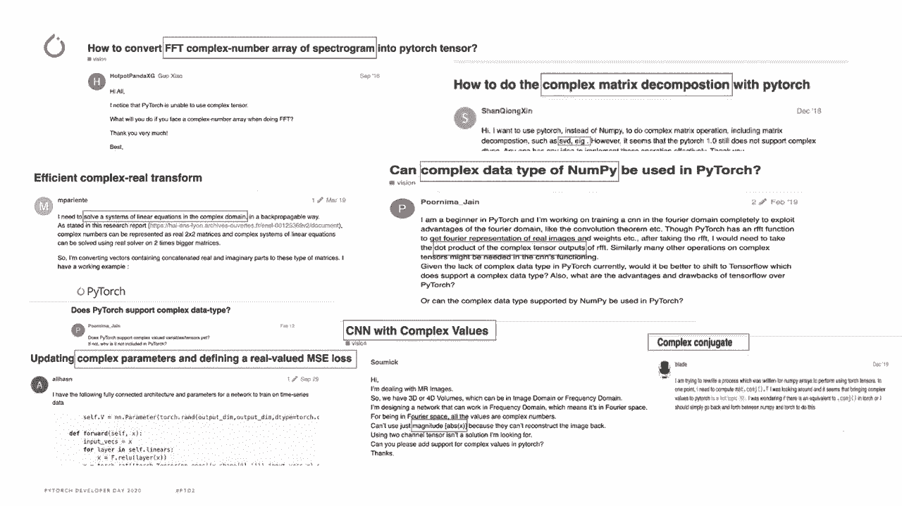
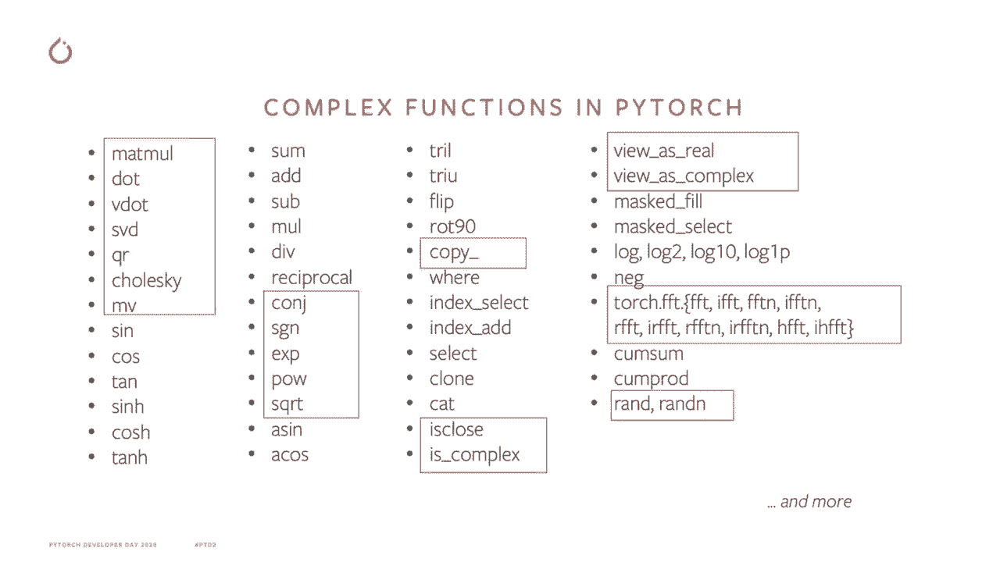

# Pytorch 进阶学习讲座！14位Facebook工程师带你解锁 PyTorch 的生产应用与技术细节 ＜官方教程系列＞ - P1：L1- PyTorch 中的复数 - ShowMeAI - BV1ZZ4y1U7dg

🎼。

嗨，大家好。感谢你们今天让我来这里。我的名字是Anjuli，我在Pytorch团队工作了过去一年，参与了一个令人兴奋的项目。这个项目就是复数，今天我们将讨论的就是这个话题。所以直接开始吧，让我们聊聊复数是什么。

你们中的一些人可能已经熟悉复数。但我会简单回顾一下，以确保我们在同一页面。😊。

复数是可以表示为 a + b 的数字，其中 A 和 B 是实数，I 是单位虚数，等于负1的平方根。所以现在我们已经确定了复数是什么，让我们谈谈它们的应用领域。复数在多个领域都有应用。

特别是在数学、物理和工程领域，量子力学和信号处理是你可能熟悉的一些例子。感谢欧拉，他提出了这个神奇的公式，如屏幕上所示，将虚数与正弦和余弦项联系起来，例如。

这个关系可以用来将标准的余弦波方程重写为两个复指数的乘积，这通常简化了相关的数学计算，因为复指数比它们的正弦对应物更容易处理。😊我们还可以在深度学习领域中从复数中获益。

最近关于神经网络的工作和旧有的基本理论分析表明，复数可能具有丰富的表示能力，但由于Pytorch缺乏原生复数支持，使得解锁这种潜力变得更加困难。在Pytorch，我们致力于赋能我们的用户，我们的理念是使事情易于使用，并为用户扫清困难的障碍。随着我们收到对复数支持的请求。

我们决定对此采取一些措施。以下是我们多年在Pytorge讨论论坛收到的一些请求。稍后我们会讨论这里列出的一些内容，但我想特别强调的是，这是一个以社区驱动的项目，我们根据社区的持续反馈来优先考虑我们构建的功能，并与社区合作进行实际开发。

我们从社区听到的意见归结为三个主要点。这是添加原生复数支持的动力。第一个是自然表示。历史上，我们将复数表示为两个实数的元组。但我们听到许多用户反映，使用这种约定编写代码实在太累了。

因此，我们希望引入一个 API，使得在 Pytorrch 中处理复数变得更简单，同时让代码更易于维护。其次是复数功能。如果你想为复数操作提供类似的支持，并利用 Pytorch 在加速器上运行的能力。😊到目前为止，我们还在 CPU 和 GPU 上添加了许多专用内核，以优化复数操作。

事实上，在 CPU 上，我们也支持复数操作的复用。第三是自动微分。正如我之前提到的，我们希望支持神经网络研究，因此我们正在努力添加复数自动微分支持，这在优化问题中是非常有帮助的。

那么，让我们来看看复数张量如何简化我们在 Pitorrch 中的生活？

那些在 Pytorch 中查看过谱图的朋友，可能对右侧的代码比较熟悉。显示的张量展示了我们历史上在 torch 中如何表示复数。正如你所见，它看起来笨重、丑陋且难以阅读，实际上没有理由不在 torch 中使用复数数据类型。因此在 Pytorch 1.6 中。

我们引入了两种本地复数 D 类型，complex 64 和 complex 128，分别对应于 float 和 double 数据类型。我还想提到，新增加的第 15 模块中的函数，迈克尔稍后会讲到，支持复数。现在，拥有本地复数支持的另一个好处是，你不再需要编写所有麻烦、耗时且容易出错的解决方法。

在我们最新的版本中，许多常见操作，如 Mamall、SVD 等，已经为我们的复数用户提供了支持。我们还添加了核心属性和张量构造函数的支持，以便提供自然的复数支持，正如你在 Ny 和 Python 中所熟悉的那样。

右侧是使用本地复数支持编写的 Facebook 代码函数的示例。代码的细节并不重要，重要的是我们不断添加功能，以优先满足社区认为有价值的用例。

😊。

这里是我们迄今为止添加的一些操作符的示例。正如你所见，我们已经支持了许多线性代数操作、三角函数操作和代数操作，并且我们不断努力添加更多。

而且不仅如此，在最新版本中，你还可以对复数函数进行微分。

对于那些熟悉复杂微分的人来说，我们计算共轭词导数；对于那些不熟悉但希望能够使用复杂参数的优化器的人，我们为你提供了梯度约定，现有的优化器可以开箱即用，处理优化实值目标的常见情况。如果你只是好奇想要编写自定义梯度函数，可以查看我们网站上的复杂自动微分文档。

这就是我们今天的现状，展望未来，我们正在积极工作以支持分布式计算，这将帮助我们实现更大的性能提升。😊 我们还在扩展复杂操作符的覆盖范围，并努力为torch audio添加本地复杂支持，因为它使用了大量的复杂数字。

所以我希望我们能让你对在Pytorch中使用复杂数字感到兴奋。我们在网站上提供了文档以帮助你入门，所以请尝试一下，给我们反馈，让我们知道你的想法。我们收到的每一条反馈，如每一个bug报告和每个“这很奇怪，我们不明白为什么会发生”的意见，对我们都非常有价值。我们在Github上还有很多有趣的讨论，如N N模块的冲突支持，你可以参与其中。

如果你想请求新的功能或加入这个精彩的贡献者社区，请在Github上查看我们。我们一直在监控Github上的复杂表格。因此，提交新问题和参与讨论是让我们知道你希望在即将发布的版本中看到什么的好方法。我想以感谢我们出色的开源贡献者为结束，感谢他们为Pytorch添加了大量的冲突支持。

😊。

感谢你今天的收看和关注。
