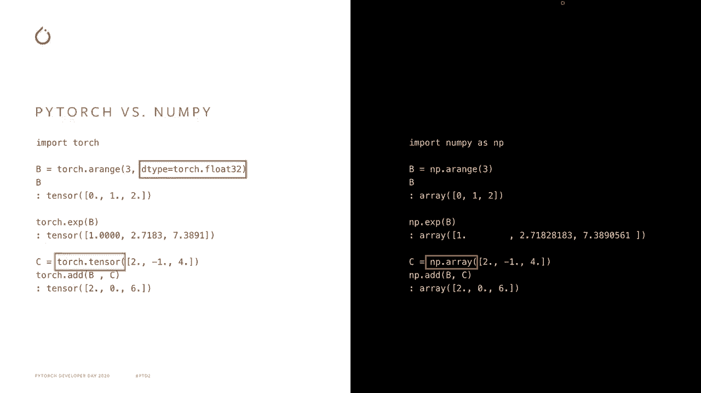

# Pytorch 进阶学习讲座！14位Facebook工程师带你解锁 PyTorch 的生产应用与技术细节 ＜官方教程系列＞ - P2：L2- 使 PyTorch 更加“与 NumPy 兼容” 

🎼。

大家好，我是 Mike Ruberry，Facebook 的一名工程师，负责 Pytorrch。我将谈谈我们如何使 Pytorrch 更加兼容 Numpy。在这次简短的演讲中，将分为三个部分。首先，我将描述 Pytorrch 兼容 Numpy 的意义以及我们的目标。在第二部分，我将谈谈我们在 Pytororch 1 中的许多新操作符和更新的操作符。

使其成为迄今为止最兼容 Numpy 的 Pytorch 版本。在第三部分，我将简要谈谈我们在 Pytorch 1.8 及之后的发展方向。那么让我们开始讨论 Pytorch 兼容 Numpy 的意义。对于那些不知道的人，Numpy 是一个流行的 Python 包，用于处理数组，或者说 Pytorch 所称的张量。

它的 API 是众所周知的，这使得许多首次使用 PyTtororch 的用户感到熟悉。通过使 Pytorch 兼容 Numpy，这意味着它实现了与 Numpy 相同的功能，并且这些功能的行为在 Pytorch 和 Numpy 中几乎相同。这意味着熟悉 Numpy 的人将已经对 Pytorch 感到熟悉。

使其直观易用。这应该让人们花更少的时间查看文档，而更多的时间开发他们的程序。

兼容 Numpy 的 Pyedtort 并不是一个新概念。从一开始，Pyedtort 就被设计成类似于 Numpy，正如这些代码片段所示，这两个包今天非常相似。然而，Pytorch 和 Numpy 之间存在小差异。例如，如前所述，Numpy 所称的，Pytorch 称为张量。

在这个片段中，我们还看到 Pytorch 对数据类型的要求更为明确，要求在调用指数函数之前，指定张量 B 包含浮点值。

现在，我们可能会认为 Numpy 兼容性的目标是消除 Pytorrch 和 Numpy 之间的所有差异。但实际上并非如此。Pytorrch 和 Numpy 之间将始终存在差异，因为它们关注不同的场景。例如，Pytorch 旨在在多个设备上运行，而不仅仅是在 CPU 上。它还可以在 GPU、TU、移动设备和自定义 ASIC 上运行。

Pyitetorch 也旨在运行神经网络。神经网络通常比科学程序以较低的浮点精度运行。最后，Pytorch 旨在支持 autograd，这有其特定的要求。例如，为了正确计算反向传播，Pytorch 必须保存中间计算结果。

在这种情况下，Pytorch 和 Numpy 之间将永远无法完全相同，但我们仍然可以努力使 Pytorch 尽可能类似于 Numpy。

现在，让我们谈谈在 Pytorch 1.7 中是如何做到这一点的，以及为什么这是我们发布过的最兼容 Numpy 的 Pytorch 版本。

这是因为我们添加了许多 Numpy 中存在但 Pytorch 缺失的新运算符，并且更新了一些 Pytorch 中行为与 Numpy 中相应运算符不同的旧运算符。例如，我们添加了一系列与快速傅里叶变换相关的功能。我们还增加了用于计算统计量的新函数，比如 Torcht Quantile。

我们有一些用于操控张量的辅助函数，如 Htac、Vt 和 Dt。我们甚至有第一类的零阶改良贝塞尔函数。我们还更新了一些运算符，比如除法，例如，在 Pytorch 中的除法现在与 Numpy 和 Python 3 中的除法兼容。

总是执行真实除法，而不是有时执行整数除法。😊 总的来说，我们在 Pytorch 1.7 中修改了超过 65 个运算符。

现在，我们的目标是什么？在 Pytorch 1.8 中，我们预计将增加或修改另外 38 个运算符。我们也希望扩展两个新模块。第一个是 Torch dot F of T 模块，包含我之前提到的快速傅里叶功能；第二个是 Torch dot lineal 模块，包含线性代数功能。我们还计划保持与社区的互动。

在撰写本文时，我们有 14 位活跃的社区贡献者。

从那时起，我们已经添加了几个新功能。这是一个让你也参与进来的好机会。如果你希望在 Pytorch 中看到 numpy 或 scipy 的某个功能，请通过在我们的 GitHub 上提交问题来告诉我们。如果你想通过贡献一个运算符来参与 Pytorch，请查看相关问题链接以获取更多信息。

再次感谢我们的社区贡献者。这个幻灯片已经过时，这很遗憾。但与我们出色的 Pytorch 社区合作，使 Pytorch 更加兼容 Numpy，最终让它更易于使用，这是一次很棒的经历。

所以再次感谢截至今年十月所有活跃贡献者的帮助和支持。🎼感谢你倾听这次关于我们如何使 Pytorch 更加兼容 Numpy 的演讲。
