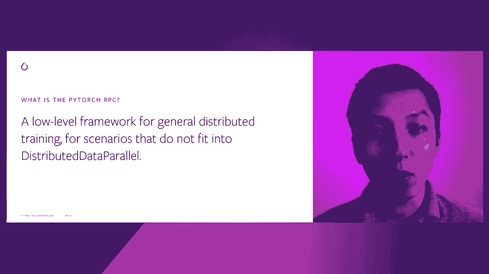
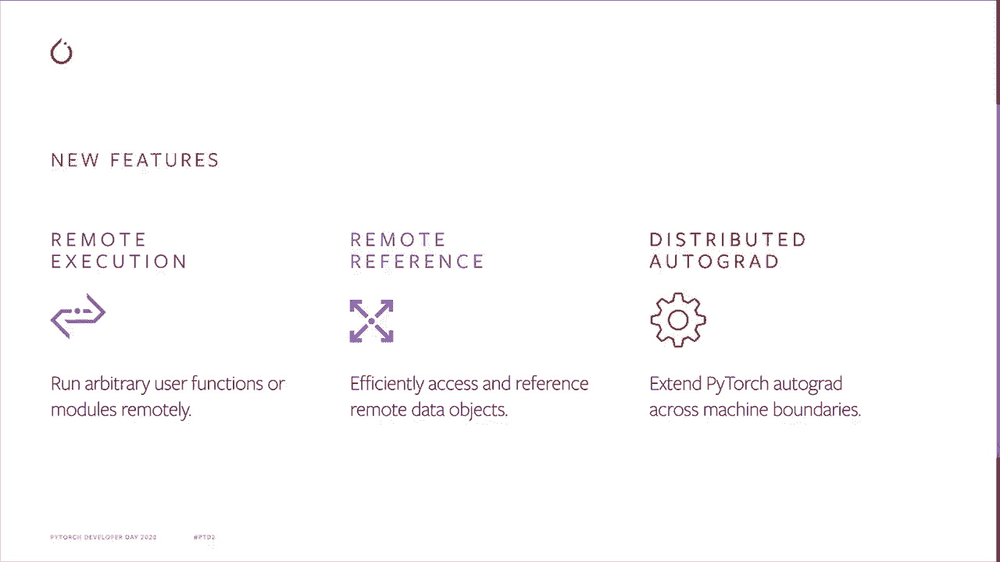

# Pytorch 进阶学习讲座！14位Facebook工程师带你解锁 PyTorch 的生产应用与技术细节 ＜官方教程系列＞ - P4：L4- PyTorch 分布式 RPC - ShowMeAI - BV1ZZ4y1U7dg

🎼。

大家好，我叫沈丽。我是P团队的研究科学家。今天，我将讨论Py分布式包，并重点讲解RPC。这是我们今年引入的新特性。我将首先简要解释什么是RPC，然后介绍一些基本的RPC API。之后。

我将介绍如何使用RPC实现不同训练应用的高级思路。

好的，那么什么是PyRPC？PyRPC是一个通用分布式训练的低级框架。在此之前，分布式数据并行（DDP）一直是PyTorch为分布式训练提供的主要特性。然而，DDP是一种特定的训练范式，每个进程都有模型的完整副本，并将输入分配到多个进程。这种方式适用于许多应用。

但是，还有许多其他应用不适用于DDP。例如，如果你的模型太大，无法放入一台机器中，你将需要多机模型并行。这与数据并行不兼容。你需要手动在进程间发送中间输出和参数，并在应用代码中恢复所有必需的内容，这可能变得非常复杂。另一个例子是，有时我们需要将参数服务器与数据并行结合使用。

对于稀疏传感器使用参数服务器，对于密集传感器使用数据并行。仅用DDP无法轻松实现这一点。解决这个问题的一种选择是为每种用例添加不同的特性。然而，如果我们这样做，将会创建一个庞大的API表面，这可能会成为用户上手的障碍。同时，也会增加编写和维护的工程开销。

此外，我们无法完全预测未来可能会出现哪些新的训练范式。另一种选择是提供一组灵活的低级工具，允许用户进行即兴创作。所以这里推出了PyRPC。我们希望它能够填补那些无法使用DDP的分布式训练应用的空白。

如果有新的分布式训练范式被广泛采用，我们总是可以选择为其引入一个专用的高级API。

现在我们知道为什么要引入RPC。那么，RPC提供了什么特性呢？在1.7版本中，IP RPC包中已经有一长串特性。但我今天的讲座只会关注最基本的部分。第一个是远程执行。这允许你在特定的远程进程上运行用户函数。

这正是你期望从任何 RPC 系统中获得的。第二个是远程引用，允许你引用远程对象并传递它。使用远程执行而不传输实际数据。它充当离散的共享指针。第三个是分布式自动梯度。它将远程执行的本地自动梯度图拼接成一个分布式自动图。

这样，当你在一个进程中对损失张量调用 backward 时，它会联系所有参与的进程和机器，并相应地计算梯度。

这是一个非常高层次的解释。现在让我们深入了解更多细节。远程执行。它允许在远程运行可调用对象。在 Part sharp C 中，所有进程都是的。任何进程既可以是颜色也可以是协调者。在通过调用 RRPC 初始化后，任何进程都会在后台运行消息监听器，并使用线程池处理请求和响应。

此后，有三种方法可以远程运行可调用对象。RRPC 同步、RCA 异步和远程。RRPC S 以同步方式滚动 R PCC。它将阻塞，直到返回值在颜色上可用。另一方面，RBC ASync 立即返回结果的未来对象。第三个 API 是远程，也立即返回，但不是返回未来对象。

它返回一个远程引用，可以视为结果的离散共享指针。R PCC 异步和远程之间的区别在于，前者总是将结果取回到颜色。但是远程 API 并不这样做。远程引用将使结果在调用期间保持活跃。本页中的代码展示了如何将不同类型的可调用对象传递给 A R PCC API。

它可以是 Pythtch 构建的操作符，也可以是用户定义的 Python 函数或脚本函数。如果性能是一个问题，请使用脚本函数，因为这不会对全局解释器锁产生竞争，这意味着不同的 IP PCC 可以在调用上并发运行。远程引用。

远程引用就像一个分布式共享指针。它指向本地或远程进程中的一个对象，并将通过引用计数管理数据对象的生命周期。当一个调用希望将输出直接转发到另一个进程并避免将实际数据取回时，这非常有用。在这个例子中，worker Ze 充当协调者进程。

它在四个其他进程之间建立数据依赖关系，并且没有实际数据对象经过 W0。白色虚线箭头是轻量级的 R PCC 远程调用，而粗红色箭头是重量级的数据模式。我们来看一个远程调用，从 W0 到 W3。参数 R 和 RB 是来自 W1W2 的输出的远程引用，当在 RPRPC API 中使用 R 和 RB 作为参数时。

RRPC系统将自动在W3上分叉R和RB，并相应增加引用计数。在W3上，从W1和W2获取真实数据的成本为2，这将阻塞直到在W3中收到数据。通过这种方式，远程引用允许WDro在分布式环境中异步高效地设置功能执行和数据依赖。

远程执行和远程引用帮助应用程序在进程和机器之间拼接前向路径。Pytorch中的另一个重要组成部分是自动微分系统，它支持反向路径。RPC框架扩展了本地自动微分引擎，使其能够在分布式环境中工作，并提供分布式优化以更新应用程序中涉及的所有参数。

本地自动微分和分布式自动微分之间的一个区别在于，分布式自动微分引擎将梯度存储在专用上下文中，而不是存储在peri dotgrad字段中。对于同一组参数，可以同时存在多个自动微分上下文。这样设计的原因是，可能会有多个并发反向传递显示相同的参数，而在这种情况下。

我们需要确保这些反向传递不会相互干扰。因此，为了使用分布式自动微分，你需要首先创建上下文。在该上下文中创建的所有RPC将携带上下文信息，这将帮助调用者和同事在反向路径中找到彼此。

在右侧的这个工具示例中，它首先使用两个远程调用来创建两个千米，并使用千米远程引用列表初始化分布式优化。之后，它通过简单地从所有者获取参数并将它们相加来运行前向传递。

然后它将损失张量输入到分布式自动微分反向函数中。该函数计算分布式自动微分图中所有参数的梯度，并将梯度存储在上下文中。最后，我们可以将上下文ID传递给分布式优化步骤函数。该函数将联系所有参数的所有者，从上下文中检索相应的梯度，并使用提供的本地优化更新参数。

在这种情况下，它是STGD。如你所见，分布式训练的API与本地训练非常相似，唯一的区别是你需要为其创建一个上下文。

鉴于所有这些新工具，你能用它们做些什么？

这解锁了许多在Pythtorch上离散的训练场景，我将简要描述其中三个。第一个是参数服务器，你可以有一个参数服务器，或者多个分片的peri服务持有参数，然后可以有多个训练者运行训练集成。

R PC框架可以帮助将它们连接在一起。另一个例子是分布式模型并行。在这种情况下，模型可能无法适应一台机器。在这种情况下，你可以将模型分割成多个子模块，并使用RPC和RF将它们拼接在一起。第三个例子是管道并行。你可以使用R PCC中的异步API来处理一个批次，然后在多个批次上同时运行干预。

这些用例都有教程可用。好吧，这就是关于Python Sha PCC的非常简短的介绍。在这个讲座中，我希望确保至少向你传达一个信息，那就是，如果DDP不足以满足你的用例，请尝试P tryC。我们有很多教程。

我们还有一个全面的API页面。我们每天都在积极监控数据问题和论坛关于RPC的提问。所以如果你遇到任何问题，请告诉我们，如果Pyth RRPC有任何改进的空间，也请告知我们。

