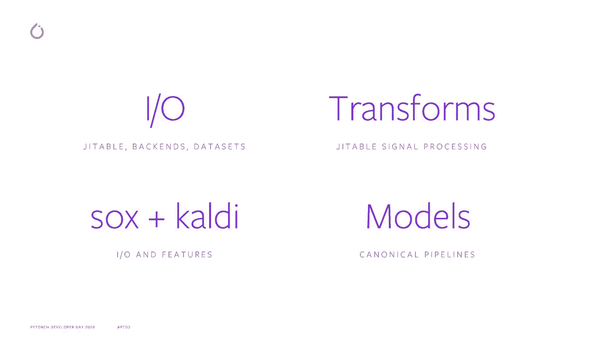
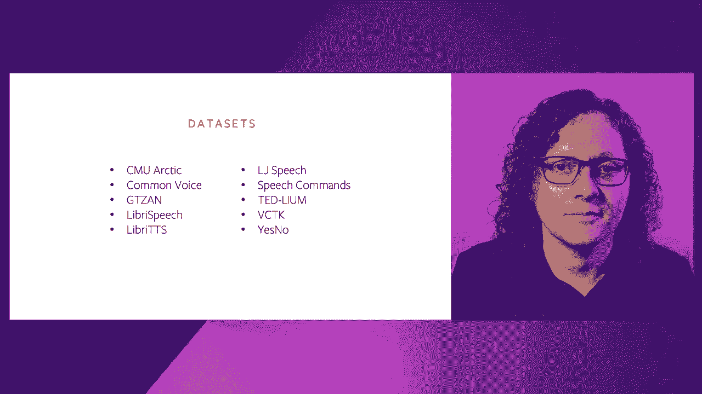
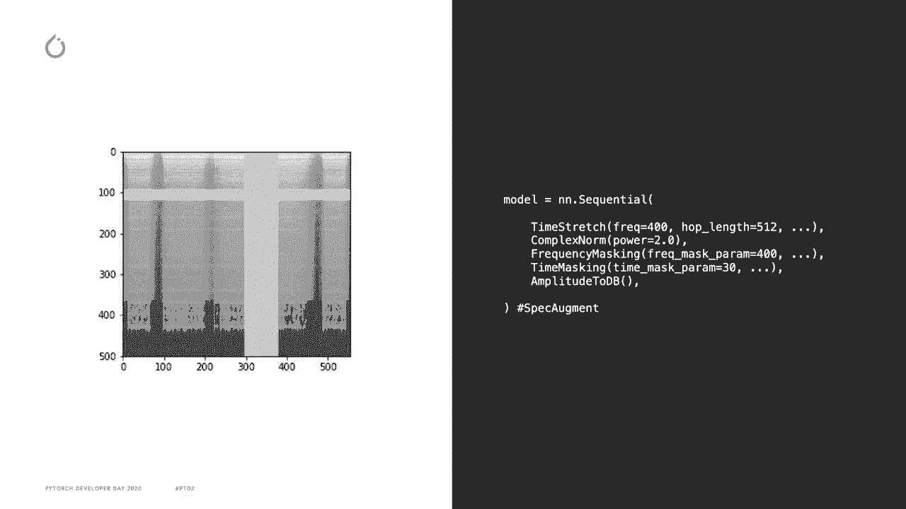
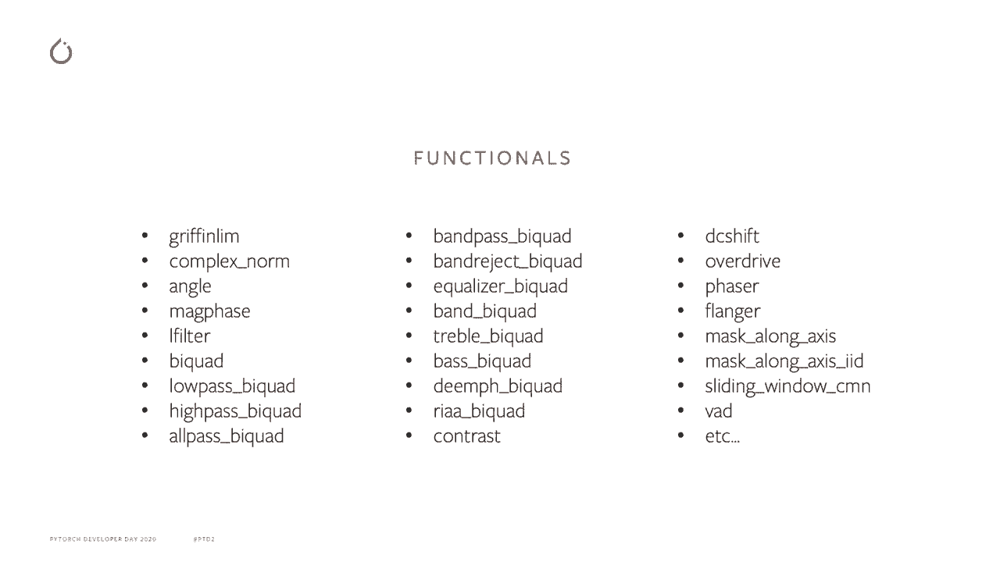
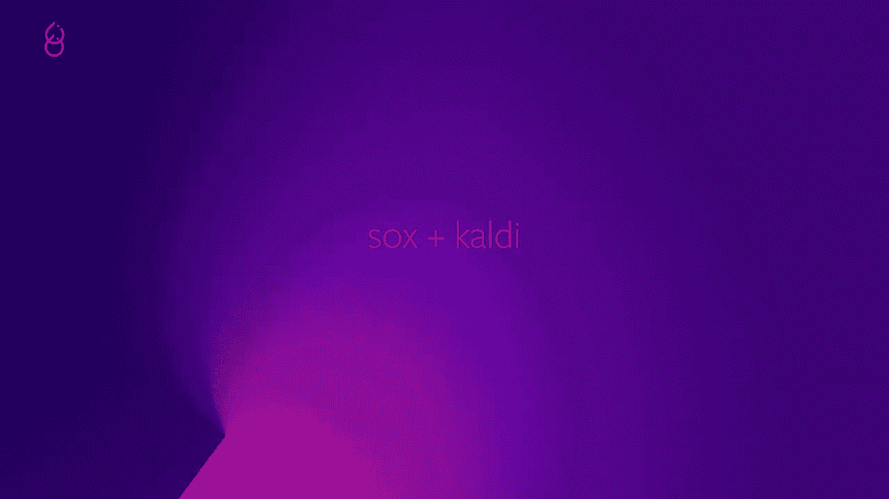
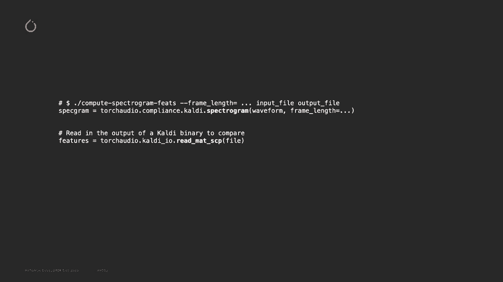
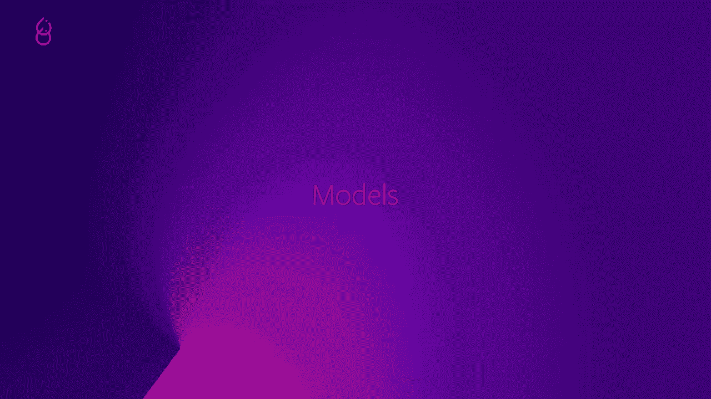
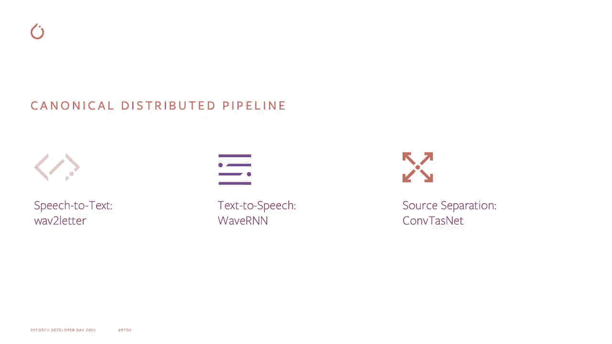
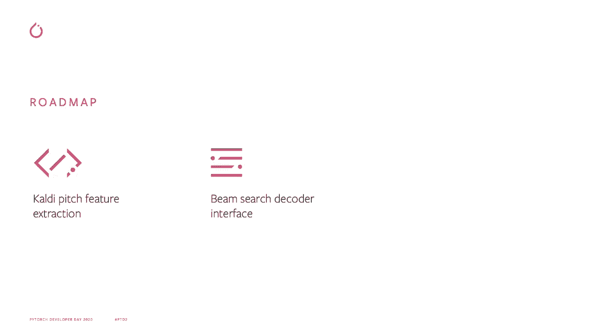

# Pytorch 进阶学习讲座！14位Facebook工程师带你解锁 PyTorch 的生产应用与技术细节 ＜官方教程系列＞ - P6：L6- TorchAudio - ShowMeAI - BV1ZZ4y1U7dg

🎼。

大家好，我是Vincent Kenville Bellair，我是Tordu的技术负责人。这就是我今天要谈论的内容。Torruio的目标是为其他研究人员和工程师提供构建模块，使他们能够将研究带入生产。

通过这种方式，Tortrivio 可以加速其他开源生态系统库的开发。Toorodo 是围绕以下核心功能构建的。第一个功能是IO，用于从各种文件格式（如MP3、wave、FL和SP）读取和保存张量。我们还可以下载并使用常见的音频数据集，样本在使用torch多进程工作时并行加载。

第二个功能是用于音频和信号处理的变换，例如谱图和FCC。变换作为Tor2 dot transforms中的神经网络模块提供。由于变换是使用纯Pytorch操作编写的，因此计算可以在GPU上进行，并可以使用Trchcr进行编译。

第三个是Sox和Cdi兼容性。Sox和Cdi是用C++为Sox编写的音频处理库。我们提供接口以使用它们的变换进行CAdi的操作，支持读取和写入CAdi二进制文件，以及提供与谱图、Ns NF bank等同等功能。

最终的功能是模型的分发，以及用于主要任务的分布式训练的标准示例管道。

如我所说，第一个功能集围绕IO展开。

这是一个使用双重编码和变换的小片段。波形变量是一个张量，它是从文件中读取的，文件的相应采样率作为标量读取。变换谱图的输入参数用来配置其行为。然后将输入张量传递过去，计算得到谱图张量作为输出。

我想强调的特别之处在于，变换不仅是标准的torch模块，因此可以使用Jit进行编译，而加载函数使用torch minings，因此也可以在支持Git的地方编译和移植。目标是使整个管道能够轻松在生产中使用Jit。😊。

我们支持针对不同任务的多个数据集，例如用于语音识别的库语音和用于文本到语音的库TTS。

我提到的下一个功能集是变换，正如我之前所说，它们是用纯Pytorch编写的，因此支持批处理、torch grip和GPU。这里是另一个例子，由于每个变换都是一个torch模块，因此它们可以组合在一个标准的顺序包装器中，以方便数据增强。

在这里，我们获取一个声谱图，应用随机时间拉伸，计算复数范数，应用随机频率掩蔽和随机时间掩蔽，然后将幅度转换为分贝。频率掩蔽和时间掩蔽是声学信号处理的一部分，这就是我在图像中展示的内容。一段频率和另一段时间被随机掩蔽。

代码被分为执行计算的功能和一个变换，后者是一个NN模块，包装每个功能并保持其状态。这里我列出了一些我们最近添加的新功能。例如，你可以看到用于频率和时间掩蔽的maone轴。我们还有几个在信号处理或语音执行检测操作中使用的双通道滤波器，以检测语音。

下一个功能是与socks和qualitydi的接口。

对于suck，我们提供了一种直接在Pytorrch中以torchscriptable方式使用其效率加操作的方法。例如，这里我正在对Pytorrch张量直接应用增益、速度、速率变化、填充和修剪的效果。对于CAdi，Torrode为Torrodo转换提供了一个包装器，模拟提供给CAdi二进制文件的标志。

你还可以通过Torrojiio读取Arc和SCP文件，以便CAdi的处理输出可以在你的Torrod程序中使用。CAdi在Aio社区中使用非常广泛，因此我们希望简化与它的接口。

我想谈论的最终功能集是库中模型的添加。

对于语音识别，我们添加了一个使用Lib语音数据集和Wa到字母模型的语音识别训练示例管道。对于文本到语音，我们添加了基于WaR&N模型的vcoder，以及在示例文件夹中使用Libris TTS数据集的示例训练管道。对于源分离，我们添加了COVtizedNe模型和一个使用华尔街日报混合数据集的示例训练管道。

在结束之前，我想强调几个在我们路线图上的功能。

首先，由于社区的需求，我们希望包含质量音调特征提取。其次，我们有兴趣包括一个波束涌现解码器接口，这对语音识别应用尤其有用。最后，用户请求的另一个损失是添加RNN转导损失。

要使用和了解 Pytorch，你可以访问 [Pytorch](https://pytorch.org/udio)。它包含关于 API 的文档、安装说明、教程以及链接到 GitHub 页面。我们还有一个新的语音命令识别教程，玩得开心！Torchd 兼容 Linux、Mac OS、Windows，并支持 Python 3。

6 及以上，就像 Pytororch 一样。

感谢观看。
