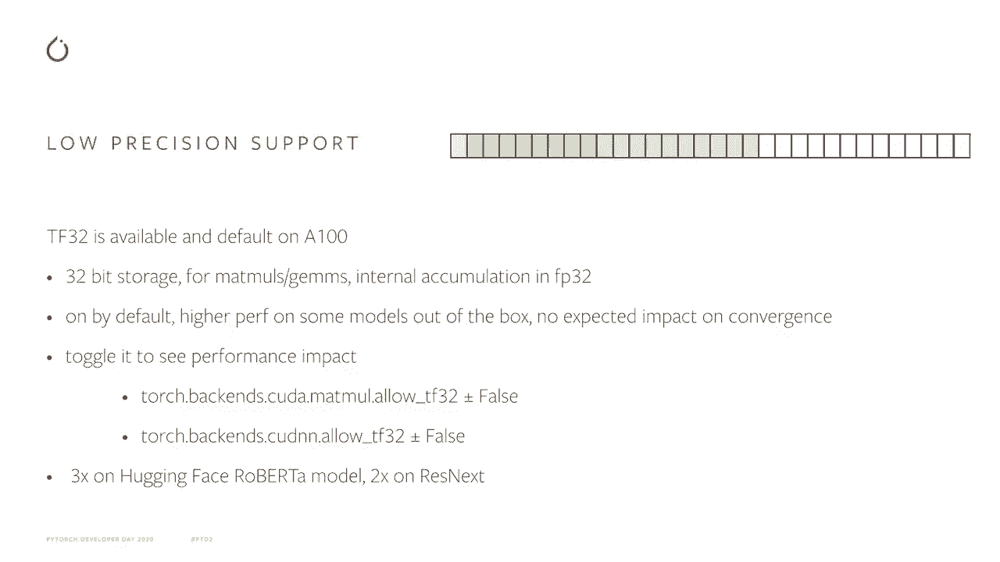
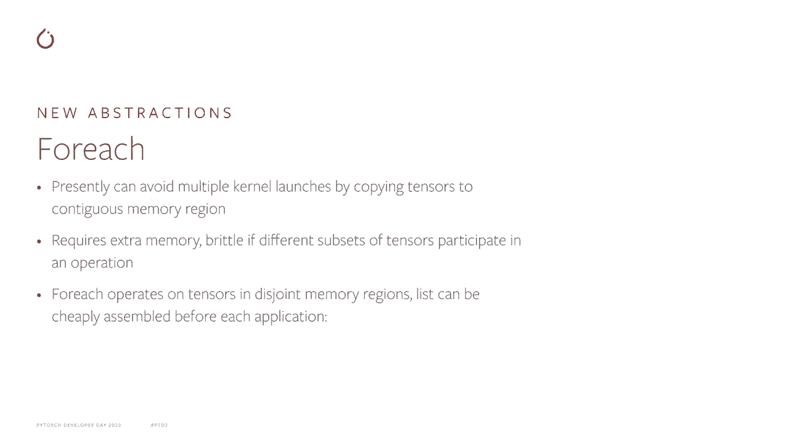
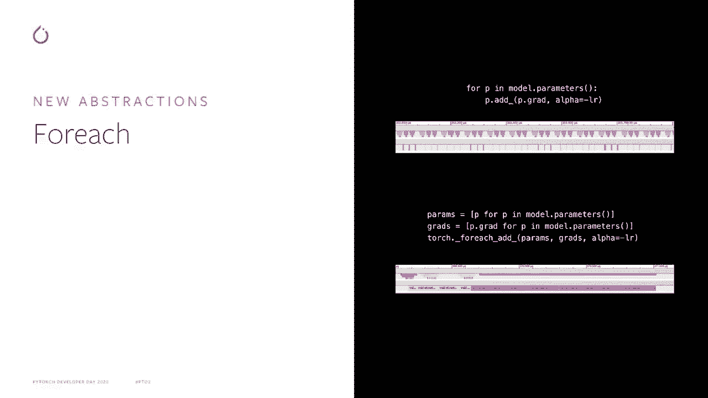
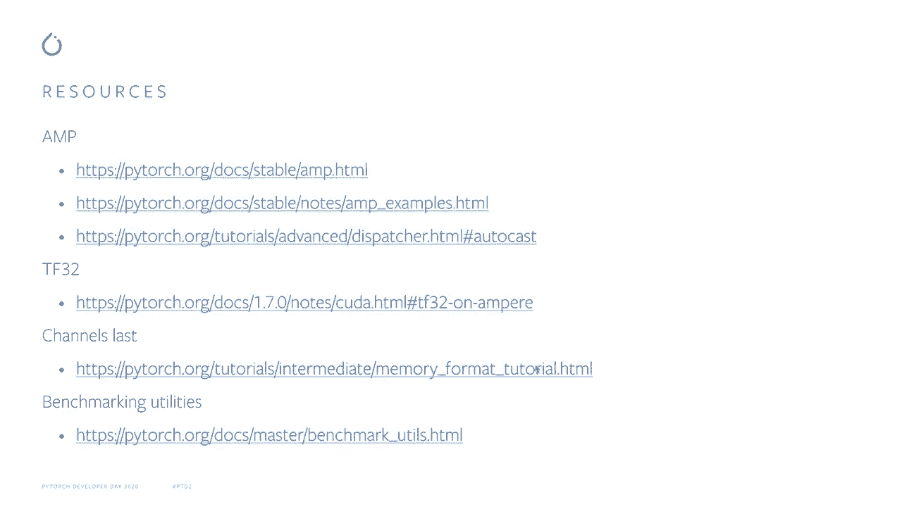

# Pytorch 进阶学习讲座！P11：L11- PyTorch 性能 

🎼。

你好，我是 Naal Gahan，是 Facebook 的应用研究科学家，我在 Pytorch 性能方面工作。今天我将讨论低精度支持和我们在 Pytorch 中实施的新性能改进及操作基准测试。因此，低精度支持。😊。

在现代硬件上，你可以牺牲一些精度，以获得显著更好的性能。Pytorch 使得处理低精度数据类型变得简单方便，并支持量化，但这在其他地方有详细介绍。我将主要讨论 T32 和 FP16 数据类型，而 FP16 在 CPU 和 GPU 的无方向开发上已经得到了支持。

右侧的图表显示了相应数据类型的内存表示，绿色框是指数位，红色框是有效位。😊你可以看到 FP16 可以用八个指数位表示广泛的动态范围，其动态范围与标准 FP32 数据类型相同，但只有 7 个有效位的有限精度。FP16 则作出了相反的权衡，具有有限的动态范围和更好的精度，而 T32 则兼具两者的优点。

它的动态范围与标准 FP32 数据类型相同，但与 FP16 一样有许多有效位。T32 在新的 MPR GPU 上启用，支持 32 位存储，因此标准网络在计算密集型操作读取输入数据时可以透明地受益，只读取 10 位有效位，因此存在一些精度问题。

然而，内部累积发生在 FP32 中，因此我们不期望转换会受到影响。你可以开启和关闭 T32，以观察其对性能和转换的影响，使用下面的评论与基准测试，Hi face Roberta 模型大约提高了 3 倍的速度，而在 ResNet 等较低复杂度的模型中则提高了大约 2 倍，相比于同一硬件上的 FP32 性能。

TF32 开箱即用，无需对现有脚本进行修改，这非常好。然而，如果你愿意稍微调整现有脚本，以实现更好的性能，FP16 将会很有用。自动混合精度现在在 Pytorch 中得到支持，该功能源自由 NVIDIA 维护的流行 ABIX 包。

🤢它自动化训练 FP16 网络，并处理由于 FP16 训练中的有限动态范围而产生的数值问题。Pytorch 旨在覆盖广泛的用例，支持对无偏梯度的操作，支持对稀疏梯度的操作。更高阶的自动梯度可以通过 Torch 的 autograd 计算，支持自定义 autograd 函数。

如果你有涉及多个模型和多个损失的复杂脚本，Python和C++路径都被支持。同时，示例和文档可在Pytor的网站上找到。

这是一个使用amp的简单示例。有两个重要部分。第一个是控制所有缩放的标量对象，第二个是M Autotocast上下文管理器，所有缩放都是为了确保转换和数值稳定性，Autocast上下文管理器确保mods和卷积以FP16运行，从而在进行需要全精度的操作时以FP32运行，达到最佳性能。

最后，调用优化器步骤的语法稍有不同，你还必须更新下一次迭代的低缩放，如这个代码片段所示。但总体来说，所需的代码更改非常少，你应该能够实现比TF32更好的性能。如果P16在所有的GPU（如Volta）上都得到支持。

现在让我们转到下一个主题，即在许多后端和数据类型中，通道丢失。例如，T32和我们刚刚讨论的FP16，当数据以通道丢失格式时，卷积性能最佳。Pyr支持通道丢失的物理内存格式，同时保留维度的传统语义意义，例如对于四个维度，我们的第一个维度仍然是批次元素的数量，第二个维度是通道，其余是空间维度。

为了充分利用通道SA支持，模型中的所有或大多数操作必须支持通道SA，而Pytor中大多数操作都支持。例如，在TorchVision中，一个流行的模型就是涵盖的。

这里有一个小示例，展示了如何通过调用辅助函数将模型转换为通道Los格式。输入也必须是通道Los格式，因此你必须修改数据加载，以直接提供通道丢失的输入，或在脚本中手动对输入调用转换函数。

输入布局在大多数操作中被传播，因此网络中的中间变量将保持通道快速。复制和张量工厂操作也保持布局，如这里的示例操作所示。类似于张量工厂的操作也会逐点保留其输入的布局，而复制操作也会以与输入相同的格式生成输出。对于卷积网络，你可以预期通过切换到通道成本获得约20%的收益。

我们在Pythr forage APIs中实现的另一个有趣特性是提供了对批量张量的高效逐点操作。与其为批量中的每个张量启动一个小内核，不如为每个张量启动几个较大的内核，每个内核处理多个张量。这种模式在优化器中尤其常见且有用。

即使现在，如果您将张量复制到连续的内存区域，然后直接在该连续内存区域上进行操作，您也可以避免启动多个内核。但这需要额外的内存，并且如果每次操作的张量子集不同，可能会变得脆弱，因为每个操作直接在不相交的内存区域上进行，并且可以在每次应用前廉价地组装列表。

这里是比较在循环中对张量批次和forage操作的时间线。循环的GPU时间线显示在底部行。您可以看到这里的GPU大部分时间处于闲置状态，内核非常短，但大多数情况下是在内核之间的空闲时间。CPU则不断忙于启动这些小内核。

相比之下，当我们使用4H APIs进行相同的操作时，GPU总是处于忙碌状态，并运行相对较大的内核。CPU一开始在提交这些内核时忙碌，但随后在其余时间内处于闲置状态，而上方的时间线仅显示处理的少量张量，在下方的时间线中，在相同的时间内处理了几百个张量。

Poche 107使用forage APIs实现了通用优化器，能够实现约从3到6倍甚至更大的加速，具体取决于网络中的参数数量。forage也易于使用，可以实现您自己的优化器，或者如果您网络中的模式需要对不规则批次的张量进行操作。

所以，试试看，将您的优化器替换为基于forage的，并查看它是否能改善性能。最后，让我们谈谈基准测试工具。Pytorch基准测试工具是针对Pytorarch用户和开发者的。当然，您也可以自己开发基准测试工具，但这需要处理一些问题。您希望基准测试运行足够长的时间，以获得可靠的时间和测量结果。

但您不希望它们永远运行，您需要收集统计数据以估计测量中的噪声。您需要确保您比较的是同类项，所有同步调用都已执行，且CPU上的多线程得到了适当控制。

如果你是一名开发者，正在为 Pytorach 开发新操作，或者在处理现有操作，你需要确保在各种输入大小下性能良好，而不仅仅是针对某一特定输入大小进行超优化。完成所有基准测试后，你可能会面对一大堆难以分析和表示的数字，因此你需要一些后处理数据的方法。我们的基准测试工具使所有这些事情变得简单。这个代码片段展示了如何使用计时器和比较 API 来比较性能。

对于两种相似的 pytharch 操作，如 take 和 gather，针对不同数据类型的计时器 API 是基于 Python 的时间模型，因此它们应该显得很熟悉。它们还提供了一些附加选项，可以包含元数据，以便后续分析更为简便，幻灯片左侧显示了该脚本的输出，时间以表格形式展示。

我们希望你会觉得我们的基准测试工具很方便。

这里是一些资源，你可以用来获取更多关于我提到的话题的信息。

感谢你的聆听，希望能在 Pyr 的性能讨论中见到你。
