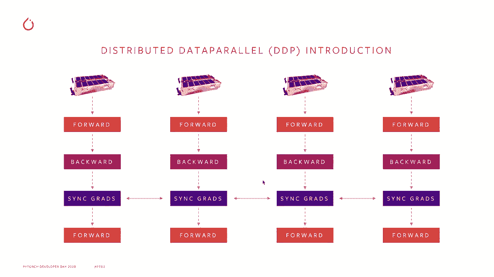

# Pytorch 进阶学习讲座！P5：L5- PyTorch 分布式数据并行 (DDP) 

🎼。

大家好，我是Priam themania，我是Facebook的一名软件工程师，正在研究Pythtos Dis，但今天我将详细讲讲Pyths Dis。关于议程，我会谈谈分布式数据并行，简称DP，以及CTND，这是一种分布式通信库。然后我会讨论一下PythOs分布式的未来工作。

首先，让我们快速回顾一下分布式数据并行。如果你有一个足够小的模型可以适应单个GPU，你会使用分布式数据并行在大规模的数据和多个GPU上进行训练。你会在多个GPU上复制这个模型。

运行前向和后向传播并行处理，得到梯度后，所有的rank会进入一个同步梯度操作，以聚合所有的梯度。接着，你会继续其他迭代，进行更多的前向和后向传播以及同步梯度操作。

这只是一个快速概述，现在让我们谈谈未来的改进，DP的一些新进展。第一个是DP通信钩子。这个功能允许你完全覆盖我刚才提到的同步梯度操作，因此你可以注册一个Python可调用对象，然后根据你想要如何聚合梯度来添加任意逻辑。这里有一个例子，如果你想在通信之前对梯度进行FP16压缩，你可以有这样的一个可调用对象，首先压缩梯度，将其转换为float 16，进行全局归约，最后再解压回float 32。这是一个例子，你还可以做更复杂的事情，比如gossip gridd，这是一种非全同步的SD算法。

好的，下一个项目是DP对不均匀输入的支持，所以如果你在不同的rank中有不均匀数量的批次。通常发生的情况是，一些已经完成其数据的rank不会进入这个同步梯度调用，而其他仍在处理数据的rank则会进入这个调用，结果会导致挂起或某种超时。因此，这在DP中一直是一个长期存在的问题，许多Pythto用户对此表示不满，现在我们对此有了修复，你可以使用这个在这里显示的模型或联合上下文包装器。这确保了一旦某些rank完成了数据处理，它们会执行一系列虚假的同步操作，以匹配仍在处理数据的其他rank，这确保所有rank能够同时完成他们的处理，这真是太好了。

这是处理训练中不均匀输入的一种方法。然后我们有一些针对DP的内存优化，因此今天的DP会创建一堆桶，将参数批处理在一起以进行一次更高效的全归约调用，但DP所做的是为这些桶创建整个梯度的副本，因此如果你有一个一GB的模型，你将拥有大约一GB的参数。

一GB的梯度，DP会再占用一GB，因为它会创建这些梯度的副本。为了避免这种情况，我们引入了一个新的参数D，称为梯度桶视图，因此这使得你的参数的dot grad字段成为桶的一个视图，这样我们就只拥有一份梯度副本。

接下来我想谈谈将DP与RPpC结合使用，因此在他的演讲中，Shan描述了RPpC框架以及它如何用于分布式模型并行，而DDP用于分布式数据并行，所以现在我们可以将这两个框架结合起来，形成更复杂的训练范式。如你所见，在这个例子中，我们有一个DP模型，这个模型被包装在DP中，因此这个模型被复制，然后我们在worker1上有一些远程参数，所以现在如果你想训练这个模型，你需要在前向传播中设置分布式优化器，你检索RF，通常是通过RPpC来检索的，然后将其输入到DP中，计算损失，然后运行反向传播和优化步骤，这将执行反向传播，它将跨所有副本聚合梯度，然后还会更新远程参数。

它也会远程运行优化器。如你所见，你可以非常顺利地结合这两个框架。

好的，现在我想谈谈 DP 中的动态分桶。DP 会将参数分成多个桶，如我刚才提到的，它假设反向传播的顺序是模型参数的反向顺序。当它构建这些桶时，如果这个顺序不成立，而在许多模型中确实是这样，那么桶就不会以最佳顺序构建，结果可能是桶 2 在桶 1 之前准备好，随后桶 1 需要等待才能调度它的全归约。这会导致性能 suboptimal。为了解决这个问题，DP 现在记录了第一次反向传播中的参数顺序，并以最佳顺序重建桶，这样你就可以更优地调度全归约。因此，在像 B 和 Roberta 这样的模型中，性能提高了大约 3% 到 7%。

然后，最后是一些杂项改进。我们在 niel 中添加了更好的错误处理，通过几个环境变量进行配置。你可以查看文档以获取更多细节。我们在 C&D 中有一个分布式键值存储，主要用于会面和协调，所以我们主要只是规范化了这个 API，并为用户添加了一些好的文档。我们为 CTD 添加了 Windows 支持，我想感谢 Microsoft 的贡献。

那么，现在在 Py 分布式中即将推出的内容是什么呢？这可能是在短期内，比如 Pytch 1.8 或 Pytch 1.9，我们将添加点对点通信支持和进程组以及 C1D。这是基于 nichels 的点对点发送和接收支持。我们还将为 RPpC 框架添加原生 GPU 支持，这样你就可以无缝地通过 RPC 发送和接收 GPU 张量。我们将为分布式模型并行性添加一个远程模块和远程设备类型的 API，因此如果你想将一个模块或模型的一部分放在不同的主机或 GPU 上，你只需使用远程模块来实现，这将是一个不错的高级 API。

我们将为 Pytch 添加管道并行性，这是一种非常流行的训练模型的方法，适用于不能在单个 GPU 上运行的模型。因此，这对于训练更大模型将非常有用。最后，我们将添加 C&D 扩展以支持第三方集体通信库，我想对此表示感谢。感谢 Intel 的贡献。好的，这就是短期的计划。

如果我们考虑更长期的规划，也许是一年之后或更长时间，我们正在考虑在 Pyth 分布式中添加零样式训练框架，以支持真正的大型模型。这是一个非常有趣的范式。

这是由微软提议的，我们正在尝试将其纳入Py分布式，然后计划添加内部并行性，因此这是一种非常有趣的技术，曾被NviDdia的Megatron用于训练大型变换器模型，我们还计划为C1D API添加类似的支持。

所以今天如果你有一个非常复杂的模型，模型内部有一些集体通信，你无法真正对该模型进行处理，因为这对于C1D API来说是不可能的，因此我们计划添加对这一点的支持，此外我们还计划为DDP添加自动调优，因为DDP有许多参数需要手动调优，例如我提到的桶的大小，因此我们计划添加一些自动调优功能，用户不必为特定环境调优DP。

然后我们有一个叫做混合并行性的想法，我们计划确保像管道并行性、模型并行性、数据并行性以及内部并行性能够无缝协作，以便用户可以灵活组合，找出最适合他们的训练范式。

接下来，一旦你有了混合并行性，我们是否可以完全自动化这一过程，用户只需提供模型和训练资源，然后我们就可以找出最适合该模型的混合并行性组合，用户无需担心。

最后，我想分享这页关于Pyth分布式概述的页面。这是一个包含Pyth分布式所有信息的地方。我一定推荐你去查看一下。

🎼这就是我所要说的。非常感谢你们的观看！
