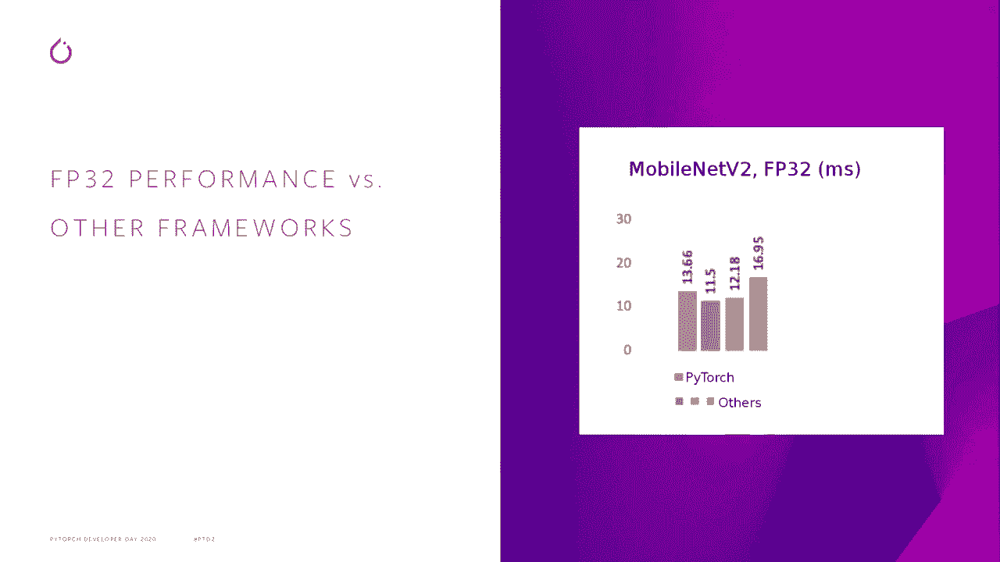
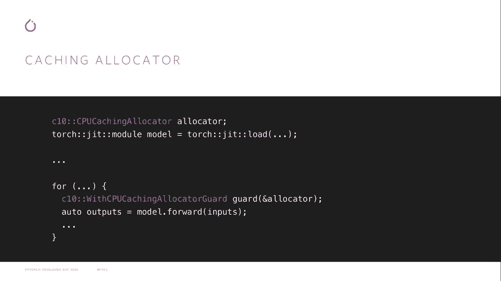

# Pytorch进阶学习讲座！14位Facebook工程师带你解锁PyTorch的生产应用与技术细节 ＜官方教程系列＞ - P13：L13- PyTorch移动版 - ShowMeAI - BV1ZZ4y1U7dg

🎼。

嗨，我是大卫。我是Pytorch的一名工程师，今天我要谈谈我们在过去一年中对Pytorch Mobi所做的一些改进。具体来说，CPU性能的提升，我们对GPU的原型支持，扩展的文档和教程，以及关于移动推理加速器的一些消息。

首先，CPU性能。CPU是手机上最普遍的计算单元。它们也是最灵活的，在某些情况下也是最强大的。因此，CPU性能始终是我们在PyTtorch Mobi上的高优先级！

在过去的一年里，我们做了很多改进。这里是PyTtorch 1.3、PyTtorch Mobi的首次发布和最新发布的Pytororch 1.7之间的比较。作为基准，我们使用了mobileNet V2模型的浮点版本。最初，我们大约在250毫秒内运行此模型，但现在在最新版本中。

我们的速度超过了10倍，在15毫秒内运行此模型。因此，如果你将我们与其他一些移动推理框架进行比较，我们大约处于中间位置，考虑到我们与之比较的其他框架的高质量，我们对此感到相当满意。现在，手机的限制比服务器要多，因此我们不能运行所有花哨的编译器机制，以从模型中获得最佳性能。

你需要进行一些前期准备，以确保你的模型运行得尽可能快。

幸运的是，我们已经能够将所有这些内容打包成一个单一的函数，你可以调用它来获得最佳性能。它被称为**为移动优化**，使用起来非常简单，如你所见，只需从Pytororch导入它。你在模型上运行它，然后将生成的模型保存到磁盘。这将确保你执行诸如将批量归一化操作折叠到先前卷积中的优化。

预打包模型权重以获得最大吞吐量，并运行模型冻结以消除不必要的开销。我们希望在未来将更多优化添加到这个入口点。因此，这涵盖了模型的准备，但在运行模型时，你还可以做一些其他事情来提升性能。

我们最近发布了一个用于内存的缓存分配器。现在，PyTtorch的默认行为，无论是在移动端还是服务器端，都是一旦你完成了张量，它的内存缓冲区就会立即释放回系统分配器，在某些情况下，释放回操作系统，这对于内存效率非常有利。

但是如果你不断重复运行相同的模型，你可能会浪费大量时间快速释放和重新分配这些缓冲区，而缓存分配器则可以让你更明确地控制内存策略。😊使用方式相当简单，你创建这个缓存分配器对象，通常在加载模型时就会创建。

每次你要运行模型时，首先创建这个缓存分配器保护对象，确保你的缓存分配器在推理过程中被积极使用。你只需要这样做，我们观察到使用缓存分配器后性能提升在5%到20%之间。

当然，这会导致在推理运行时内存使用量增加，现在从CPU移动到GPU。

很多人可能知道，GPU在服务器端的机器学习中已经流行了一段时间，但几乎所有的移动设备也都有GPU，它们可以用于加速设备上的推理。在高端手机上，使用强大的GPU可以显著提升性能，但即使在配置较低的设备上，你也能获得其他好处，比如降低功耗和释放CPU以进行其他密集型操作，例如进行视频通话。

例如，今天我们发布了对iOS上使用两种不同API进行GPU推理的原型支持，我们有Metal，这是苹果的高性能低级GPU访问API，而在Android上我们有Vulkan，这是下一代跨平台GPU访问的开放标准。使用这些后端的方式是针对移动设备进行优化。

我们之前介绍的实用函数用于获取最佳性能，你只需传递另一个参数，告诉它你想使用哪个后端，它将为你的模型进行适当的准备。现在，当你运行模型时，还有几个额外的小步骤需要做。这个第一个示例是针对iOS的。当你获取输入张量时。

你需要调用这个`.metal`方法，将其移动到GPU，以便Metal可以访问它。然后在运行完模型后，你需要调用`.CPUU`将结果带回CPU进行进一步处理。如果你在Android上使用Vulkan的C++ API，你会做一些非常相似的事情。但如果你使用我们的Java API，会有更简单的方法。

在加载模型时，你只需传递一个额外的参数，即设备（device），告诉Vulcan模型将在哪个设备上运行，它可以在运行模型时自动处理输入和输出的移动到GPU和回退。现在，从GPU运行所获得的好处会因设备和模型而异，但举个例子，我们发现将ResNet 18模型从我们最佳的CPU实现切换到Metal后，性能提高了33%，在iPhone 11上表现尤为明显。

我今天最期待的发布并不是代码发布，而是我们扩展的文档和教程集。Pytorch移动的首要任务之一是让其易于使用和可访问，我们认为文档是实现这一目标的重要方式。因此，我将介绍一些可用的文档教程，其中一个最有趣的是Pytorch移动性能食谱，这是一个关于性能技巧和窍门的一站式资源，包括如何进行操作符融合和量化。

确保你使用最佳的内存格式。

确保你适当地重用内存。同时，如何设置基准测试，以确保你能够测量你的模型，并验证你从这些优化中获得的收益。我们今天还发布了针对Vulcan和Metal的教程，深入介绍如何正确使用这些API以获取GPU的访问权限。

我们还发布了一些演示应用，展示如何将Pytorch移动集成到应用程序中，这些应用可用于Android和iOS，并涵盖了一系列功能，如图像分割和机器翻译。

我们还发布了一个教程，展示如何在Android应用中使用自定义操作符，这到目前为止有点棘手，因为你必须配置Android NDK以使用外部依赖项。但这个教程将引导你完成这一过程并简化操作，这里有一个使用ROI对齐操作符在这个演示应用中运行更快的RCNN目标检测模型的示例。

我们今天发布的最后一项是让你可以访问移动推理加速器，这些加速器利用在GPU上运行模型的好处，将其提升到一个新的水平，但我将让下一位演讲者来详细介绍这一发布的细节，并留下相关链接以获取更多Pytorch资源。

在官网上，您可以通过手机点击查看我们的首页教程，然后查看我们的深入教程和教程食谱，移动设备将带您到食谱，这些是关于如何使用特定功能的小技巧和窍门。希望您在使用Pytorch移动版时玩得愉快，非常感谢。

