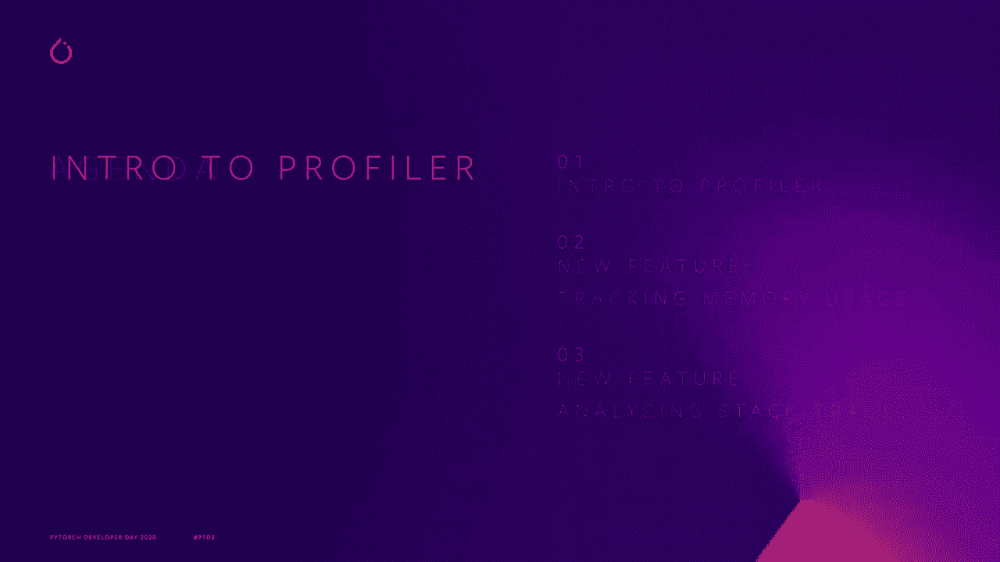
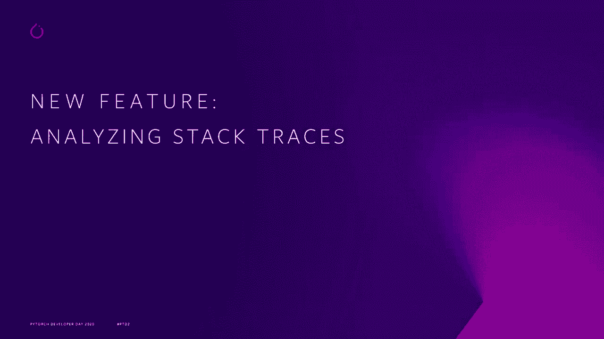
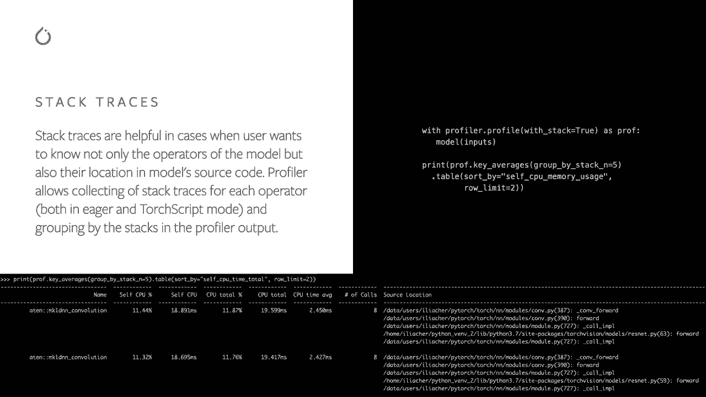

# Pytorch进阶学习讲座！14位Facebook工程师带你解锁PyTorch的生产应用与技术细节 ＜官方教程系列＞ - P9：L9- 最新的Profiler API和最佳实践 - ShowMeAI - BV1ZZ4y1U7dg

🎼。

你好，我叫Ellia，我是一名在Facebook工作的软件工程师，专注于PyOch。在这次演讲中，我将讨论PyTch Pror和我们最近添加的两个新功能。

那么Pytoch Pror是什么？Pytoch包含一个易于使用的工具，允许你测量模型操作符的运行时和其他性能指标。在一个简单的例子中，我们首先开始必要的模块输入，然后创建Gsite 18模型，正如你所看到的，我们在模型推理中。通过Profile Cons管理器。一切都在这个Conx管理器内部被分析，一旦你完成。

你可以打印出结果。在这种情况下，你会看到一个按操作符名称分组的表格，并且有一些关于自我和总CPU时间的指标。Profiler还具有更多功能，例如按操作符输入形状分组，支持CPU和GPU操作符，自定义标签代码范围。

并以Chrome JON格式保存跟踪。例如，如果你想查看操作符的输入形状，只需传递记录形状为真，并按输入形状分组。在这种情况下，我们看到多个操作符，例如卷积，具有不同的输入形状。

所以让我们检查最近添加的内存使用情况功能。除了测量运行时，Pror还可以用来测量模型操作符使用的张量内存量。只需传递Pro内存为真，然后你可以按CPU或Quda内存使用量进行排序。在我们的示例中，我们看到大部分内存被空操作符消耗。

这并不令人惊讶，因为我们使用这个操作符来创建新的张量。此外，Resize操作符也消耗了内存，它用于改变张量的大小。根据总CPU内存列，你可以看到还有其他操作符直接或间接调用空和resize。

但是如果你想知道的不仅是操作符，还有操作符在模型中的位置呢？

堆栈跟踪在这种情况下很有帮助。因此你可以只需传递stack2，然后按顶部和堆栈条目进行分组。在我们的示例中，我们看到有两个顶部Mkelian N卷积操作符。在源位置，我们不仅可以看到torch和M卷积模型内部的位置。

但也有两个不同的煤炭站点在原始Resnet模型脚本中。

如果你想了解更多关于Profilr的内容并查看更多示例，请查看我们网站上的Pror食谱，非常感谢你。

