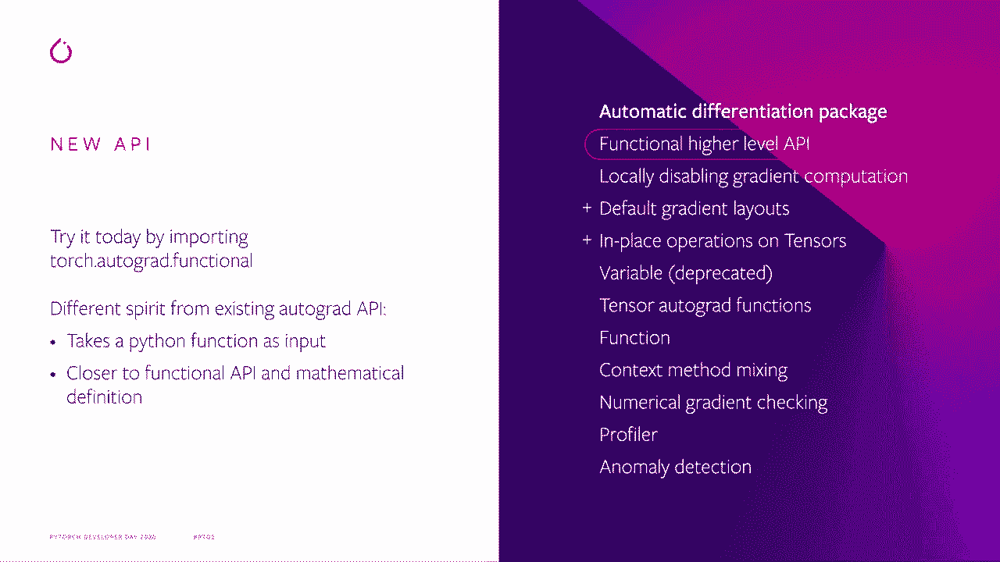
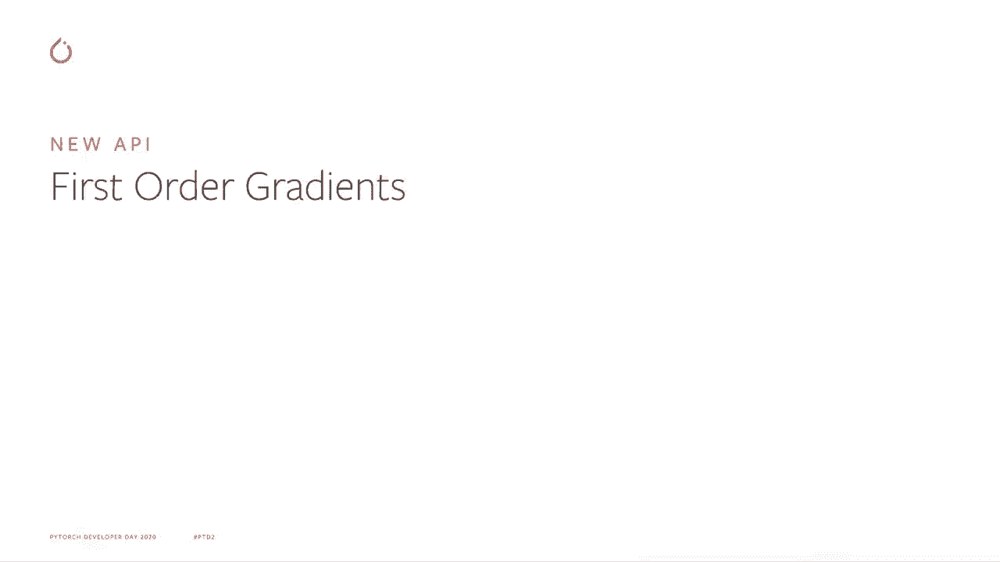
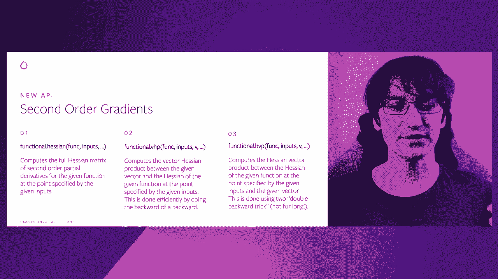
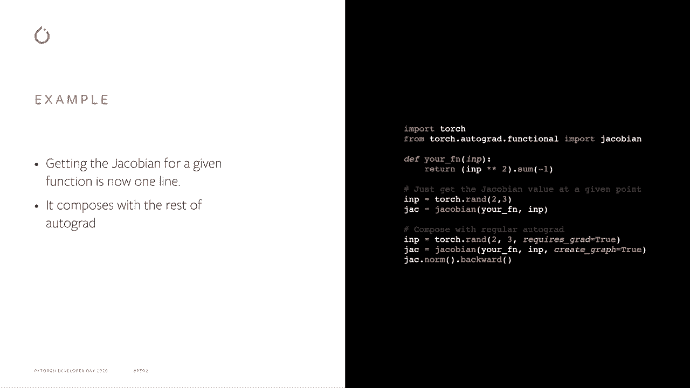
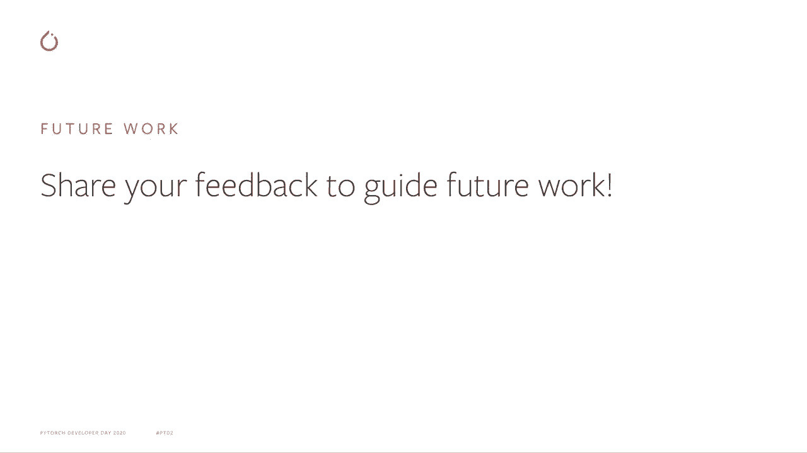

# Pytorch进阶学习讲座！14位Facebook工程师带你解锁PyTorch的生产应用与技术细节＜官方教程系列＞ - P3：L3- Autograd的高级API - ShowMeAI - BV1ZZ4y1U7dg

🎼。

大家好，我的名字是Alban，我是Facebook的一名研究工程师，正在纽约的Pytorch前端团队工作。更具体地说，我在Autograd子系统上工作。所以今天我将与大家讨论我们为Autograd添加的全新高级API。

特别是，我将简要概述这个新API的动机、实际样子以及如何使用，最后介绍一些未来的工作计划！

首先，这个新API的动机是当前的autograd API并不适合所有人。特别是，dot backward函数非常针对Torch和N用户，因为它填充了所有张量的dot grad字段，并且与我们在StN中使用的状态和优化器紧密相关。类似地，autogradgrad则更倾向于神经网络用户，因为它是为反向传播构建的，所有命名和API设计都是如此。

想到神经网络。因此，我们认为，现在有更多的普通用户使用Autograd进行比单纯的神经网络更多的优化。我们需要一个好的通用API，供这些人使用，以满足他们的所有需求。此外。

对于更高级的功能，比如计算雅可比，我将在这里用作许多事情的示例。在Pythtorch中拥有一个参考实现是非常好的。原因是直到最近，如果你想用Spytorch计算雅可比，你需要复制粘贴几年前做的代码。

所以，人们在他们的代码中基本上拥有一个过时的版本g。我们不能真的对计算雅可比的方式进行改进，让每个人自动获得这个新的升级版本。因此，这个新API将帮助我们通过这个通用API为用户带来更多性能改进。

而且，基于这个想法，我们最近还围绕这个API添加了一个完整的基准系统，以确保现有模型和我们用户经常使用的模型具有良好的性能，并且我们也可以通过不同的变化来衡量我们正在做的改进。

但我们也可以测量回归并确保它们不显著，并在它们影响主要发布之前捕捉并修复它们！

那么这个新API在哪里呢？它位于torch.dot.autogra.functional符号下。你可以在autograd文档中找到它，名为功能性高级API。与现有API相比，它具有稍微不同的理念，主要是将函数作为输入，而不是前向传递的结果。

这样做的主要原因有两个，一个是因为它更接近数学公式，且人们习惯于直接对函数进行求导，而不是先进行前向路径再计算梯度。第二，它还使我们在前向传播中对发生的事情有了更多的自由，特别是对于我们计划的一些优化。

在前向传播期间，我们需要做一些特殊的事情，不希望用户担心。因此，这个新API将允许我们非常高效地做到这一点。

那么这个新API包含什么呢？第一大部分是一阶梯度。正如我之前提到的，我们有一个直接为你计算雅可比矩阵的函数，给定一个函数和一些输入点。我们还有一个向量雅可比乘积，它对应于反向模式自动微分，在神经网络领域对应于反向传播算法。

这实际上非常接近现有的autograd dot grad函数。最后，我们还提供了一个雅可比向量乘积。另一种方式，这个对应于前向模式自动微分，可以用于计算方向导数。

这个API的第二个部分对应于二阶梯度以及非常相似的函数。一个计算所有二阶导数的海森矩阵函数。一个向量海森乘积，它使我们能够有效地进行反向模式自动微分，计算海森矩阵与给定向量之间的乘积。

同样，海森向量乘积则更对应于前向模式自动微分。

现在来举一个如何使用DC API的例子。再次作为雅可比函数的例子，现在你不需要从旧的代码中复制粘贴代码，你可以直接从torch导入。正如你在第一个例子中看到的，当你有一些输入时，只需调用雅可比函数，你就能得到雅可比值，这很简单。

这就是你需要做的所有事情。很不错的是，你可以将这个新API与现有的autoquad API组合起来。例如，如果你输入需要梯度，你可以请求雅可比矩阵的计算来创建图形，从而能够反向传播，正如你所看到的，你可以计算刚得到的雅可比矩阵的范数并进行反向传播。

然后你可以将其与训练的其余部分组合，以获得你所需的所有量。还有许多更多的例子，这里的一些例子包括基于雅可比计算的梯度惩罚，以及与前向模式自动微分相对应的雅可比向量积计算。这尤其有趣，因为它们实际上计算高维的方向导数。

这些导数对许多优化算法非常有用。同样，计算海森矩阵或海森向量积的二阶方法使你能够更高效、更简单地执行牛顿步法或近似牛顿步法，而不是使用当前的 Auto RE API。

所以最后谈谈一些未来的工作。第一部分实际上是我们目前正在进行的工作。第一个是针对节点 8，目标是对于雅可比向量和海森向量积，将其替换为实际的前向自动微分。这项工作正在进行中，希望我们能很快发布。

基于此，你可以获得非常好的性能提升。关于这个新 API，有一件有趣的事情是，如果你在其发布时已经使用了这个 API，你将免费享受到这个新前向模式 ID 的好处。同样，你可以获得徽章渐变。因此，这与你听说过的 VMap 功能是一个合作，目的是加速雅可比和海森计算的计算速度。

最后，torch.nN 的可组合性是我们正在研究的另一个主题。原因在于，当前的 NN 模块持有大量状态，并且它们不是功能性的，因此与我们设计的新 API 并不完全兼容。因此，这里的想法是尝试在 Torch 端提供 NN 模块的功能性版本，以便我们能更高效地使用它们。对于长期的工作，我们在寻找想法，请分享你对这些工作的反馈。

它如何帮助你实现你想做的事情。如果你对这里发生的事情有问题或担忧，请在 GitHub 或 Pythtorch 论坛上公开问题。并请帮助我们让 DC API 完全符合你的需求。

🎼非常感谢你们的倾听，祝你们有美好的一天。
