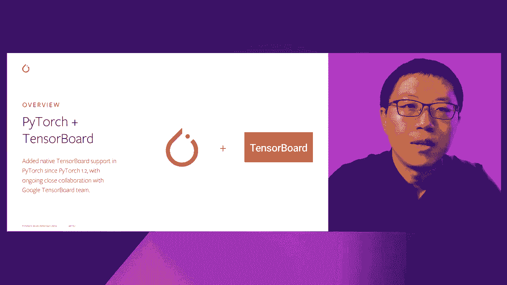
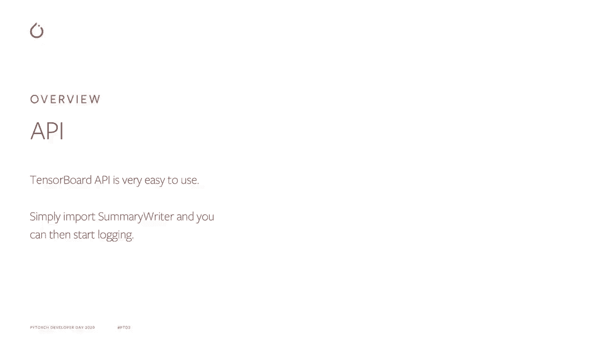
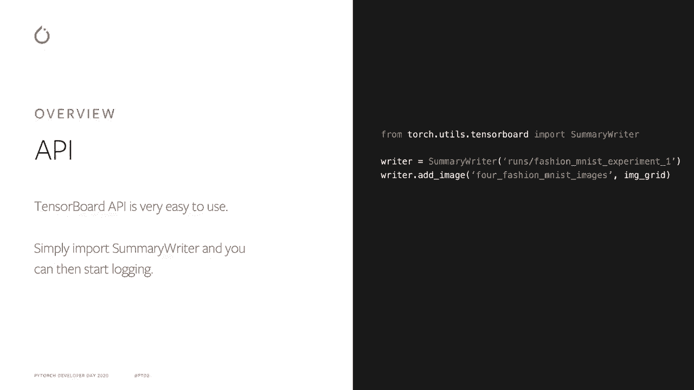
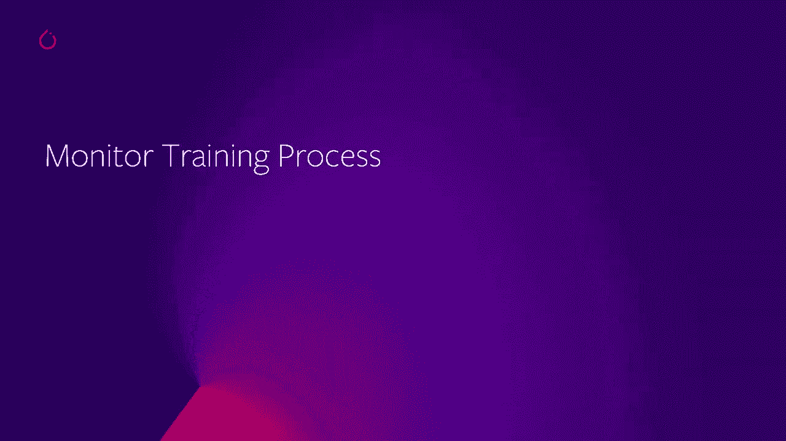
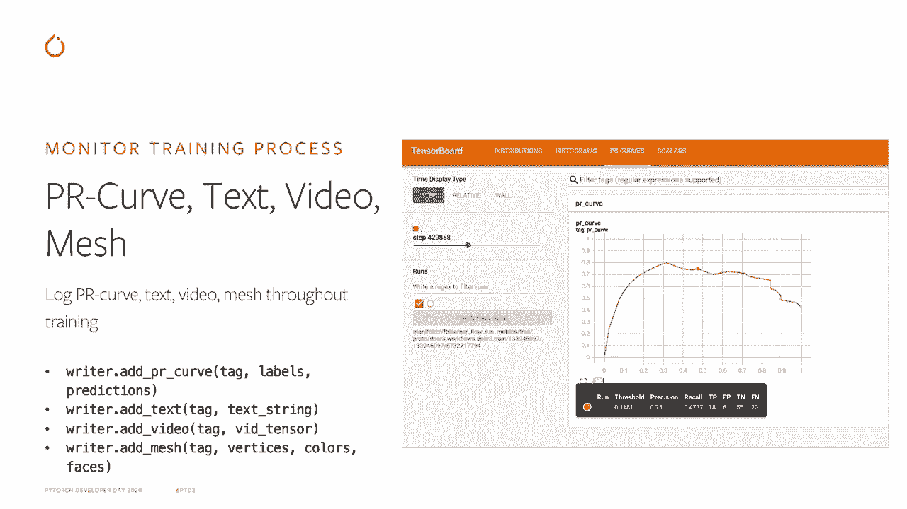
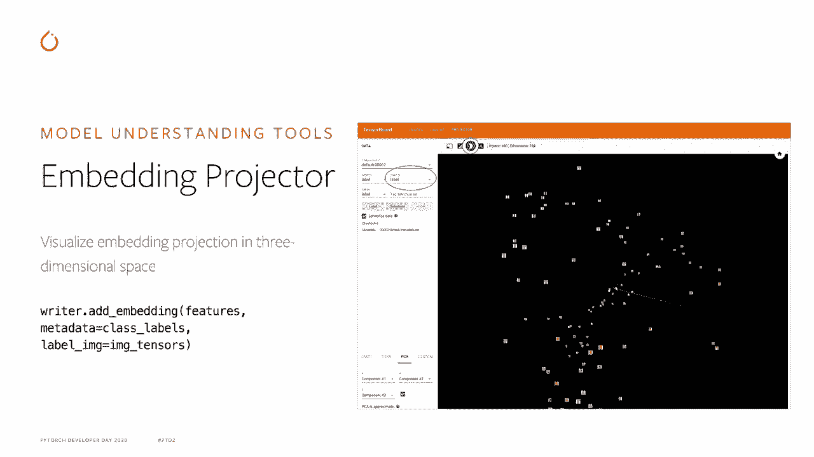
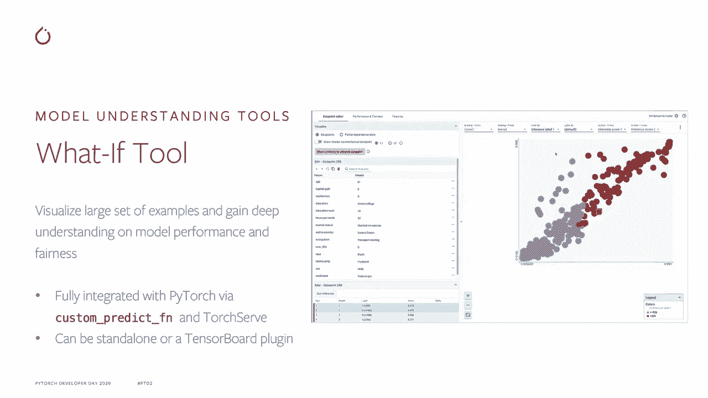

# Pytorch进阶学习讲座！14位Facebook工程师带你解锁PyTorch的生产应用与技术细节P10：L10- 使用TensorBoard进行可视化 

🎼。

大家好，我的名字是Si Chii Yan。我是Facebook Pytorch Model DevX团队的软件工程师。今天我要讲的是如何使用TensorBoard可视化Pytorch模型。以下是我演讲的议程。首先，我将概述Tensable API，然后深入探讨监控训练过程的API，以及模型监控工具的API。

最后，我将简要介绍一些当前正在开发中的功能。

总体来看，自Pytorge 1.2以来，我们已推出对TensorBoard的原生支持，自那时起，我们与Google TensorBoard团队建立了持续的密切关系。因此，Pythtor中的Tensor API非常易于使用。你只需初始化summerwriter并传入表示你想要记录数据的目录的锁定器。

这可以是本地目录或远程目录，比如S3。然后你可以使用像At Scalla这样的API或添加图像来加载你的数据。

最常见的用例是监控训练过程。这包括使用Sca API监控模型学习曲线、QPS或CPU YouTubes在整个训练过程中。

你只需传入标签名和sca值到Add Sca API。你也可以通过使用多线图或边距图API在同一图表中可视化多个Scala系列。直方图API允许我们在训练过程中可视化张量的直方图和分布。这包括模型权重、激活或梯度。

你只需传入标签名和张量值以添加直方图API。然后张量直方图和分布将自动计算并解锁到TensorBoard。图像MPI允许我们可视化图像训练样本或目标检测框，或在训练过程中从Mapllib或Pli生成的图像。例如，人们可以生成散点图或条形图。

通过我的partlib将模型预测值转换为图像并通过图像API记录。Tensible还提供各种其他API，用于记录模型的PR曲线、文本、视频、网格等。

下一部分是关于TensorBoard中的模型和监控工具。

图形插件允许我们可视化模型架构并识别性能瓶颈。你只需传入一个Pythr模型和输入张量。然后模型图将自动生成并解锁到TensorBoard。

嵌入投影插件允许我们在三维空间中可视化嵌入值。

H prime插件允许我们可视化模型参数与模型性能指标之间的关联，从而帮助我们识别最有前景的超参数集合。在这个例子中，我们使用平行的柱状图深入分析一些最有前景的运行，并识别它们在超参数方面的共同特征。What if2允许我们可视化大量示例并按某种方式对其进行分组。

特征值或模型预测值可以帮助深入理解模型在不同细分领域的性能或公平性。它通过自定义预测函数和Torch Serve与Pytorrch完全集成。可以作为独立应用程序或Tensoror插件进行查看。

最后一部分将涵盖我们目前正在开发的一些功能，并计划在不久的将来带入开源社区。

Profiler插件将启用自动模型性能分析和建议。它还将提供每个操作和GPU内核的模型性能详细视图。Ploty插件将使我们能够在板上原生可视化Ploty图形，提供更好和更互动的用户体验。

与通过图像API将其转换为图像和日志相比，警报插件允许我们监控训练过程中的某些模型指标。当这些指标超出或低于某些阈值时，可以自动获取警报。该阈值可以是绝对阈值、导数阈值或比较阈值。

这就结束了我的讲座，想要了解更多关于Pythtor Tensor Board的信息，请访问我们的网站Pythtor.org，并查阅Tensor Board文档和教程。非常感谢您观看这段视频。
