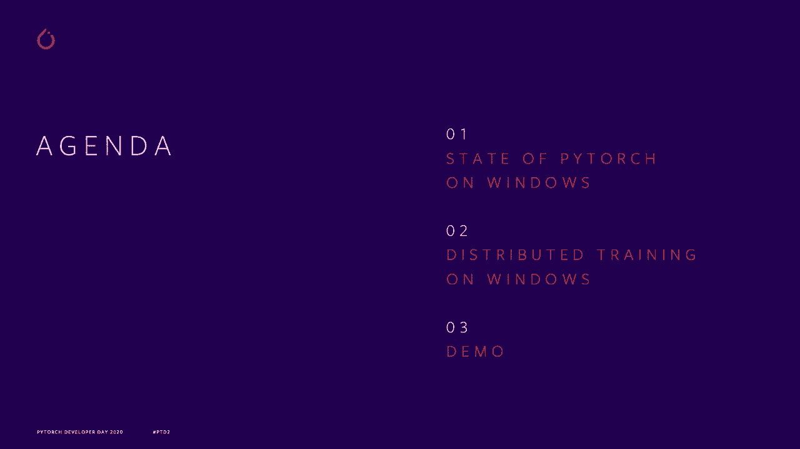
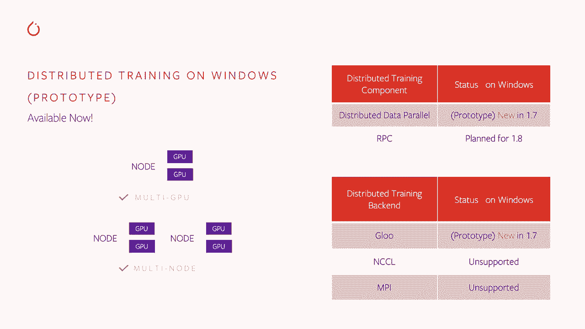
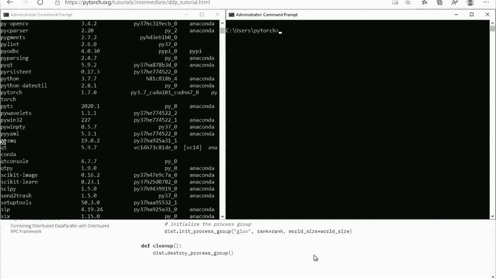
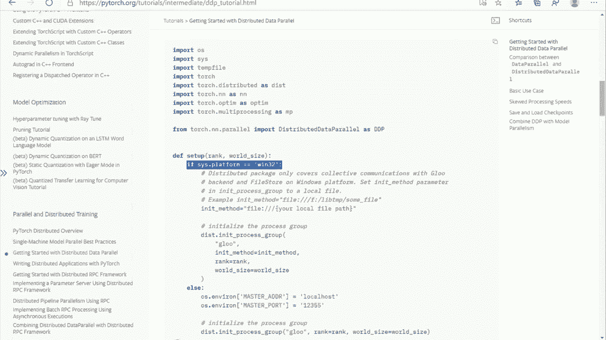
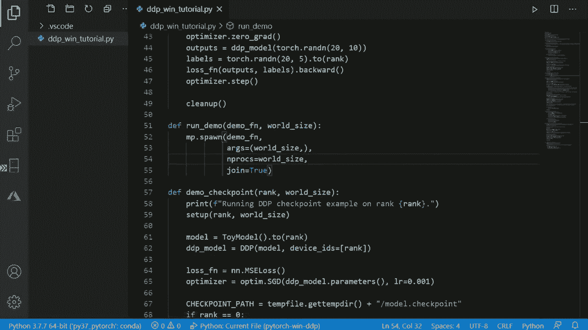

# Pytorch进阶学习讲座！14位Facebook工程师带你解锁PyTorch的生产应用与技术细节P12：L12- Windows上的PyTorch 

🎼。

大家好，我们来谈谈我们在Windows平台支持方面最近的改进。我是Max Lucano，微软Azure AI平台团队的产品经理。你们可能会想，微软为什么要谈论Pytorch和Windows，下面我来澄清一下。最近，微软成为了Pytorotch Windows的主要支持者。

我们的目标是改善Windows平台支持的质量，以便Windows用户在自己选择的平台上构建AI应用时获得良好的体验。在这一部分，我们将谈论我们在Windows平台上启用Pytorch各项功能方面取得的最新进展。

最近，我们在当前版本中启用的主要功能之一是分布式训练，因此我们将稍微谈一下这个内容，并演示如何在Windows上进行分布式训练。

但首先，让我们谈谈作为Python社区的YV，应该关心Windows平台。根据最新的SeflowDevelop调查，Windows仍然是最受广泛开发者欢迎的操作系统。而这对于今天的Pythors社区来说可能并非如此，因为如今的Pythors社区更倾向于那些习惯使用Linux和Mac的专业研究人员。

但如果你展望未来，看看我们希望引入Pytorch的下一批用户，那么Windows用户将是最大的用户群体。这一点通过我们自己的用户研究得到了进一步确认，如果查看LinkedIn的个人资料，那么声称具备机器学习能力但没有博士学位的机器学习专业人士人数是博士生人数的七倍，而在过去的一年中，这些非博士的机器学习专业人士数量几乎翻了一番。

好吧，博士人数显然没有增长太多。这意味着未来使用Pytorch的潜在用户是软件工程师和分析师，以及那些非常关注Windows平台的用户。我们来谈谈Pytorch的现状。首先，Pytorch和Windows是一个社区努力的结果，通过这个社区的努力。

实际上，我们在Pytorch的各项功能覆盖范围方面取得了相当不错的状态。正如你所看到的表格，我们也有很好的覆盖。不过在功能深度的覆盖上还有一些空白，因此我们需要在这方面做更多的工作。最初的感谢应该归功于Je和Poo，他们是将Windows平台支持引入Pytorch的原作者。

他基本上独自实现了原始的Windows支持，最近还添加了Torch音频支持。在微软方面，我们实际上已经开始在Windows上工作，现在我们有四位贡献者在这个领域工作，其中两位已经成为长期维护者。

我们开始改进Pythtors的质量。因此，我们增加了测试自动化，使其与Linux平起平坐，并改进了教程。新的Pyth用户在学习Pythtorch和Windows时有很好的体验。在此次发布中，我们的主要特性是分布式训练。

我们将在下一张幻灯片上详细讨论这个问题。我们还与Vi Amazon合作，为Torservve带来了Windows支持，Elijah Repert也在为job Bi提供Windows支持。非常感谢大家的努力。这将是培训的内容。首先，最新的1.7版本的Pyth现在可以使用，如果你在Windows上安装它。

你将拥有支持分布式训练的二进制文件。支持多GPU和多节点配置，但需要注意的是，我们还没有花很多时间测试multin。因此，请期待目前可能不稳定，但我们计划在即将发布的版本中进行额外测试。Pythtorarch有两种类型的分布式训练：分布式数据并行和新的RPC框架。在此次发布中，我们启用了分布式训练的分布式数据并行模式，并期待在即将发布的版本中启用RPC。RPC是一个令人兴奋的新特性，将用于Pythtorch的各种新特性，因此将其引入Windows也很重要。

当前版本在分布式训练后端的情况稍微复杂一些，我们有救护车胶水后端，但niel和MPPI后端当前不受支持。与NikIel的情况更为复杂，因为NikIel由Nvidia支持，而Nvidia不为Windows平台提供支持，所以我们需要与Nvidia合作，确定NikIel后端的计划。

有了这些，我们准备深入了解byytor Windows的实际操作。我这里有一台配备强大DP的Azure虚拟机。

让我们在VDdia SMMI中查看一下，你可以看到这台机器上有两块NviDAV100 GPU，因此这应该有足够的性能来加速我们的模型训练。让我们看看我们能在这里做些什么。我这里也安装了Pytorch的最新版本，当然是1.7，并且支持Kudo。现在我们可以去Pythtorch教程，看看有什么样的内容。嗯。

我们可以使用的示例是Python教程，正如我提到的。我们改进了其中一些，实际上是所有的，并且在Windows平台上实现了它们的平滑分离，因此我们选择这个关于分布式数据并行的入门教程，该教程通过三个不同类型的分布式数据并行训练示例引导用户，并提供示例代码供他们在自己的机器上执行。

你可以看到我们在这里添加了一些特定于Windows的说明，以确保用户在Windows平台上成功。我已经将这个源代码复制到我的虚拟机中。因此，现在我们在我的Visual Studio Code环境中展示了这个教程。

我们可以花一点时间进行探索，但我们实际上要尝试并运行这个示例。因此，你可能在这里看到的第一个评论或第一个要点是初始化方法，PyTorch支持三种初始化方法。

TCP/IP通信环境变量和远程文件存储，目前这是我们发布版本的一个限制，我们仅支持远程文件存储。因此，在这里我们指定文件的路径，该路径被工作节点用来相互传达其配置设置。

在这种情况下，我们使用单台机器和多个GPU。因此，我们只是使用本地文件在两个进程之间进行通信。对于跨多台机器的真实分布式训练，你需要使用远程文件系统，将文件放在远程文件系统上。

让我们探索一下我们要尝试的模型。在这个教程中，有三种模型被尝试。第一个是一个简单的两层网络，这个教程基本上是使用标准的分布式数据并行模型在两个GPU上进行分布式训练，并汇总来自这两个GPU的梯度，因此这是在多个GPU上训练模型的标准模式。

第二个示例说明了如何进行检查点和同步。因此，它再次训练模型，但其中一个工作节点保存检查点。大约在零时保存检查点，然后另一个工作节点加载检查点。在这两者之间，我们使用分布式训练屏障同步，以确保操作按正确顺序进行。这是分布式数据并行概念的另一个示例，现在可在Windows上使用。

最后一个示例实际上说明了如何进行分布式模型并行训练。它在一个GPU上训练一层，然后将数据传递给第二个GPU以训练第二层。因此，随着大型NLP模型的引入，这种模型并行训练变得越来越重要。在我们运行这个脚本之前，还有一个最后要提到的点是它是如何实际运行的。

你可以看到，这个脚本会自动根据 GPU 数量扩展所需的工作线程。我们这儿的电压大小将是 GPU 数量。因此，现在我们所需要做的就是运行这个脚本。

让我们来看一下。我们可以使用 N SMI 监控它的进展。你可以看到，现在两个 GPU 都被我们的脚本利用了。所以现在它开始运行第二个示例，两个点的示例。你可以看到负载稍微大一些，它在 GPU 之间异步进行，但随后它会平衡，并且最终第二个模型并行训练也是以更异步的方式运行。

你可以在 NDSM 中看到，它实际上跨越多个 Python 进程，以同时利用两个 GPU 卡。因此，你已经看到在 Windows 上运行分布式数据并行是多么简单。这与 Linux 非常相似，如今在 Windows 上运行与在 Linux 上一样容易。至此，我们的演示结束。非常感谢你观看这一部分。我是 Maxim Lucianov。

如果你对 Pytorch 和 Windows 有任何问题或想法，请给我发消息，祝你度过愉快的 Pythtorch 开发者日。
