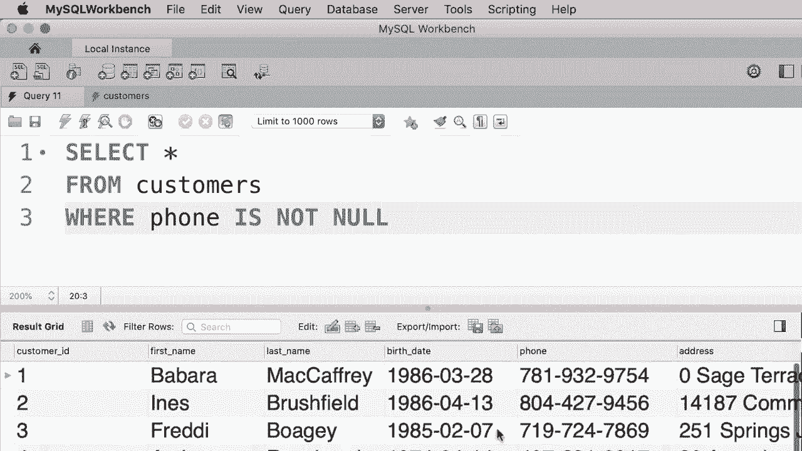

# SQL常用知识点合辑——P15：L15- IS NULL 运算符 

哦，在本教程中，我将向你展示如何查找缺少属性的记录。例如，如果我们选择我们数据库中的所有客户。😊你会看到客户ID为I5的客户没有电话号码。所以如果你仔细看，这里会看到值为null。null表示缺少值。现在。

假设我们想查找所有没有电话的客户，也许我们想给他们发一封邮件，告诉他们“嘿，你的电话在我们的系统中缺失”。那么我们该如何获取这些客户呢？这非常简单，我们使用空运算符。所以在条件中我们写出“电话为空”。现在让我们执行这个查询。😊我们只得到一位没有电话的客户。

现在我们也可以使用非运算符来获取确实有电话的客户。所以我们将条件改为不是空，让我们执行查询。现在在查询结果中，每位客户都有电话号码。

对于这个练习，我想写一个查询来获取尚未发货的订单。这是一个在许多实际应用中使用的非常有用的查询。例如，假设你是一个在线商店的管理员。你想查看尚未发货的订单，以便跟进。😊所以写一个查询来获取这些订单。😊所以这里我们有订单表。

让我们快速查看一下这个表中的数据。😊好吧，如果你仔细观察，你会发现一些订单没有发货日期，这些订单也没有承运人ID，承运人ID是用于识别承运人的唯一编号。因此，任何缺少发货日期或承运人ID值的订单都被视为未发货订单。接下来我们来写一个查询来获取这些订单。

所以回到我们的查询编辑器，选择所有订单。从订单表中，条件为“发货日期为空”。你也可以写“承运人ID为空”。这两种写法都是正确的。现在让我们执行这个查询，我们应该得到五个订单，订单1、3、4、6和8。

