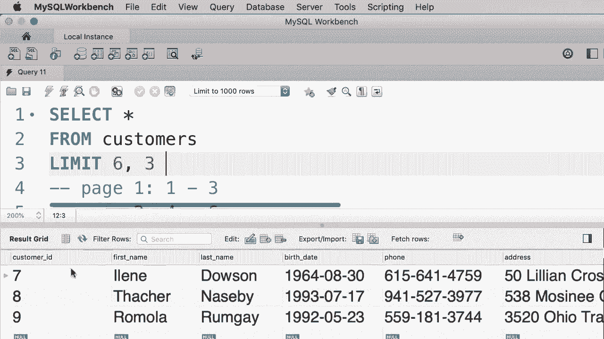
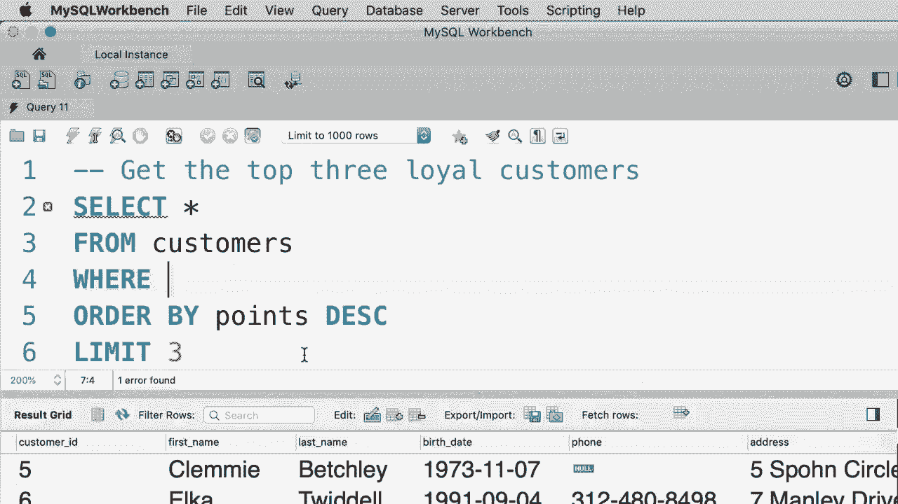

# SQL常用知识点合辑——P17：L17- LIMIT 运算符 

哦。在本教程中，我将向你展示如何限制从查询中返回的记录数。例如，当我们执行这个查询时，我们获得了所有客户和客户表。所以我们在这里有10个客户。😊，现在，如果我们只想获取前三个客户怎么办？这就是我们使用限制子句的地方，让我给你演示一下。所以在from之后，我们输入limit 3。

这将仅返回前三个客户。如果我们传递的参数大于我们的查询产生的记录数，我们将得到查询结果中的所有记录。例如，如果我在这里传递300，显然我们在这个表中没有300个客户。因此，当我们执行这个查询时，我们将得到这个表中的所有10个客户。

所以这就是限制子句的工作原理。😊，现在我们可以选择性地提供一个偏移量。这在我们想要分页数据的情况下非常有用。例如，假设我们有一个网站，在这个网站上有一个网页供用户查看数据库中的所有客户。现在为了简单起见，假设我们每页只想显示三个客户。

那么我们在第一页上会有什么客户呢？😊，我们会有客户，1，2，3。在第二页，我们会有客户4，5，6，在第三页，我们会有客户7，8，9。😊，现在假设我们想写一个查询来检索第三页的客户，我们该怎么做呢？我们想跳过前六条记录，然后选择三条记录，对吧，所以我们把限制子句改成这样。

😊，限制为6和3。所以6是我们所称的偏移量，这基本上告诉mySQL跳过前六条记录，然后选择三条记录。让我们执行这个查询。😊，好的，现在我们得到。客户，7，8和9。

现在，对于你的练习，我希望你获取前三个忠实客户。这些客户的积分比其他人都高。好的，首先，我们从客户表中选择所有内容。😊，现在我们需要按积分降序排列这些客户。所以如果你查看查询结果，你会看到客户按忠诚度排序。

所以最忠诚的客户首先出现，现在我们只想选择前三位客户，这就是我们使用 limit 子句的地方。所以 limit 3。😊，让我们执行这个查询。这些就是最忠诚的客户，客户 ID 为 5、6 和 3。现在我希望你记住一件事，那就是 limit 子句的顺序。limit 子句应该始终放在最后，所以首先我们有 select 子句，然后是 from，可选的我们可以有 where，接着是 order by，最后是 limit。这些子句的顺序很重要，如果你改变顺序，My SQL 会对你大喊大叫，所以在编写查询时请注意顺序。

😊。

哦。
