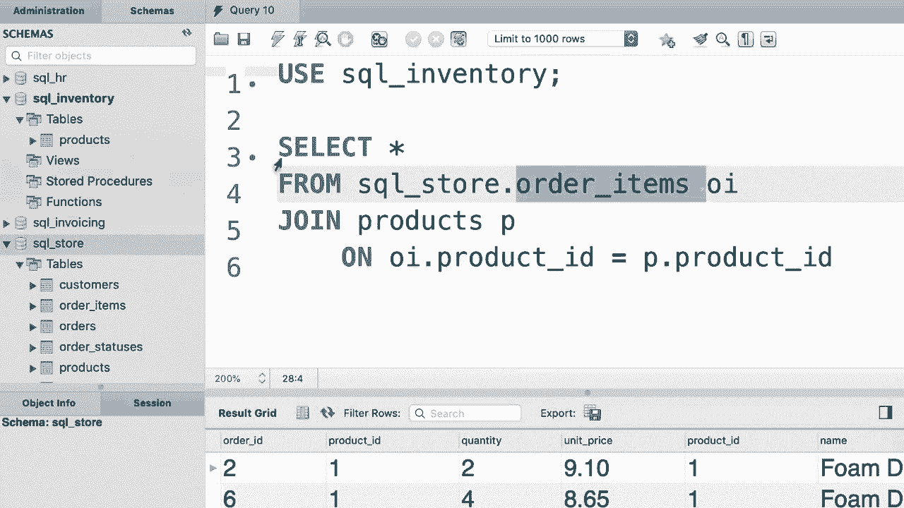

# SQL常用知识点合辑——P19：L19- 跨数据库联接 

哦。在现实世界中，当你作为开发者或数据库管理员工作时。你常常需要与多个数据库合作。在本教程中，我将向你展示如何合并来自多个数据库表的列。这是相当简单的。所以在SQL store数据库中，我们有这些你比较熟悉的表。

现在假设这个产品表不在这里。😊，现在，如果你查看SQL库存数据库。你可以看到这里有。😊，另一个产品表。这个产品表与我们在SQL store数据库中的产品表完全相同。因此它具有相同的列和相同的数据。😊，从技术上讲，这并不是一个好的设计。

我们不希望在多个地方重复相同的表。但是为了这个演示，假设我们在这里没有产品表。所以我们想将订单项表与SQL库存数据库中的产品表连接。让我们开始吧。因此，从订单项表中选择所有内容，我们立即给它一个别名。我们想将其与产品表连接。这个产品表是SQL库存数据库的一部分。所以我们必须在前面加上它的数据库名称。因此我们输入SQL inventory。

😊，点。😡，现在，再一次，我们可以给这个一个别名，例如P。😊，然后输入我们的连接条件。因此，OI.dot产品ID应该与P.dot产品ID相同，让我们运行一个查询。你看，这样我们就成功地连接了跨多个数据库的表。请注意，我们在前面加上产品表的数据库名称，因为我们正在对SQL store数据库编写这个查询。

请查看导航面板，SQL store数据库以粗体显示，因为我们之前写了。😊，使用语句选择了一个数据库，即SQL store。现在，如果我们选择SQL库存数据库，会发生什么呢？让我们看看。因此SQL inventory。😊，现在。由于我们有多个语句，我们必须用分号结束这一切。😊。

现在我们想从订单项表中选择所有内容。 但是我们在这个数据库中没有这个表。😊。所以现在我们必须在这个表名前加上它所在数据库的名称，即SQL Underline Store。😊。让我们执行这个查询。😊，好的，一切运作得非常顺利。所以这是教训。

你只需要为那些不属于当前数据库的表加上前缀。换句话说，你的查询将根据当前数据库而有所不同。😊。

哦。
