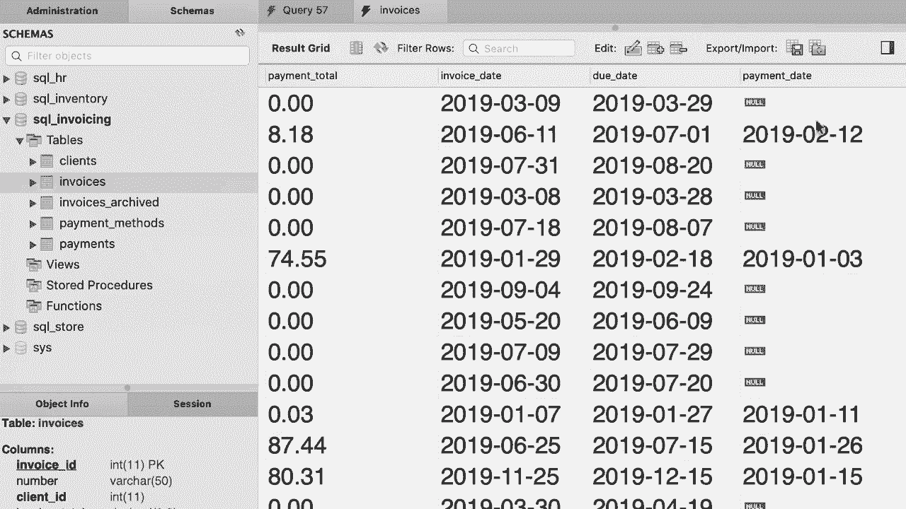
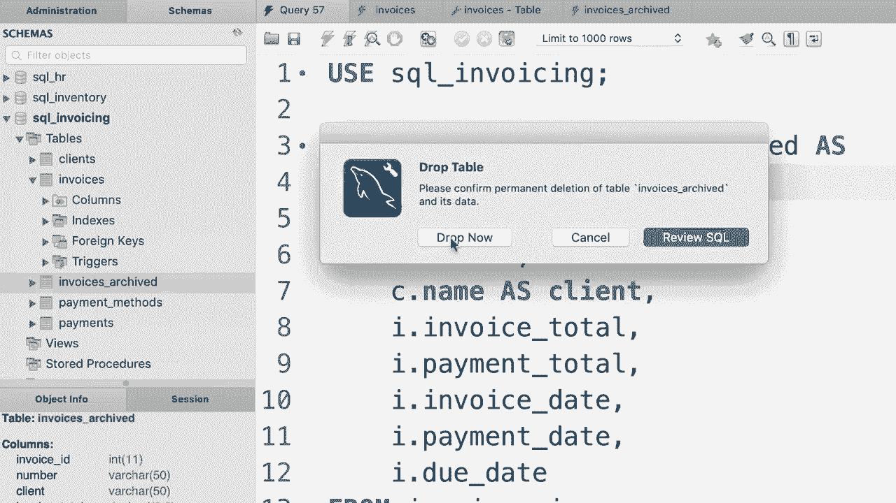
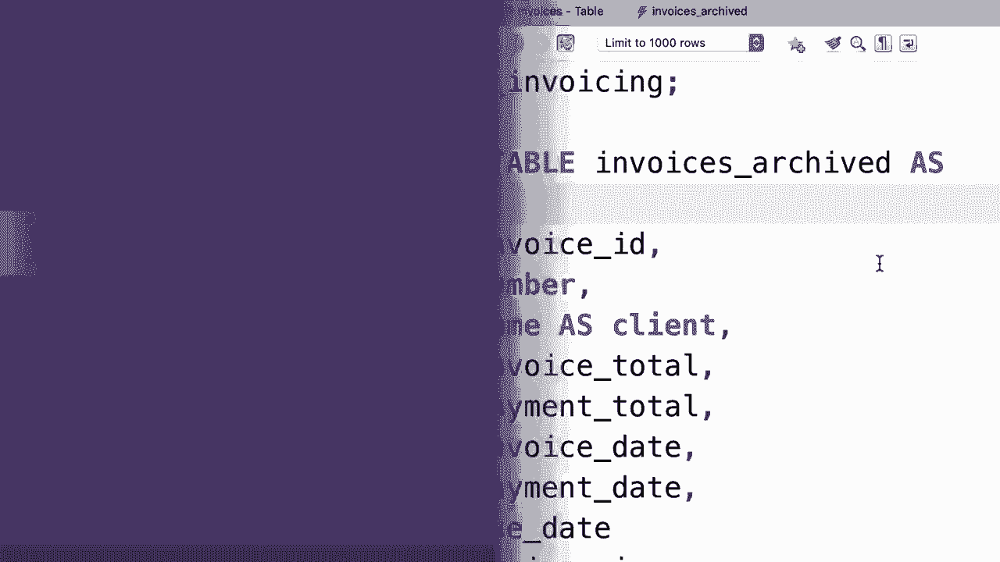

# SQL常用知识点合辑——P35：L35- 创建表的副本 

哦。在本教程中，我将向你展示如何将数据从一个表复制到另一个表。例如，在我们的订单表中，目前大约有十几条记录。现在假设我们想创建一个名为订单归档的表，并希望将该表中的每一行插入到新表中，如果我们有10个订单，我们不想编写一个包含10组值的插入语句，这样非常耗时，因此我将向你展示一种快速从一个表复制数据到另一个表的强大技术。

😊，首先，我们需要创建这个新表订单归档，为此我们将使用创建表作为语句，因此创建表。订单归档作为。现在。紧接着，我们编写一个选择语句以获取所有来自。😊，订单表的内容。现在让我们看看执行这个查询时会发生什么。看看，回到导航面板。

我们需要通过点击这里的图标来刷新这个视图。现在我们有了一个新表订单归档，让我们看看数据。所以你可以看到所有的订单都在这里，并且我们有与订单表完全相同的列。然而，如果你在设计模式下打开这个表。😊。

你可以看到在这个表中我们没有主键。因此，订单ID列没有标记为主键，而且也没有标记为自增列。因此，当我们使用这种技术创建一个表时，MySQL将忽略这些属性，这意味着如果你想明确地将记录插入到这个新表中。

我们必须为订单ID提供一个值，因为这个列不再是自增列。好的。因此，使用创建表作为语句，你可以快速创建一个表的副本。现在我们将这个选择语句称为子查询。子查询是另一个SQL语句的一部分的选择语句。现在。

我们还可以在插入语句中使用子查询，这是一种非常强大的技术。它允许我们做一些非常酷的事情。让我来给你展示一下。所以首先，让我们右键点击订单归档表。😊，然后点击截断表，因为我们想删除这个表中的所有数据。好的，它在询问确认，让我们截断这个表。因此现在回到这个表。😊。

让我们刷新表，我们这里没有任何记录，好的。现在回到我们的查询编辑器。假设我们只想将订单表中的一部分记录复制到这个表中，比如2019年之前的所有订单。因此首先让我们选择订单表中的所有内容，条件是。😊，订单日期早于2019年1月1日。好的。😊，这些是所有的订单，订单编号2到10。

美妙。现在我们想将这些订单复制到订单归档表中。😊。我们可以在插入语句中将选择语句作为子查询使用。写下插入。进入订单归档。现在我们不需要提供列名，因为我们将在这个查询中为每一列提供值。😊，所以。我们做到了。这是将选择语句作为插入语句中子查询的一个例子。

让我们执行这个。好的，现在回到表中。😊，让我们刷新记录。我们只拥有2019年前下的订单。好的，这里有一个非常，非常。非常酷的练习给你。回到我们的 SQL 发票数据库。查看发票表。😊。所以在这个表中我们有这些列：发票 ID、号码、客户 ID。

它与客户表中的客户 ID 列相关，后面还有一些其他列。现在假设我们想在这个表中创建记录的副本，并将它们放入一个名为发票归档的新表中。然而，在那个表中，我们想要的是客户名称列，而不是客户 ID 列。因此，你需要将这个表与客户表连接，然后将该查询作为子查询用于创建表语句。为了让练习更有趣，我希望你只复制那些确实有付款的发票。所以如果你看看这里。

这个付款日期列决定了是否对这张发票进行了付款。因此只选择那些确实有付款日期的发票。这是一个非常非常好的练习。花两到三分钟在这上面，然后继续观看。

嗯。

好的，我首先要使用 SQL 发票数据库。现在让我们选择所有内容。😊。从发票表中，并与客户表连接。在这里我将使用 using 语句来简化我的连接，我们将用哪个列来连接客户 ID 列呢？😊，让我们执行到目前为止的这个查询。好的。

首先我们看到客户 ID 列，这个列用于连接这些表。😊，然后我们有来自发票表的列，如发票 ID、号码等等，接着是来自客户表的列，如姓名、地址等等。显然，我们并不想要所有这些列。我们只需要来自发票表的列。

但我们应该用客户名称列替换客户 ID 列。所以让我们快速看一下发票表的设计。这里我们有发票 ID、号码、客户 ID，我们想用客户名称替换这一列。😊，所以回到我们的查询中。我将选择发票 ID、号码，然后是客户名称，我们把它重命名为客户。

我们还有哪些其他列？我们有发票总额和付款总额，所以让我们也添加这些。发票总额，以及付款总额。我们还有三列日期：发票日期、到期日期和付款日期。那么，让我关闭导航面板。发票日期、付款日期和到期日期。现在，技术上讲。

因为这些列仅存在于发票表中，我们不需要用表别名来前缀它们。所以我们可以简化代码。但我个人更喜欢前缀，因为这让我更清楚如何连接这些表。这只是个人偏好。其他开发者可能不同意，这也完全没问题。

所以无论你喜欢什么，这都完全没问题。让我们执行查询，确保得到正确的结果。😊 所以我们有发票 ID，编号，客户，漂亮，然后是其他这些列。😊 现在我们想要过滤结果，只返回有付款的发票。😊 所以我们可以返回有付款日期的记录，或付款总额大于0的记录。

这些都完全没问题。那么回到我们的查询。底部，让我们添加一个词条。付款日期不明时，这更好，让我们再执行一次查询。现在我们只得到这一小部分发票，非常好。最后，让我们将查询作为子查询使用在创建表格的语句中。😊

所以在选择之前，我们输入创建表格“发票归档”的语句，来吧。让我们执行查询。非常好，现在回到导航面板，刷新视图。😊 这就是我们的新表格“发票归档”。让我们看看数据。看吧。我们只有已付款的发票，以及每张发票的客户姓名，非常好。现在。

只需注意，如果你再执行一次这个查询，你会得到一个错误，因为我们已经有一个名为“发票归档”的表。在课程后面，我会告诉你如何删除表格。这非常简单。但现在你可以右键点击，选择删除表格。😊 然后确认。

好吧，然后你可以再运行一次查询。😊 是的。
