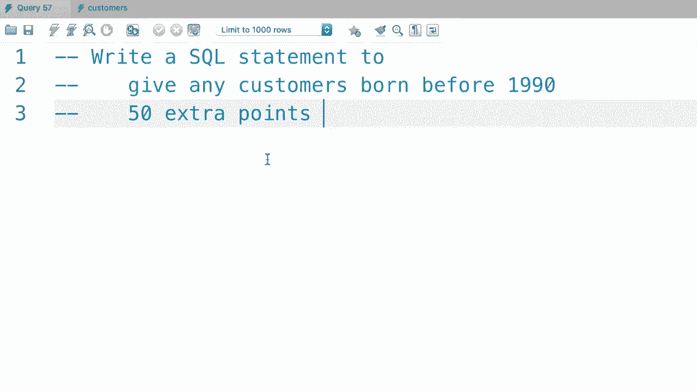
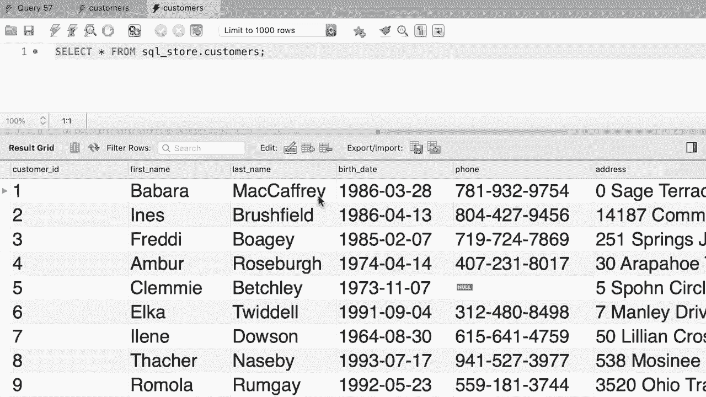

# SQL常用知识点合辑——P37：L37- 更新多行 

哦。在上一个教程中，你学习了如何使用更新语句更新单条记录。现在，如果你想更新多条记录，语法是完全相同的，但你在这里输入的条件必须更通用。例如，回到发票表，我们可以看到客户编号为三的客户有多条发票，我们可以写一条语句来更新这个客户的所有发票，因此回到我们的核心编辑窗口，我们将条件改为客户ID等于3。然而，如果你在MySQL Workbench中执行此语句。

这是我们在本课程中一直使用的软件。你将会遇到一个错误，因为默认情况下，MySQL Workbench以安全更新模式运行。因此，它只允许你更新单条记录。如果你使用其他MySQL客户端或在你的应用程序代码中编写这条语句，就不会有这个问题。这仅限于MySQL Workbench。现在让我告诉你如何解决这个问题。

所以在顶部，我们转到MySQL Workbench菜单，然后选择首选项。😊在这个对话框的左侧，点击SQL编辑。😊然后，向下滚动到底部。取消勾选这个复选框以保存更新。这可以防止你不小心更新或删除表中的一堆记录。现在我们继续这个操作。现在我们需要重新连接到这个MySQL实例。

让我们复制所有代码并关闭这个本地实例窗口。好了，现在在主页上，双击这个连接重新连接，看看吧。😊 然后粘贴所有的SQL代码。现在让我们执行这个操作，客户编号为三的所有发票都在这里更新了，我们还可以使用in运算符。假设我们想更新客户编号为3和4的所有发票。😊

所以你在where子句中学习的所有运算符也适用于这里，但技术上来说，这个where子句是可选的，因此如果你想更新表中的所有记录，只需省略它。😊现在这是你本教程的练习，回到我们的SQL数据库。写一条SQL语句，为任何在1990年之前出生的客户增加50分。

嗯。

好的，我先使用SQL存储。😊然后写一条更新语句来更新客户表。将分数设置为分数加50，因此这里我们使用一个表达式来更新分数列。对于任何在1990年之前出生的人，所以条件是出生日期小于1990年1月1日。好的，让我们执行这个查询。😊好的，现在让我们再打开一次客户表。

所以，任何在1990年之前出生的人现在都有额外的50分。

哦。
