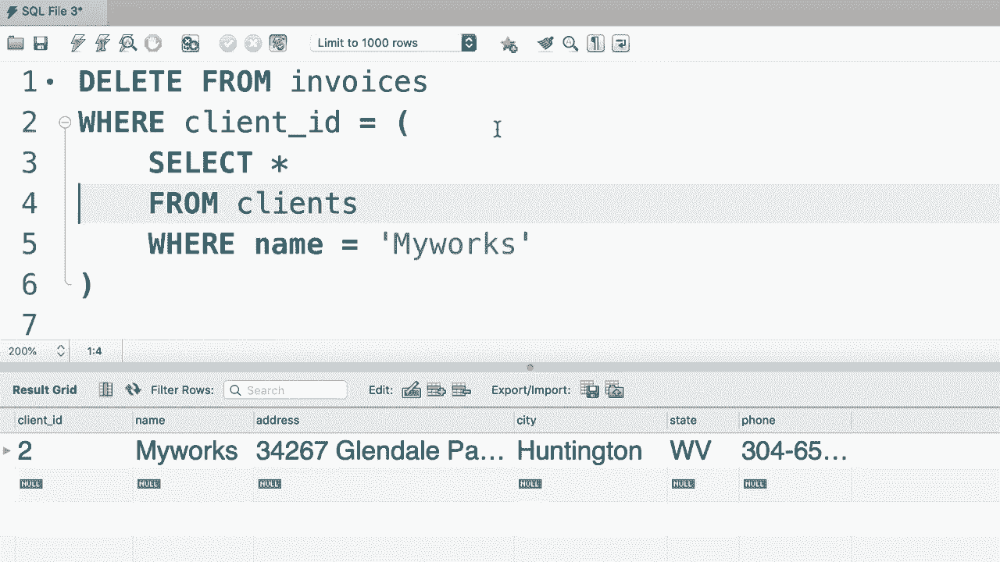

# SQL常用知识点合辑——P39：L39- 删除行 

哦。所以你已经学会了如何插入和更新数据。在这节课中，我们将通过学习如何删除数据来完成这一部分，这非常简单。我们使用 delete from 语句从表中删除记录，比如说发票表。现在可选地，我们可以添加搜索条件来识别我们想要删除的记录。如果你不写这个条件，这个语句将删除表中的所有记录，显然这是非常危险的，所以在执行这个语句时一定要小心。

😊，现在这里，假设我们想删除 ID 为 1 的发票，所以发票 ID 等于一。我们也可以使用子查询，假设我们想删除所有名为“我的作品”的客户的发票。首先我们找到这个客户。所以从客户表中选择所有字段，条件是名称等于“我的作品”。😊。现在执行第二个查询。这里是我们的客户。

现在我们可以获取这个客户的 ID，并在搜索条件中使用它。所以客户 ID 等于。这是我们添加子查询的地方。😊，就像之前一样。很好。这就是我们如何在 SQL 中删除数据。😊。

哦。
