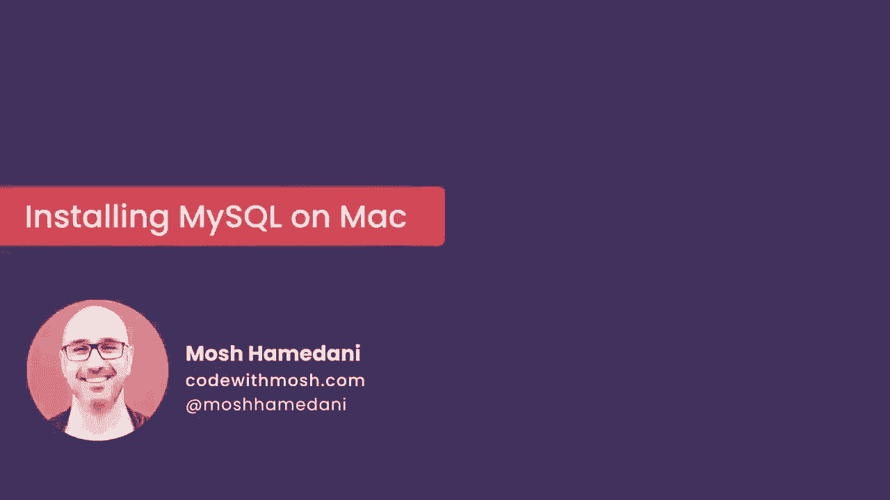
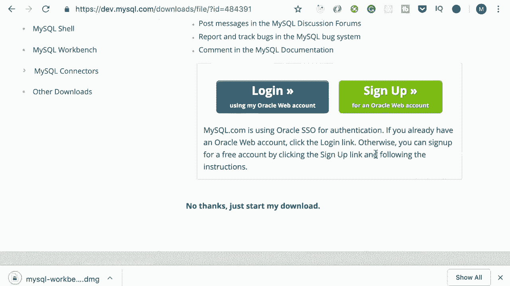
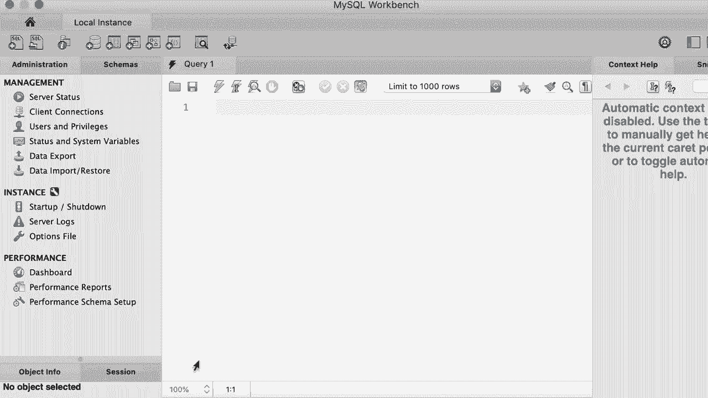

# SQL常用知识点合辑——P4：L4- 在Mac上安装MySQL 

哦。在这个教程中，我将向你展示如何在你的电脑上安装MySQL。现在我使用的是Mac，所以首先我会展示如何在Mac电脑上安装MySQL，然后我会展示如何在Windows上安装它。如果你是Windows用户，可以跳过这个教程。😊，现在，打开你的浏览器，访问MySQL.com。然后进入下载页面，向下滚动到底部。

在这里，你应该能看到MySQL社区版。这是完全免费的。我们将在整个课程中使用它。所以我们继续吧。😊，现在在这个页面上，点击MySQL社区服务器。然后，在这个页面上，你应该能看到Mac OS的可用版本。所以在这个列表中，下载第一个项目，即DMG归档文件。好的，现在在下一个页面。

点击“我不需要”，然后开始下载。😊，好的，如你所见，我们正在获取一个DMG文件。这基本上是一个安装向导。😊，好了，现在DMG已经下载完成。我们来打开它，然后双击这个包。这将启动一个安装向导，使用起来非常简单，所以只需不断点击继续。

我同意许可协议。😊，并安装我的技能。它会要求你输入密码。这是你用来登录电脑的密码。所以我们在这里输入。😊，好的。现在这里我们需要为root或管理员用户设置一个密码，所以点击下一步，在这个框中输入一个复杂密码。😊，好的，现在让我们完成安装。

然后再输入一次你电脑的密码。嗯。我们完成了。这真是太简单了，太棒了。😊。好的，我们安装了MySQL社区服务器。现在我们需要一个图形工具来连接到服务器并管理我们的数据库。所以回到下载页面。😊，再一次，向下滚动到底部。然后去MySQL社区版。在这个页面上，你应该能看到MySQL工作台。

这是一个图形工具，我们用它来连接到我们的数据库服务器。所以我们也下载这个。😊，现在再次在这个页面上。等待下载一个DG归档文件。下载。再一次，我们必须说，不，我们不想登录或注册。所以我们继续下载DMG。

然后，打开它。好的，你会看到这样的东西。所以只需将MySQL工作台拖动到应用程序文件夹中。我们就这样做吧。😊，现在我要把这个复制到应用程序文件夹。😊。

很好，所以我们安装完成了。这非常简单。现在，按下命令和空格键，搜索my Sql workbench。来吧，打开它。😊，现在。第一次我们收到这个消息，因为这是我们从互联网下载的应用程序。所以我们需要告诉Mac我们信任它。继续吧。这就是我的SQl workbench。

现在默认情况下，您应该在这里看到一个连接。如果您看不到，您需要创建一个。让我给你演示如何做。为了这个演示，我将右键单击并删除这个连接。😊，好的，现在我们从头开始创建一个连接，点击这个加号图标。😊，在这个页面上，给这个连接起个名字，比如说本地实例。

现在我们将使用的连接方式是TCpiIP，默认设置。主机名是127.0.0.1，这是本地机器的地址，端口是3306，这是MyQ服务器的默认端口，管理员的用户名。现在我们需要输入密码，这是安装时设置的密码，所以点击存储在钥匙串中，然后在这个框中输入密码。

对于MyQ服务器，好的。最后，让我们测试一下连接。好的，我们成功连接到本地机器上的MyosQl服务器，Beai。点击确定，这里在MyosQql Workbench的主页上有一个连接。每次我们打开MyosQql Workbench时，我们使用这个连接来连接到本地服务器。😊，好的。

我们已经在Mac上完成了MyosQ的安装。接下来，我将讲解如何在Windows电脑上安装MyosQl，所以请随意跳过这个教程。😊。

是的。
