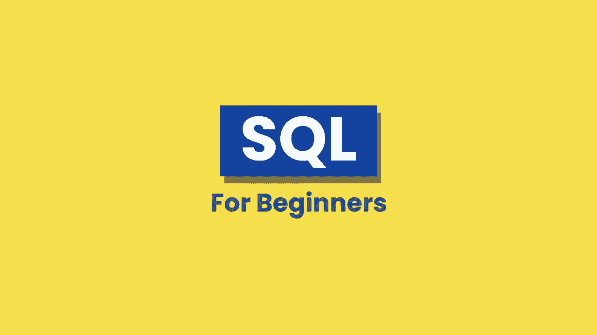
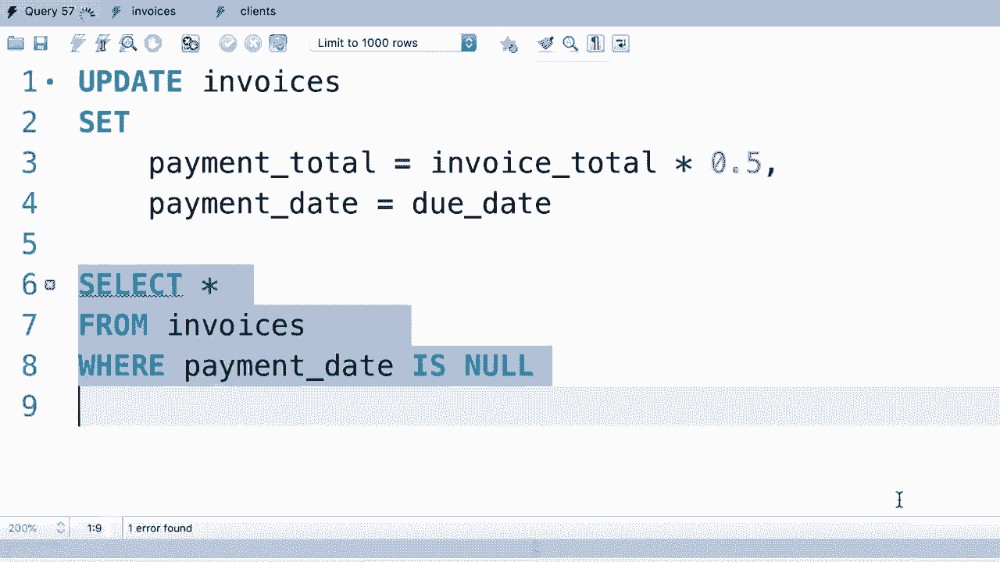
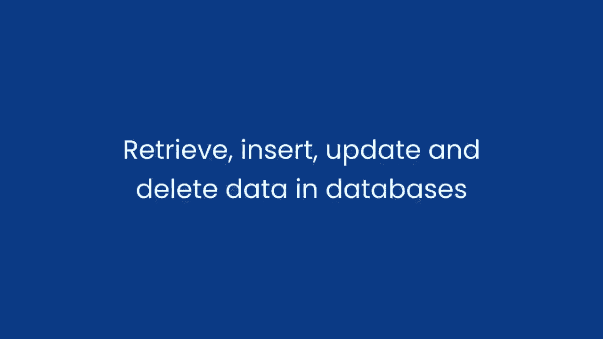
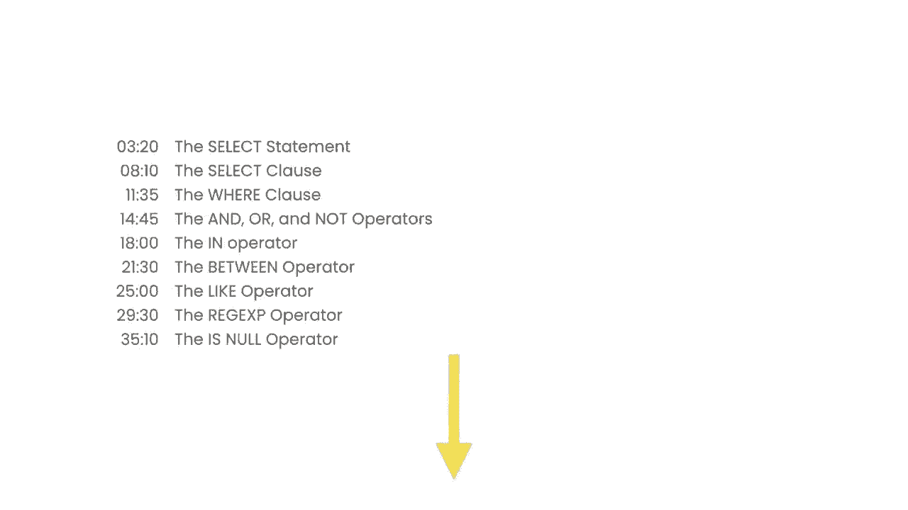

# SQL常用知识点合辑——高效优雅的学习教程，复杂SQL剖析与最佳实践！＜快速入门系列＞ - P1：L1- 介绍 - ShowMeAI - BV1Pu41117ku

🎼嗨，我的名字是Mosh Hamiddani，我非常兴奋能成为你的讲师。在这个三个小时的课程中，你将学习到开始使用SQL所需的一切。首先，我将给你一个三分钟的SQL介绍，然后我们将安装必要的工具并编写我们的第一个SQL查询。这个课程非常适合那些想从头开始学习SQL的人，也适合那些有一些基础知识但想填补空白的人。在这个课程结束时，你将能够检索和插入数据。

更新和日常数据在数据库中，我们将讨论表，关系，不同类型的连接，子查询，正则表达式等等。这些是每个软件开发者或数据科学家必须了解的基本概念。这个SQL课程包含大量练习，帮助你学习和记住SQL语法。此外，视频下方有一个目录，可以快速跳转到特定教程。

😊。

现在让我们开始吧。
