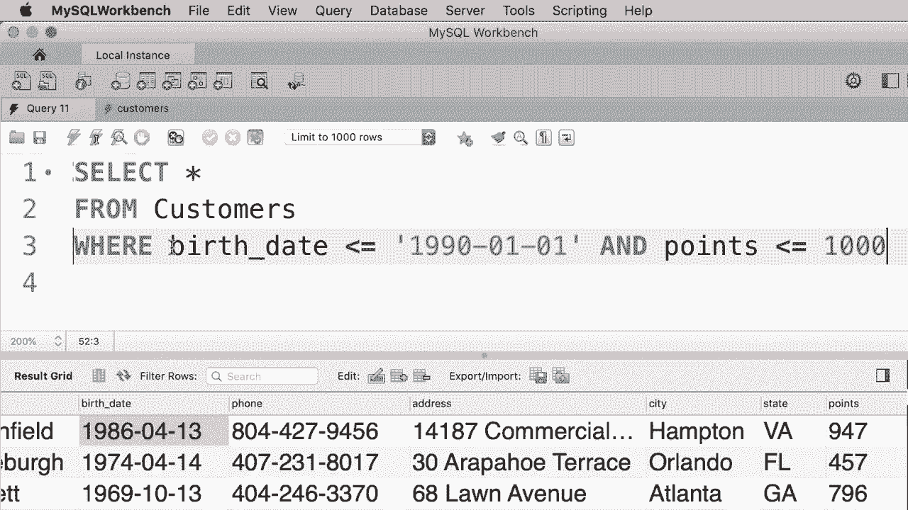
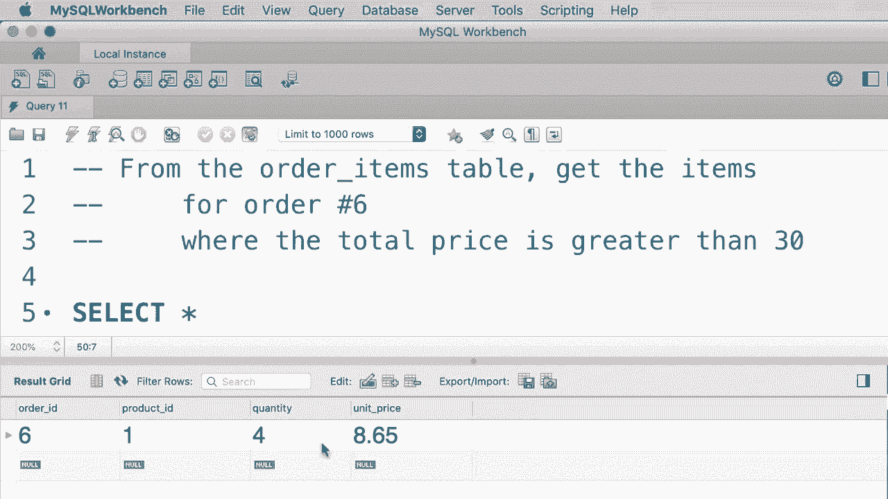

# SQL常用知识点合辑——高效优雅的学习教程，复杂SQL剖析与最佳实践！＜快速入门系列＞ - P10：L10- AND、OR 和 NOT 运算符 

在这个教程中，我将向你展示如何在过滤数据时组合多个搜索条件。所以假设我们想要获取在1990年1月1日后出生的所有客户，并且他们的积分超过1000，这时我们使用与运算符，因此我们输入并，然后在输入另一个条件，比如积分。

😊，大于1000。现在，当我们执行这个查询时，我们只获得满足这两个条件的客户。我们来看一下。所以执行。我们只有两位客户。如果你看，这两位都是在1990年后出生，并且他们的积分超过1000。这就是与运算符的作用。

这两个条件都应该为真。与与运算符相对，我们有或运算符。所以使用或时，只要这两个条件中的至少一个为真，该行就会在结果集中返回。我们来看一下。现在我们再次执行这个查询。结果不是两条记录，而是😊，相当多的记录。所以例如。

我们有这个人在1990年后出生，但如果你看他们的积分，他们超过了1000分。因此，任何满足至少一个条件的客户记录都会被返回。现在让我们将其提升到下一个层次。假设我们想要获取在1990年后出生的客户，或者他们应该至少有100000积分并且居住在弗吉尼亚州。所以我们这样做。我们输入并，然后添加另一个条件，州等于弗吉尼亚。

让我们执行这个查询，看看我们得到什么。我们只得到完整的记录。因此，这些客户要么是在1990年后出生，要么积分超过1000且居住在弗吉尼亚。如果你看这里的第一个客户，这个人并没有在1990年后出生，但你可以看到她住在弗吉尼亚，并且积分超过1000。

所以最后两个条件对于这个客户是成立的。现在，在组合多个逻辑运算符时，你需要注意这些运算符的顺序。早些时候我谈到了算术运算符的顺序。我告诉过你，乘法的优先级高于加法和减法，我们可以使用括号来覆盖默认顺序，逻辑运算符也有相同的概念。所以与运算符总是优先计算。因此，当执行这个查询时，查询执行引擎首先评估这个条件，因为在这里我们使用的是与运算符，即使我们在第一个条件后输入了这个条件也无所谓，因为与运算符具有更高的优先级。现在，你始终可以使用括号改变顺序，这也确保了代码更简洁，更易于理解。

😊，所以我们可以在最后两个条件周围加上括号。我们也可以把这些放在新的一行。😊，为了清晰，像这样。所以任何阅读这段代码的人都可以很容易理解这个查询的意图？

现在我们还有另一个逻辑操作符称为非，我们用它来否定一个条件。让我给你演示一下，所以我将简化我们的“或”子句。😊假设我们正在寻找1990年后出生的客户，或者他们的积分超过100。 如果我们执行这个查询，我们得到。这些人，客户ID为1、3、5，等等。

现在我们可以使用非操作符来否定这个条件。所以我们在这里应用非操作符，并且最好在这个条件周围加上括号。现在，当我们执行这个查询时，我们会看到其他不在当前结果集中的客户。让我们来看一下。😊因此，我们看到的客户ID为1、3、5、6，等等。

我们得到的客户ID为2、4和10。现在从技术上讲，这些客户出生在1990年之前，并且积分少于1000。所以如果你看看这里，第一个客户出生在1990年之前，并且他的积分少于1000。我怎么知道的？让我告诉你我在数学中学到的一个技巧。每当你有一个非操作符时。

你可以这样简化你的表达式。我们将非操作符应用于第一个条件，即在1990年后出生的人。我们如何否定这个条件呢？嗯，大于操作符变成了小于或等于。这就是该条件的逆。对吧？现在我们应用“非”来否定“或”。我们得到了“与”。最后。

在最后一个条件上应用非操作符，即拥有超过1000积分的人员。当我们否定这个条件时，我们得到的客户是积分少于或等于1000的客户。现在我们可以去掉非操作符以简化这一点。我们不再需要括号，因为我们只有两个条件是通过“与”连接的。

这是结果。正如你所看到的，这样阅读和理解要容易得多，出生在这个日期之前的人，他们的积分少于1000。

。

好的，这里是你的练习。从订单项表中获取订单号为6的项目，其中该项目的总价格大于30。好的，这里是订单项表，在这个表中我们有这些列：订单ID、产品ID、数量和单价。如果我将数量乘以单价，我们可以得到该项目的总成本，然后我们可以将其与30进行比较，所以让我们继续编写这个查询。

选择所有。来自订单项表。在这里我们需要两个条件，一个是订单。所以订单ID应该是6。第二个条件，我们想要计算总价格。所以我们获取单价。😊将其乘以数量。这个值应该大于30。所以如我们所见，我们可以在“或”子句中使用算术表达式。

这并不局限于选择类。好的，😊现在让我们执行这个查询，看看我们得到什么。我们应该只得到一个项目。该项目为产品1，数量为4，单价略高于$8，因此该项目的总价格大于30。

