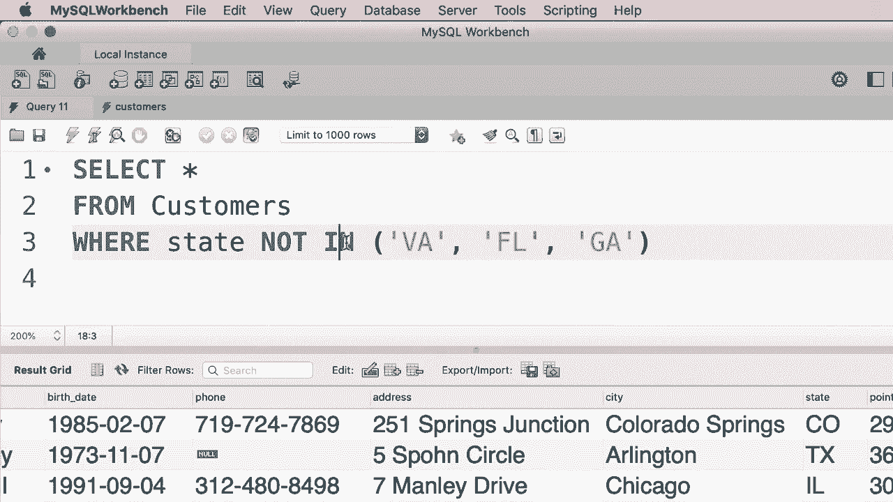
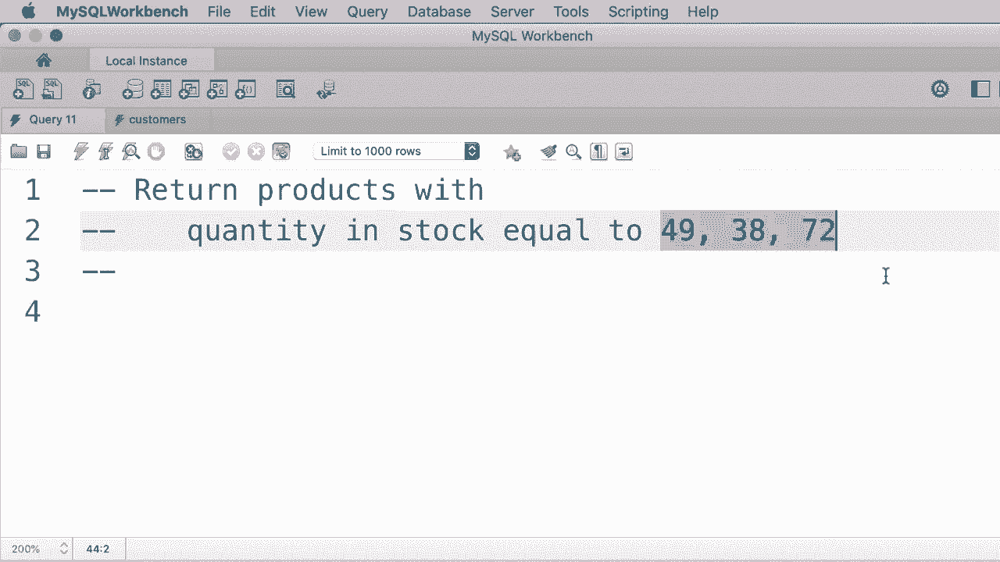
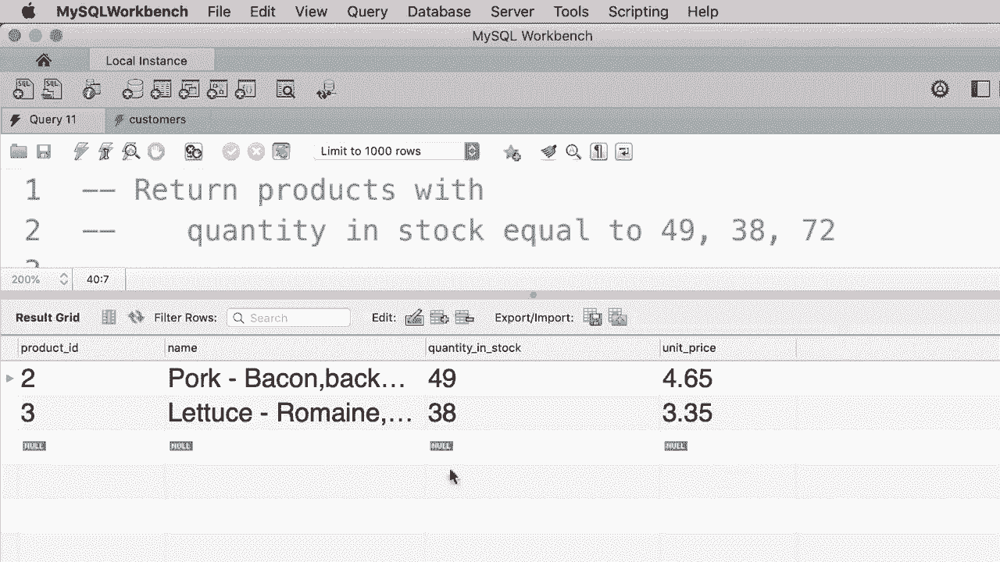

# SQL常用知识点合辑——高效优雅的学习教程，复杂SQL剖析与最佳实践！＜快速入门系列＞ - P11：L11- IN 运算符 - ShowMeAI - BV1Pu41117ku

在本教程中，我将向你展示如何在SQL中使用“in”运算符。举个例子，假设我们想获取位于弗吉尼亚州、佛罗里达州或乔治亚州的客户。编写这个查询的一种方法是这样：where state equals Virginia 或者 state equals Georgia。😊。或者 state equals Florida。对于刚接触SQL语言或编程的人来说，这个表达式可能有点奇怪。

他们问，Msh，为什么我们不能这样写这个表达式？

当state等于弗吉尼亚州或乔治亚州或佛罗里达州。这就是我们使用或运算符组合多个条件的原因。所以这里我们有一个条件，或者更准确地说是一个表达式。但在这个或运算符的右侧，我们有一个字符串。在SQL中，我们不能将字符串与产生布尔值（真或假）的布尔表达式组合在一起，这就是我们必须这样编写查询的原因，所以我们有多个表达式或多个条件，并且我们通过或运算符将它们组合在一起。好吧，现在如果我们执行这个查询，我们会得到这些客户。

但是有一种更简短、更清晰的方法来获得相同的结果，而不是使用或运算符组合多个条件。我们可以使用“in”运算符，所以where state is in，然后在括号中添加所有值，例如弗吉尼亚州、佛罗里达州、乔治亚州，顺序不重要。这个查询与我们之前的完全等效。😊，但如你所见，它更简短且更易于理解。让我们执行它。看。

我们得到了完全相同的结果。现在这里我们也可以使用非运算符。假设我们想要获取这些州以外的客户，所以我们可以使用“where state not in”。😊。这个列表。现在如果我们执行这个查询，我们会得到位于科罗拉多州、德克萨斯州等地的客户。所以当你想要将一个属性与一系列值进行比较时，请使用“in”运算符。

😊。

现在这里有一个练习，我希望你写一个查询，获取库存数量等于49、38或72的产品。暂停视频，完成这个练习，然后继续观看。😊。

好吧，这很简单，所以我们执行一个选择所有列的查询，从产品表中获取库存数量为49、38和72的记录，使用“in”运算符来比较这个属性。让我们执行这个查询，我们得到了。😊，只有两条记录，因为我们没有库存数量等于72的产品。

哦。
