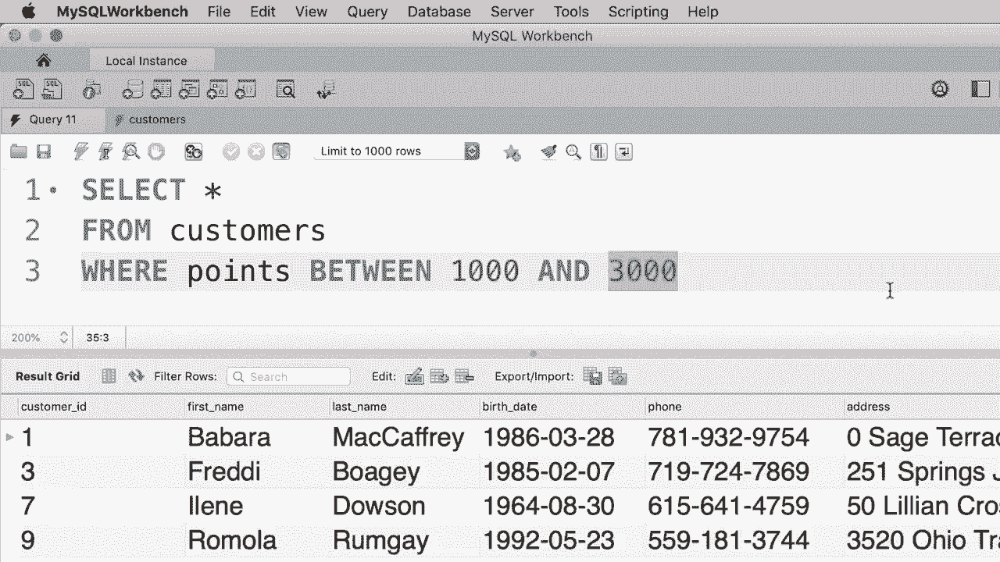
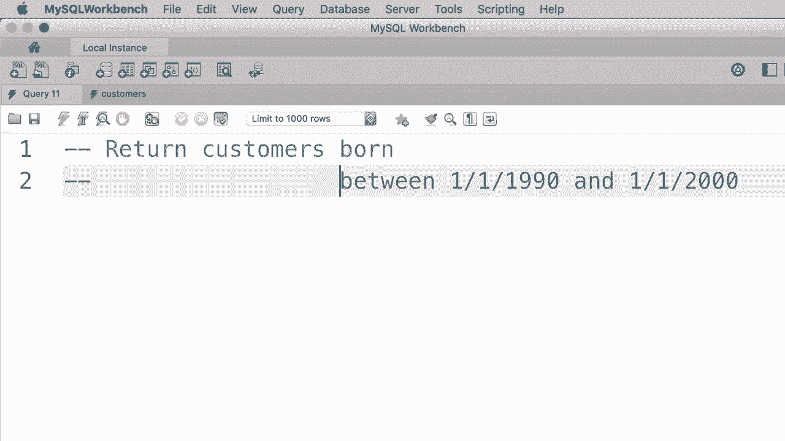
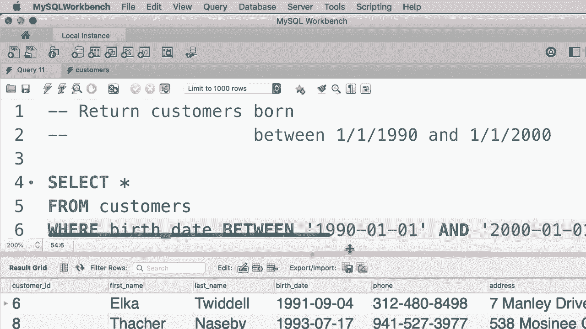

# SQL常用知识点合辑——高效优雅的学习教程，复杂SQL剖析与最佳实践！＜快速入门系列＞ - P12：L12- BETWEEN 运算符 - ShowMeAI - BV1Pu41117ku

哦。在本教程中，我们将查看 SQA 中的 between 运算符。所以假设我们想获取积分在1000以上和3000以下的客户。查询是这样的，where points greater than 1000，更准确地说是大于或等于1000，并且 points less than or equal to 3000。当我们执行这个查询时，我们得到。😊，我们得到了多少人，四个人符合这个标准？

现在，无论何时你在用一个属性与一个范围的值进行比较时，你都可以使用 between 运算符，这使得你的代码更简短、更清晰，因此我们可以将这个表达式重写为 where points between 1000 和 3000。这与我们之前的内容完全等效。

所以这些范围值也是包含的。这意味着点数大于或等于1000，或小于或等于3000，让我们执行这个查询。我们得到完全相同的结果。😊。

嗯。

好的，现在作为练习，我想写一个查询来获取出生日期在1990年1月1日到2000年1月1日之间的客户。

好的，我们从选择所有开始。从客户那里，哪里？出生日期在这条线上，日期在……所以这里需要注意的是，我们也可以对日期值使用 between 运算符。这不仅限于数字的使用。所以我们出生日期在现在，我们需要提供两个日期值。正如我之前告诉你的，日期的格式是四位数的年份，所以是1990。

月份需要两个数字，日期也需要两个数字。所以生日应该在这个值和第二个值之间，20，0，1 和 01。让我们执行这个查询。我们得到。

只有三个人符合这个标准。哦。
