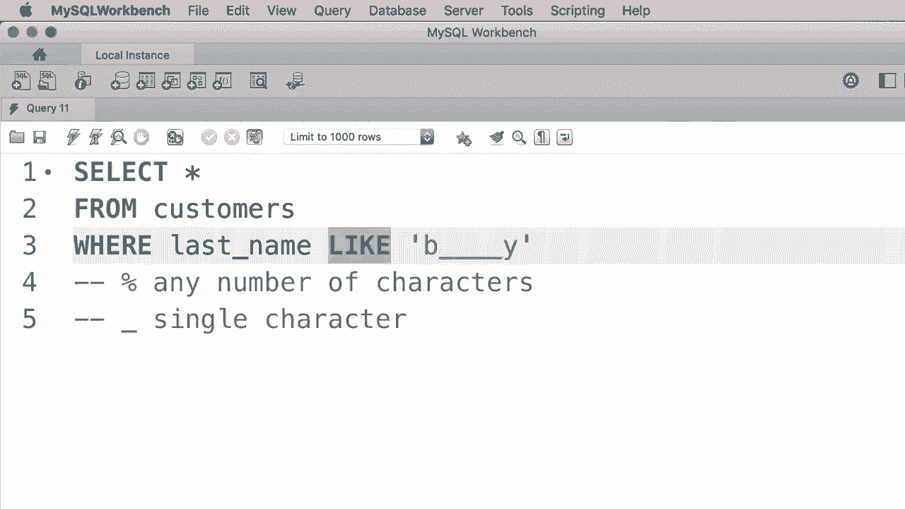
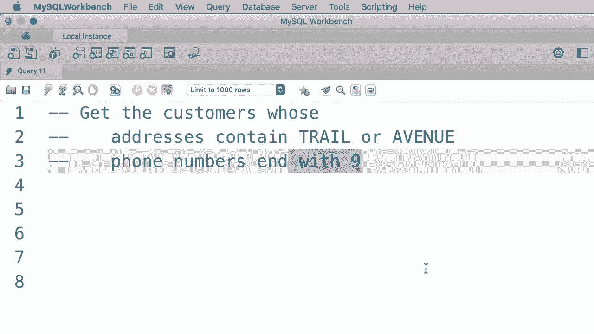
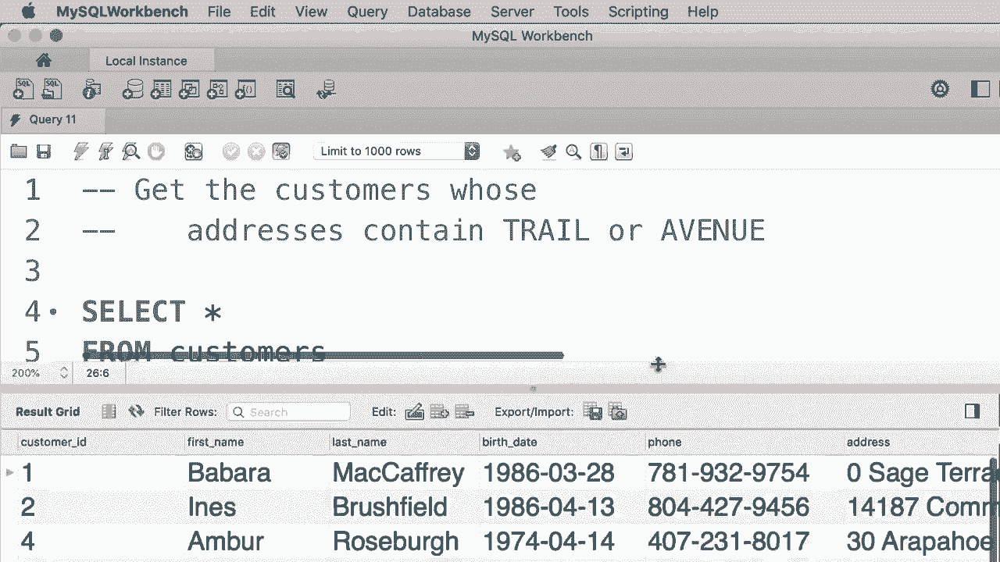

# SQL常用知识点合辑——高效优雅的学习教程，复杂SQL剖析与最佳实践！＜快速入门系列＞ - P13：L13- LIKE 运算符 - ShowMeAI - BV1Pu41117ku

在本教程中，我将向你展示如何检索与特定字符串模式匹配的行。例如，假设我们只想获取姓氏以“B”开头的客户。因此在WHERE子句中。😊，我们输入“where last name”。这就是我们使用like运算符的地方，紧接着我们添加一个字符串模式。因此，我们想获取姓氏以“B”开头的客户，并且“B”后可以有任意数量的字符。

因此，我们使用百分号来表示任意数量的字符。在“B”后可能有一个字符、没有字符或十个字符。使用这个模式，我们可以得到所有姓氏以“B”开头的客户。而且无论是大写“B”还是小写“b”都没关系。让我们执行这个查询，结果出来了。我们只有三位姓氏以“B”开头的客户。😊，作为另一个例子。

假设我们只想获取姓氏以“brush”开头的客户。因此，我们将模式改为“brush percent”。现在执行查询，我们只得到这位客户。现在，这个百分号不必位于模式的末尾，可以在任何位置。例如，假设我们想搜索姓氏中含有字母“B”的客户。

无论是在开头、中间还是结尾。因此，我们将模式改为“percent B percent”。这个模式意味着在“B”之前或之后可以有任意数量的字符。让我们执行查询。这些客户的姓氏中有“B”，而且不管“B”是在开头、中间还是结尾。

让我们看另一个例子。我想获取所有姓氏以“y”结尾的客户。😊。所以这是我们使用的模式，执行这个查询，我们有五位姓氏以“y”结尾的客户。这就是我们使用百分号的方法。现在，我们还有一个下划线，它匹配一个单一字符。因此，使用这个模式，我们得到的客户姓氏恰好有两个字符。

我们不关心第一个字符是什么，但第二个字符应该是“y”。让我们执行这个查询。显然，我们没有任何姓氏与这个模式匹配的客户，但如果将模式更改为五个下划线，即“1，2，3，4，5”。😊，再加上一个“y”。我们应该能获取这些客户，因此他们的姓氏恰好有六个字符。

我们不关心前五个字符，但它们都以“y”结尾。现在，作为另一个例子，我们可以用“B”替换第一个下划线。这意味着我们想获取姓氏以“B”开头的客户，且在“B”后面恰好有四个字符，最后以“Y”结尾。让我们执行这个查询，因此我们只有一位客户符合这个模式。😊，这就是我们使用like运算符的方法。

我们使用百分号来表示任意数量的字符。并且。😊 一个下划线来表示单个字符。现在这个like运算符在MySQL中是一个较旧的运算符。但我们还有一个更新的运算符，它更强大，可以让我们搜索任何字符串模式。这就是我接下来要向你展示的内容。😊

好的，这里我将给你两个关于like运算符的练习。首先，我想让你找到地址包含“trail”或“avenue”的客户。接下来，我想让你找到电话号码以9结尾的客户。😊 

好的，让我们开始第一个练习。所以从customers表中选择所有记录，条件是地址像这样搜索。😊 我们想要“trail”，但“trail”可以出现在地址的任何地方。因此我们在“trail”前后都放一个百分号。接下来，我们应该使用or运算符来搜索另一个模式。

或者地址像，让我把这放到新的一行，这样更好。地址像，再次使用百分号“avenue”百分号。就这样。所以让我们执行这个查询。😊 这里是你应该得到的结果，ID为2、9和10的客户，如果你查看他们的地址，他们的地址中都有“trail”或“avenue”。现在让我们开始第二个练习。

我们想找电话号码以9结尾的客户。这非常简单，所以让我修改我们的工作条件。😊，在电话号码那一栏，我们再次使用like运算符，后面跟一个百分号和9，这就是你需要做的。😊 让我们执行这个查询。结果是，ID为3和7的客户。

他们的电话号码以9结尾。所以这就是我们如何使用like运算符，顺便说一下，你可以在这里始终使用not运算符。假设你想找电话号码不以9结尾的客户。那么我们只需在like前加上not。现在如果我们再执行一次这个查询，我们会得到数据库中的所有其他客户。😊

哦。
