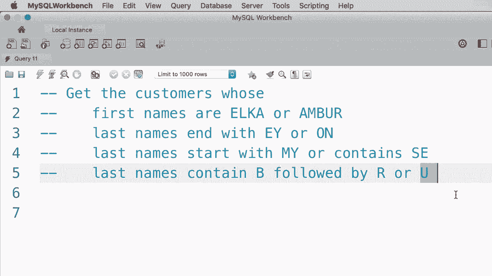
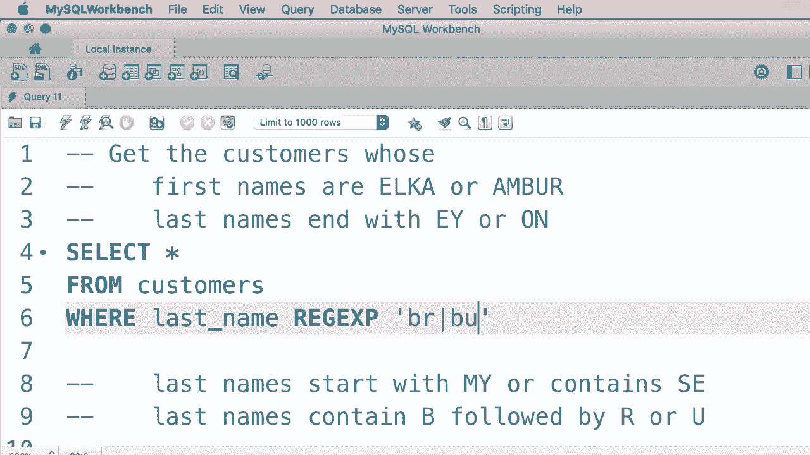

# SQL常用知识点合辑——高效优雅的学习教程，复杂SQL剖析与最佳实践！＜快速入门系列＞ - P14：L14- REGEXP 运算符 

在上一个教程中，你学习了 SQL 中的 like 运算符，因此作为另一个例子。假设我们想搜索姓氏中包含单词 filled 的客户。因此，我们输入一个类似于这样的 where 子句：where last name like percent，field percent。这样单词 field 可以出现在姓氏的任何位置。让我们执行这个查询。

我们只得到一个客户，很好。现在，我们在 MySQL 中还有另一个运算符，即 red X。😊它是正则表达式的缩写，正则表达式在搜索字符串时非常强大。因此，它们允许我们搜索更复杂的模式。这里有一个例子。如果我想使用正则表达式重写这个最后的 where 子句，它看起来是这样的。

where last name，R A G，E X P。😊现在在我们的字符串模式中，我们不需要输入人名符号，我们只需输入 field。所以第4行的内容与第3行完全相同。让我们执行这个查询。😊我们得到了相同的结果，很好。现在在正则表达式中。

我们有额外的字符，而在使用 like 运算符时并没有这些字符。例如，我们可以使用插入符号来表示字符串的开头。因此，如果我把插入符号放在单词 filled 前面。😊这意味着我们的姓必须以 field 开头。显然，如果我们执行这个查询。

我们没有任何匹配该条件的记录，因此我们使用插入符号表示字符串的开头。😊我们还可以使用美元符号表示字符串的结尾。因此，这个模式意味着姓氏必须以 field 结尾。让我们执行这个查询。我们得到了与之前相同的结果。现在我们也可以在这里搜索多个单词。例如。

假设我们想找到姓氏中包含单词 filled 或 Mac 的客户。因此我们使用管道符号，竖线并输入另一个模式。😊让我们执行这个查询。在这里我们有两个客户，其中一个的姓中有单词 Mac，另一个的姓中有单词 field。😊现在我们可以将其提升到下一个层次。

假设我们想找到姓氏中包含单词 field、Mac 或 row 的客户。😊让我们执行这个查询。我们得到了三个客户，很好。因此，我们使用管道符号或竖线来表示多个搜索模式。现在，作为另一个例子，我们可以将第一个搜索模式更改为类似这样的内容。😊

现在这个模式意味着姓氏要么以 field 开头，要么包含单词 field，要么包含单词 row。让我们执行这个查询。😊现在我们只得到了两个客户，因为我们的客户姓 Bru field，不符合这个模式。然而，如果我们将第一个模式改为 field 加上美元符号并执行查询，我们会得到三个客户。所以这就是我们在构建复杂模式时如何组合多个特殊字符。

现在让我们来看另一个例子，假设我们想要搜索姓氏中包含E的客户。这些都是符合条件的人，现在假设我们想确保在字母E之前要么有G，要么有I。所以这就是我们使用方括号的地方，括号内添加多个字符，如G和I，这样就能匹配任何姓氏中在E之前有G或I或M的客户，因此这些字符中的任何一个都可以在E之前出现。😊现在让我们执行这个查询。看吧，我们在第一个例子中只得到两个客户，在E之前我们有I。

在第二个例子中，E之前的方括号内包含的字符之一是G，它也是E之前的另一个有效字符。现在，再一次，方括号不必在E之前，我们可以将其放在E之后，因此任何在姓氏中以E后跟F、M或Q的客户都可以用这个模式返回。显然，我们的数据库中没有人。所以这就是我们如何使用方括号。

所以我们也可以提供字符范围。例如，我们可以有E，E之前要有任何从A到H的字符。我们不必像AB、C、D、E、FG那样逐一输入，这样显得很冗长，所以我们可以输入A到H，现在如果你执行这个查询，我们得到这三个人。😊让我们快速回顾一下在本教程中你学到的关于正则表达式的所有内容。

我们使用插入符号来表示字符串的开始，所以是开始。😊我们使用美元符号表示字符串的结束。我们使用竖线或管道表示逻辑或，因此我们可以提供多个搜索模式。我们使用方括号来匹配括号中列出的任何单个字符。

最后我们使用方括号和一个连字符来表示一个范围，所以任何从A到F的字符。😊从技术上讲，我的学校支持更多特殊字符，但老实说，我在本教程中列出的那些是你在90%的情况下会用到的，所以记住这些就可以了。说实话。

很多初学者发现正则表达式的语法令人困惑。因此，在这个视频中，我将给你四个练习，我精心设计了这些练习，以帮助你快速了解这套语法。这是第一个练习。获取名字是Elca或Amber的客户。注意这个是Amber的拼写。😊现在是第二个练习。

返回姓氏以EY或ON结尾的客户。这是第三个练习。获取姓氏以my开头或包含SE的客户。最后作为最后一个练习，返回姓氏中包含B后跟R或U的客户。请花两到三分钟完成这个练习，完成后请回来继续观看。

好的，让我们完成第一个练习。所以我们想要获取所有。😊，哎呀，这里有个C。选择商店从客户中，正则表达式。😊，这是我们的模式。我们想搜索两个词，Elca或Amber，简单就是这样，让我们执行这个查询。我们应该得到两个客户。看，Amber和Elca。好的。

现在让我们完成第二个练习，我要删除这个。我们不再需要它。😊。所以我们想要获取客户，选择从Custom开始。哪里姓氏？

应该以EY或ON结尾。所以在搜索模式中。我们输入EY后面跟一个美元符号来表示字符串的结束。然后我们添加一个竖线来提供第二个搜索模式，O，再一次，美元符号。让我们执行这个查询，哎呀，实际上我忘记输入正则表达式了，你看。😊。

所以让我们执行这个查询。我们应该得到这四位客户，ID为1、3、5和7。前面的三位，他们的姓氏以E、Y结尾，最后一位客户，他或她的姓氏以ON结尾。好的，现在，让我们进行第三个练习。我将更改这里的正则表达式。

我们想要获取姓氏以my开头或包含S的客户。所以我们用一个字符来表示字符串的开始。😊，所以它应该以my开头。或者它应该再次包含S，很简单，让我们执行查询。😊，我们得到了ID为4、8和10的客户，最后我们想获取姓氏中包含B的客户。

所以让我们更改搜索模式，我们应该有B后面跟R或U。现在，有两种方式来写这个正则表达式。我们可以使用方括号。所以我们有B后面跟R或U。这是一种方法。另一种方法是使用竖线，所以。BR或BU，这两者都是有效的解决方案。希望你在下一个教程中完成这些练习，我将向你展示如何获取缺失值的记录。

😊。

哦。
