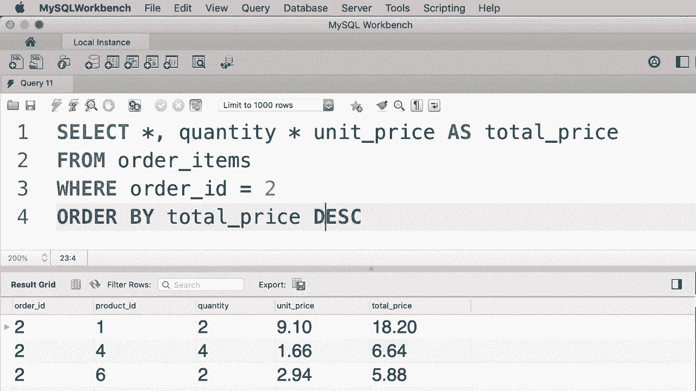

# SQL常用知识点合辑——高效优雅的学习教程，复杂SQL剖析与最佳实践！＜快速入门系列＞ - P16：L16- ORDER BY 运算符 - ShowMeAI - BV1Pu41117ku

哦。在本教程中，我将向你展示如何在 SQL 查询中对数据进行排序。这里我们有一个查询，用于选择客户表中的所有客户。如果你查看查询结果，你会看到我们的客户按 ID 排序，所以我们有客户 1。

2，3，4 等等，这是默认的排序列，但我们可以使用 `order by` 子句随时更改这一点。不过首先让我解释一下为什么客户 ID 列是默认的排序列。😊所以我先打开左侧的导航面板，这里是客户表。

现在让我们点击这个看起来像工具的中间图标。😊这将我们的客户表打开为设计模式，在这里我们可以更改列。我们可以添加新列或删除现有列，或者更改它们的名称或顺序等等。现在如果你仔细观察，你会看到客户 ID 前面有一个黄色的钥匙，这意味着此列是此表的主键列。

在关系数据库中，每个表都应该有一个主键列，该列中的值应唯一标识该表中的记录。因此，回到我们的查询窗口。你可以看到该列中的值唯一标识每个客户。

客户 ID 列是此表中的主键列，这就是为什么当我们针对此表编写查询时，我们的客户默认按 ID 排序。现在让我向你展示如何按其他列对客户进行排序。所以在 `order by` 子句中，我们输入另一个列的名称，比如名字。😊

让我们执行查询。现在你可以看到我们的客户不再按 ID 排序，而是按名字以升序排序。现在，如果你想反转排序顺序，只需输入 D E SC，这是降序的缩写。现在你正在按降序排序这些客户。好的。

我们也可以通过多个列对数据进行排序，例如。假设我们首先想根据客户的州进行排序。然后在每个州内，我们想按名字进行排序。因此，我们在这里输入多个列，州和名字，然后执行查询。

现在你可以看到，我们这里的第一个州是加利福尼亚州，接着是科罗拉多州，而在佛罗里达州，我们有两个客户，这些客户按名字排序。让我们仔细看看，首先是 Amber，然后是另一个客户。我们也可以在这里随时使用降序参数，例如，我们可以按州以降序排序，然后按名字以升序排序，或者再次以降序排序，因此我们可以用多种方式对数据进行排序。

现在，MySQL与其他数据库管理系统之间的一个区别是，在MySQL中，我们可以按任何列排序数据，无论该列是否在选择子句中。例如，假设我们只想选择每个客户的名字和姓氏，现在我们可以按这个表中的任何列对结果进行排序，它们不必是名字和姓氏，例如，我们可以按他们的出生日期排序。

看看。这是一个在MySQL中的有效查询，但其他数据库管理系统有时会对你写这样的查询大喊大叫。现在我们也可以通过别名排序数据，例如，在我们的选择子句中添加数字10，并给它一个别名，比如说得分。所以得分在这个表中不是一个有效的列，它只是一个表达式的别名，在这种情况下是一个简单的数字。现在这里我们可以有一个复杂的数学表达式，实际上并不重要。😊。

我们仍然可以通过别名对数据进行排序，这样我们可以先按得分排序，然后按名字排序。再一次，这是从玛雅·斯基的角度来看一个有效的查询。现在在我们结束这个教程之前，还有最后一件事，我看到一些教程教你如何按列位置排序数据。例如，在这里我们可以按1和2排序，这基本上意味着按名字和姓氏排序数据，这些列的顺序是如果我们执行这个查询的话。

你可以看到我们的客户是按名字和姓氏排序的。😊。虽然这种方法有效，但你应该避免，因为如果将来你在名字列前面添加一个新列。

假设说出生日期。现在，我们的客户不再按照之前的顺序排序。因此，通过列位置排序数据会产生意想不到的结果，这是你应该避免的。相反，始终按列名排序，比如名字。嗯。好吧，这是你在这个教程中的练习。在这个数据库中，我们有一个名为订单项的表。

我们可以找到每个订单的商品。现在我写了一个你看不到的查询，因为这是我将给你的练习的解决方案。这个查询产生了这个结果。所以我们只得到了订单ID为I2的商品，并且我们根据每个商品的总价格对这些商品进行了排序。

因此，每个商品的总价格等于数量乘以单价。在这种情况下，产品1的总价格刚好超过$18。所以继续写一个查询，选择订单ID为I2的所有商品，并按总价格降序排序。

😊。

嗯。

好吧，我们从订单项中选择所有内容，条件是订单ID等于2。这将返回该订单的所有商品。现在我们要确保按总价格对它们进行排序。所以在ORDER BY子句中，我们写出一个表达式，即数量乘以单价。这将返回每个商品的总价格，然后我们在这里添加降序参数。

所以再一次，我们在`order by`子句中使用的表达式不一定要是列名。它可以是一个别名或像这样的算术表达式。让我们继续执行这个查询。😊这就是我们得到的结果。为了清晰起见，我想在结果中添加另一列。假设是数量。😊在价格下的单位，再给它一个别名，比如总价格。

让我们执行查询。我们可以清楚地看到，这些数据是按总价格降序排列的。然而，我们的查询中有一些重复。我们在两个地方重复了这个表达式。所以现在我们可以通过使用一个别名（总价格）来简化我们的`order by`子句，我们得到完全相同的结果。😊接下来，我将向你展示如何限制查询返回的记录数量。

哦。
