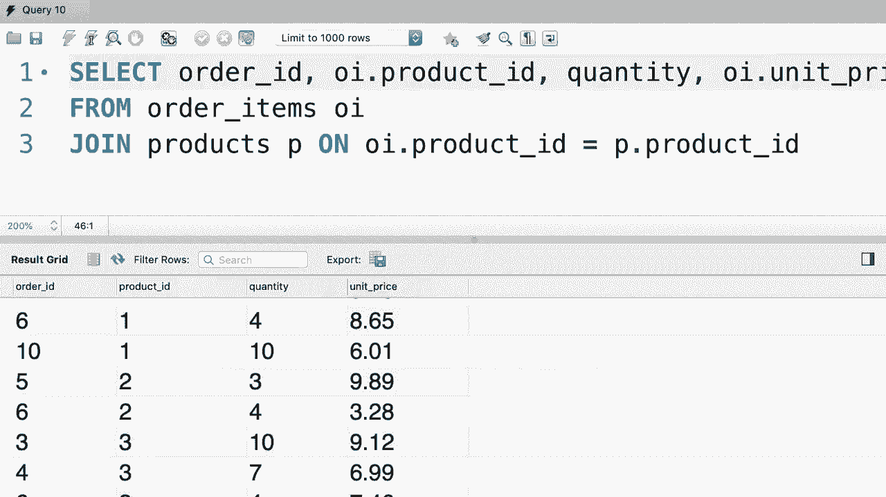

# SQL常用知识点合辑——高效优雅的学习教程，复杂SQL剖析与最佳实践！＜快速入门系列＞ - P18：L18- 内部连接 - ShowMeAI - BV1Pu41117ku

哦，到目前为止，我们只从一个表中选择列，但在现实世界中，我们经常从多个表中选择列。这就是我将在接下来的几个教程中向你展示的内容。😊 所以在左侧，如果你查看我们的订单表，让我们选择这里的所有数据。😊 在表中。

我们使用客户ID列来识别每个订单的客户。正如我之前告诉你的，我们这里不存储客户信息，比如他们的电话号码、电子邮件和地址，因为这些信息可能在未来发生变化。如果某个客户下了多个订单。

那么我们必须回来更改多个记录。我们不想这样。这就是我们为客户和订单设置单独表格的原因。😊 现在在本教程中，我将向你展示如何选择订单表中的订单，但不是显示客户ID，而是显示每个客户的全名。😊

所以让我们回到查询窗口。😊 好的，我们想从订单表中选择所有内容。现在我们应该将这个表中的列与客户表中的列结合，这就是我们使用join关键字的地方。现在我们可以选择性地输入inner join，因为在SQL中，我们有两种类型的连接，inner join和outer join。

我们稍后将在本节中查看外连接。所以现在我们只使用inner join，而这个inner关键字实际上是可选的，因此我们不必输入它。😊 所以你想将订单表与客户表连接。现在，我们希望基于什么来连接这些表？好吧，在客户表中，我们有这个客户ID列。所以如果我们将这两个表放在一起。

我们希望对齐记录，使得客户ID相等。这就是我们使用on短语的地方。😊 所以在on后面，我们输入一个条件。这里是我们需要输入的条件，订单表中的客户ID应该等于客户表中的客户ID。😊 现在，这超出了屏幕范围。让我分开这一行。

这样更好。通过这个查询，我们告诉MyQL，嘿， whenever you’re joining the orders table with the customers table，确保订单表中的客户ID列等于客户表中的客户ID列。😊 现在让我们执行这个查询。😊 看看结果。因为我们在这里选择了所有内容。

前几列来自订单表，因为我们先列出了这个。😊 现在，在订单表中的所有列之后，我们有客户表中的列，包括客户ID、名字、姓氏等等。😊 现在让我们简化结果集，只选择订单ID、名字和姓氏。

所以回到我们的查询，我们选择订单ID，名字和姓氏。现在我要执行查询。😊那更好，所以在每个订单ID旁边，我们可以看到下单客户的名字。😊现在，如果你想在这里显示客户ID呢？😊，那么。

我们把这个放在这里，看看会发生什么，自定义I。执行查询。我们得到一个错误。如果你查看底部的输出窗口，你应该会看到一个错误，提示列customer ID D字段列表是模糊的。现在，不幸的是，我无法展示这个错误，因为我的录制窗口比MySQL工作台小。

不过先放一边，让我解释一下为什么会出现这个错误，因为在订单和客户表中都有这个customer ID列。所以我的技能不确定我们想从哪个表中选择这个列。这就是为什么它说这个列是模糊的。😊所以我们需要通过在前面加上表名来限定这个列。😊。

我们可以从订单表或客户表中选择，实际上没有关系，因为值是相等的，对吧？😊所以在你有多个表中有相同列的情况下，需要通过在前面加上表名来限定它，好的，现在再执行一次查询。

所以，你看，我们有订单ID，客户ID和全名，很美丽。😊现在在结束这个教程之前，还有一件事，如果你仔细注意。我们在多个地方重复了“订单”这个词，我们在这里也有，在连接条件中也是如此，客户表同样如此。

我们在这里重复了。😊我们可以通过使用别名来消除这种重复，使我们的代码更简单。所以在每个表后面，我们可以给它一个别名。😊O，是订单的简称。所以按照惯例，我们缩写表名。现在，无论何时我们有订单，应该用O替换它。所以在连接条件中，我们用O替换订单，再一次。😊。

在选择子句中。你看，我们也可以为客户表应用一个别名。😊我们得到了C，然后我们简化我们的连接条件，如此。😊所以这就是我们如何从多个表中连接列。现在，作为你的练习，我希望你查看订单项表。所以，在这个表中我们有订单ID。

产品ID，数量和单价。现在我想让你写一个查询，将这个表与产品表连接。对于每个订单，返回产品ID及其名称，后面跟着数量和订单项表中的单价，顺便说一句。

确保使用别名来简化你的代码。😊！

。

好的，首先，让我们从订单项目表中选择所有内容。然后将其与产品表连接，我们该如何连接这些表呢？😊。在订单项目表上，实际上我们现在就给它一个别名。所以我们用Oi作为订单项目的缩写，P作为产品的缩写。

所以Oi.dot产品ID。😊，应该等于P或产品do产品ID。顺便提一下，记住当你给表赋别名时，你必须在其他地方使用该别名。所以在这里我不能写出products。我的技能会对我大喊大叫。所以让我们使用缩写。好的，这就是我们如何连接这些表。让我们在此之后执行查询。😊，好的。

所以我们看到所有来自订单项目表的项目，后面是来自产品表的列。😊。现在我们想在这里明确选择几个列，所以从订单项目表中。我们想要选择。😊，或者它们的下划线ID。嗯，技术上讲。我们不必用表名来前缀，因为这个列没有在多个地方重复。

所以这并不模糊。让我们缩短代码，这样更好。😊。现在我们想选择产品ID列，但因为这个列在两个表中都有。我们必须用表名来前缀，OI或P都可以，实际上没关系。😊，接下来。我们想选择数量，最后选择单价。实际上这里在两个表中都有单价这一列。

所以这是订单项目表中的单价，这是产品表中的单价。现在你可能会好奇为什么在两个地方都有这个列。原因是产品的价格可能会变化。所以对于每个订单项目，我们想要在用户或客户下单时的价格。

所以这是在特定时间点的价格快照。我们在产品表中的单价。是现在的当前价格。这对于报告非常重要。否则，我们无法正确计算销售。因此，因为在这种情况下我们在两个地方都有单价列。

我们应该从订单项目表中选择，因为这是下单时的价格。现在让我们执行查询，这就是最终结果。😊。

