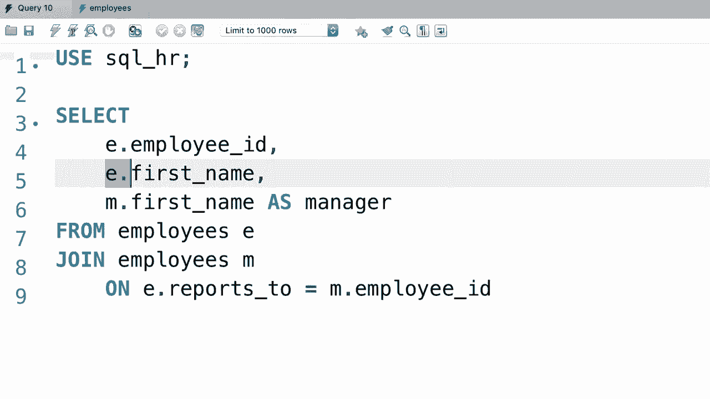

# SQL常用知识点合辑——高效优雅的学习教程，复杂SQL剖析与最佳实践！＜快速入门系列＞ - P20：L20- 自联接 - ShowMeAI - BV1Pu41117ku

哦，在SQL中，我们也可以将表与自身连接。让我给你一个例子。看看这个数据库，SQL HR。😊在这个数据库中，我们有这两个表：员工和办公室，让我们查看员工表中的数据。你看，这里有这些列，员工ID，名字，姓氏，职位。

薪资和reports2，这是这个员工或此人的经理的想法。现在我们不想在这里重复经理的信息，比如他们的电话号码、地址，因为这些信息将来可能会改变，因此我们仅使用他们的标识符或ID在表中引用他们。

现在，我们在哪里可以找到关于这个经理的信息呢？嗯，这个经理实际上是同一组织的员工😊。看看这个例子，经理ID是37270。现在，如果你看左侧，这里是那位经理的ID，也就是另一个员工😊。那么这个员工的经理是谁呢？让我们来看看😊。

我们这里没有任何值，所以这个销售的值为null。因此这个员工没有经理，这意味着他们是CEO😊。现在让我们写一个查询，将这个表与自身连接，以便选择每个员工及其经理的姓名😊。回到查询窗口，首先我们需要选择SQL HR数据库。接下来。

我们从员工表中选择所有内容，我们给它一个别名，如E。现在我们需要将这个表与自身连接。因此再次输入员工表，但我们需要一个不同的别名，我们该如何称呼这个别名呢？好吧，我们想将这个表与自身连接，以便找到经理，所以我们可以用M作为经理的缩写。

😊现在让我们写出我们的连接条件。因此，从员工表中，我们需要将reports underline两列连接到经理表，这基本上是员工表本身，涉及的列是员工的ID。现在让我们执行这个查询，看看结果😊。

我们看到员工表中的所有列都重复了，第一组列代表员工的信息，接着我们有关于经理的信息，在这个表中我们只有一个经理，但通过这个技巧我们可以轻松创建一个组织结构图，我们可以有一个经理的层级。现在让我们简化查询，只选择员工的姓名和他们的经理。

回到这里。由于员工表中的每一列都重复了两次，我们需要在每列前加上表名，例如，从员工表中你想获取员工的ID😊，以及名字。然后从经理表中你也想选择名字。

所以每一列都应该以表名或更准确地说，别名为前缀，因为所有这些列在两个表中都存在。对，我们来执行这个查询。😊，所以。这是我们得到的员工ID、名字。这里是经理的名字。我们可以通过给这个列一个别名来改进这个查询，因为有两个名字列是没有意义的，所以。😊，我们给第三列经理起一个别名。现在，再执行一次。

最终结果是，我们有员工ID、名字和Add。😊。因此，自连接表与连接其他表非常相似，唯一的区别是我们需要使用不同的别名，并且每一列都需要加上别名。😊，这就是我们所称的自连接。接下来，我将向你展示如何连接两个以上的表。😊。

哦。
