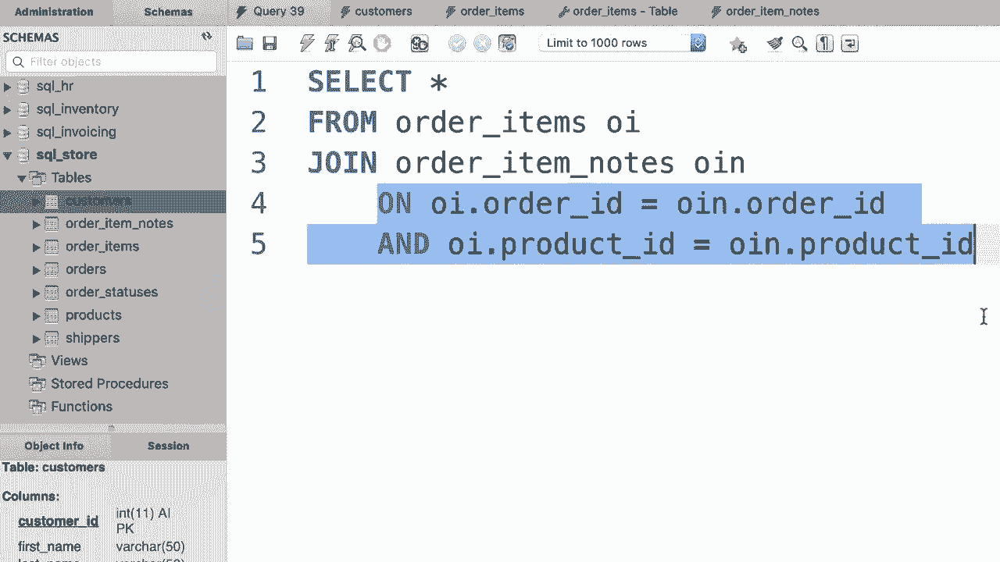

# SQL常用知识点合辑——高效优雅的学习教程，复杂SQL剖析与最佳实践！＜快速入门系列＞ - P22：L22- 复合连接条件 - ShowMeAI - BV1Pu41117ku

哦。在你所看到的所有示例中，我们使用单个列来唯一识别给定表中的行。例如，在客户表中。我们有这个客户ID列，它唯一标识此表中的行。但有时我们不能仅使用单个列来唯一标识给定表中的记录。例如，看一下订单项表。在一个表中，我们有诸如订单ID、产品ID等列。

等等。现在如果你查看数据，你会发现订单ID列中的值是重复的。它们是重复的，我们有2、2、2、66等等，因此我们不能仅凭此列唯一识别每条记录，产品ID也是如此，这一列中的值也被重复，因此在这个表中我们使用这两个列中值的组合来唯一识别每个订单项，作为例子，在这个订单中我们有三项产品。

4和6，每个产品都有数量和单价。😊。因此，如果我们使用这两个列中值的组合，我们可以唯一识别每个订单项。换句话说，我们没有两个记录对应订单ID2和产品ID1，现在我们只为该项有一条记录，好的，现在让我们在设计模式下打开这个表，所以在这里点击这个看起来像工具的中间图标。😊，注意，这两个列上都有表示主键的黄色钥匙。

这就是我们所说的复合主键，复合主键包含多个列。😊，那么这有什么重要性呢？当你有一个复合主键的表时，你需要学习如何将该表与其他表连接，例如。

这里我们有这个订单项备注表，用于保存每个订单项的备注，让我们看看这里的数据，因此我们有这个备注ID列，它唯一标识此表中的记录，旁边是订单ID和产品ID，你会发现这两列的组合唯一表示一个订单项。

😊，所以对于订单号二，产品号一，我们有两条备注。😊。现在让我告诉你如何将这个表与订单项表连接。😊，所以回到我们的查询。😊。你可以看到我已经选择了SQL存储数据库，所以我不需要输入使用语句。😊，好吧，让我们从中选择所有内容。

订单项表。给它一个别名。😊，现在我们需要将其与订单项备注连接。也给它一个别名。😊，我们将如何根据两个列连接这些表，回到订单项表？

这些是我们在联合条件中需要使用的列。因此在订单项表中，我们有这个订单 ID 列。这将等于订单项备注表中的同一列，所以是 OIN.dot.order ID。但是这还不够，我们还应该根据产品 ID 列来连接这些表。因此我们输入“and”，然后输入我们的第二个条件。

所以订单项的产品 ID 应该等于订单项备注的产品 ID。这就是我们所说的复合连接条件，因此我们有多个条件来连接这两个表。

哦。
