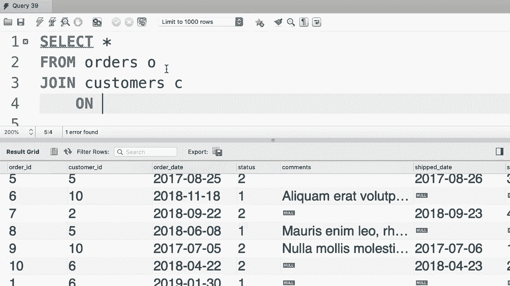

# SQL常用知识点合辑——高效优雅的学习教程，复杂SQL剖析与最佳实践！＜快速入门系列＞ - P23：L23- 隐式连接语法 

哦。在这个教程中，我将讨论MySQL中的隐式连接语法，所以这里我们有一个基本的内连接。我们从订单表中选择所有内容，与客户表连接，条件是订单的客户ID等于客户的客户ID。这是基本的，使用隐式连接语法还有另一种方式来编写这个查询。让我告诉你这是如何工作的。

😊，所以。我们选择所有内容。从现在开始，我们可以输入多个表名，比如订单、客户，并且我们也可以给它们起别名，比如C和O。然后我们将这个连接条件移动到where子句中，所以我会从这里复制，输入一个where子句并粘贴条件。😊这两个查询是等价的。😊。

我们这里有的是隐式连接语法。虽然MySQL支持这种语法，但我建议你不要使用，因为如果你不小心忘记输入where子句，你会得到一个笛卡尔积。😊让我给你演示一下。我首先会删除第一个查询。😊并执行这个。

所以我们得到了10条记录，因为在这个数据库中我们有10个订单，目前一切顺利。😊但是如果我们不小心忘记输入where子句会发生什么呢？结果可能不是10条记录，而是100条记录，因为订单表中的每一条记录现在都与客户表中的每一条记录连接。😊这就是我们所称的笛卡尔积，稍后在本节中我将更详细地讨论笛卡尔积。

但我想在这个教程中指出，使用显式连接语法更好。所以我们使用连接，因为这个语法强制你输入连接条件。😊 如果你只是将订单与客户连接而不输入连接条件，你会遇到语法错误，所以重申一下，要注意隐式连接语法。

但是使用显式语法编写所有的连接。

哦。
