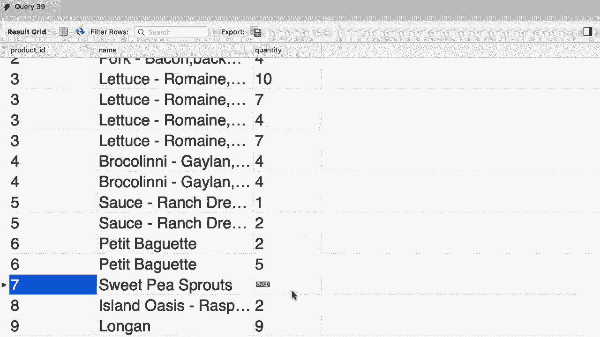

# SQL常用知识点合辑——高效优雅的学习教程，复杂SQL剖析与最佳实践！＜快速入门系列＞ - P24：L24- 外连接 

哦。在这一部分我之前告诉过你，在SQL中我们有两种连接：内连接和外连接。目前你只看到了内连接的例子，我还告诉你这个内关键字是可选的，所以每当你输入一个连接时，你都是在使用内连接。在本教程中，我们将讨论外连接及其解决的问题。

😊，所以让我们开始写一个使用内连接的查询，然后将其转换为外连接。所以选择。😊。从客户表中选择所有内容。将其与订单表连接。客户ID应该等于订单ID。很基础，对吧？😊，现在，为了清晰起见。

让我们从这两张表中挑选几个列。所以从客户表中，我想挑选客户ID和名字。而从订单表中，我想挑选订单ID。😊。现在最后，让我们对结果进行排序，这样我们就能清楚地看到我们得到的内容，按客户ID排序。😊。让我们执行这个查询，看看我们得到什么。这里是结果。

对于客户编号二，名为InNs或Inus，无论怎样，我们有两个订单，订单4和订单7。同样对于客户编号五，我们也有两个订单，依此类推。现在这个结果中缺少了一些东西。我们只看到在系统中有订单的客户。这些是客户2，5，6，7，8和10。但如果你查看客户表。

你可以看到我们有其他客户，比如客户编号一，客户编号三等等。现在目前这些客户没有任何订单，这就是我们在这个结果集中看不到他们的原因。但是如果你想看到所有客户，无论他们是否有订单，该怎么办呢？

这就是我们使用外连接的原因，让我给你展示一下是怎么回事。所以回到我们的查询。😊。我们只看到有订单的客户是因为在连接这两张表时的这个连接条件。我们只返回匹配此条件的记录。因此对于某个客户，如果我们确实有订单。😊，那记录就会被返回。但是正如你刚才看到的。

我们的一些客户没有订单。因此对于那些客户，这个条件不成立。这就是他们在结果集中没有被返回的原因。为了解决这个问题，我们使用外连接。在SQL中，我们有两种外连接：左连接和右连接。当我们使用左连接时。

在这种情况下，左表中的所有记录，无论该条件是否为真，都会返回客户。因此，我们得到了所有客户，如果他们确实有订单，我们也会看到订单ID。让我们执行这个查询，看看我们得到什么。😊，所以。你看，客户编号一没有订单，这就是为什么我们在这个单元格中得到null。😊。

客户编号 2 有两个订单，4 和 7。客户编号 3 也没有订单。因此我们对订单 I 为空。这是左连接的结果。所以回到我们的查询。当我们使用左连接时，左表中的所有记录都会被返回，无论这个条件是否成立。现在，如果我们使用右连接会怎样？😡 在这种情况下。

从订单表中返回所有记录，无论这个条件是否成立。让我们执行这个查询，看看我们得到了什么。我们得到的结果与之前使用内连接时相同，因为我们正在选择右表中的所有记录。

这是订单表，所以我们不看到所有的客户。我们现在看到的是所有的订单。如果你想使用右连接并且仍然看到所有的客户，你需要交换这些表的顺序。所以。😊 我们将订单表放在第一位。这将是我们的左表，然后我们将客户放在右侧。

所以现在使用这个查询，我们将返回来自右表的所有记录，也就是客户表。让我们执行这个查询，得到了。所有的客户，无论他们是否有订单，真美好。在结束这个教程之前，最后一件事。我看到开发者在这里使用外部关键字，所以无论是右外连接还是左外连接。

但从技术上讲，外部关键字是可选的，就像内部关键字一样。所以你不必键入它。😊 所以我将去掉这个，以使我的代码更简洁、更易于理解。回顾一下，如果你使用了 join 关键字，你就是在进行内连接；而如果你使用了左连接或右连接，你就是在进行外连接。😊 这是我们本教程的练习。

我希望你写一个查询，产生这个结果。所以我们在这里有三列。产品 I 名称和我从订单项表中选出的数量。所以在这里我们需要将产品表与订单项表连接，以便我们可以看到每个产品被下了多少次订单。然而。

如果我们做内连接，我们只会看到已经被下过订单的产品。但在这里我在做外连接。所以。😊 产品编号 7 从未被下过订单，但它仍然存在于结果中，我们现在看到数量。所以请继续写一个外连接以产生这个结果。

好吧，首先我们从产品表中选择所有内容。😊 然后进行左连接与订单项表。我们的连接条件是 P.产品 ID 等于 Oi.产品 ID。所以因为我们使用的是左连接，我们将获得产品表中的所有产品。

无论这个条件是否成立。😊 如果他们从未下过订单，我们仍然会在结果中看到他们。现在让我们选择几个列以便于理解，比如 P。产品 ID。P.dot 名称和 Oi.dot 数量。就是这样。让我们执行查询。我们得到的结果与之前相同，所以所有的产品都在这里，产品编号 7 从未被下过订单。

所以我们看到数量为 null。😊 

是的。
