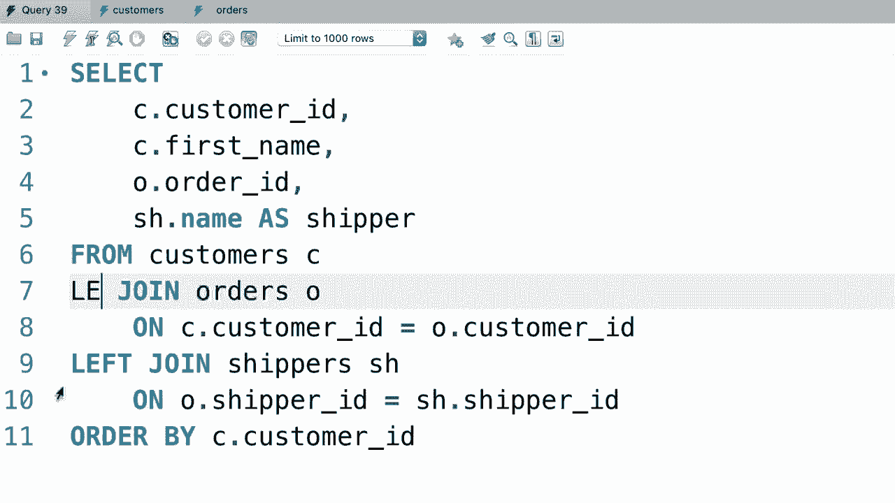

# SQL常用知识点合辑——高效优雅的学习教程，复杂SQL剖析与最佳实践！＜快速入门系列＞ - P25：L25- 多个表之间的外连接 - ShowMeAI - BV1Pu41117ku

哦。类似于内连接，我们可以在多个表之间使用外连接。让我给你展示一下。所以这是我们在上一个教程中写的查询。我们在客户表和订单表之间进行了左连接。当我们执行这个查询时。😊。我们会得到所有客户，无论他们是否有订单，如果他们有订单。

我们看到订单ID。😊，太美了。现在，如果你查看订单表。😊。你会看到我们的一些订单有发货人ID。这些是已经发货的订单。现在让我们将订单表与发货人表连接，以在结果中显示发货人的名称。所以回到查询。😊，在这个左连接之后，让我们在这里写另一个连接，我正在进行内连接。

所以让我们把订单表与发货人表进行内连接，连接发货人。😊。我们称之为SH，连接条件是什么呢？发货人ID应该等于S。发货人ID。好的，所以在这个查询中我们有一个左外连接和一个内连接。😊。让我们看看我们得到什么。😊，好吧，我们只看到五条记录，但我们还有更多的订单。

所以在这里我们遇到了之前同样的问题，我们的一些订单没有发货人，这就是为什么它们没有在这里返回。换句话说。😊，这个连接条件对我们的一些订单来说不成立，所以回到订单表。作为一个例子，这个第一个订单没有发货人，发货人ID是null，这就是为什么它没有在查询结果中返回。😊，所以要解决这个问题。

我们应该使用左连接。我们想确保所有订单都返回，无论他们是否有发货人。所以回到查询。😊。我们需要将这个内连接替换为左连接。😊。让我们执行查询，看看会发生什么。现在我们应该有更多的订单。

来吧。😊，现在为了让这个例子更有趣，我将把发货人名称添加到这里。😊。回到我们的选择子句。我们添加一个新列，像是shipper.dot.name。我们可以给它一个别名，比如shipper。让我们执行这个查询，看看结果。所以我们得到了所有的客户，无论他们是否有订单，而对于那些有订单的客户，我们得到了所有的订单。

无论他们是否有发货人，这就是外连接的力量。在上一个教程中，你学到了使用左连接或右连接都可以得到相同的结果，你只需交换表的顺序。然而，作为最佳实践，避免使用右连接。因为当你连接多个表并且有左连接、右连接和内连接时。

事情会变得非常复杂。其他人阅读你的代码时，会很难想象你是如何连接这些表的。例如，如果你在这里有一个右连接，然后再进行一个左连接，想象这些表是如何连接的就会变得更加困难，因此作为最佳实践，避免使用右连接，改用左连接。😊。

。

这是本教程的练习。我希望你写一个查询，产生这个结果。所以这里我们有这些列：订单日期、订单 ID、客户的名字、发货人。我们可以看到我们的一些订单尚未发货，所以这里有 null，最后是这个状态。花两到三分钟做这个练习，完成后继续观看。

😊 嗯。好的，让我们从订单表中选择所有内容。😊 现在我们应该将其与客户连接。条件是客户 ID 应该等于客户 ID。在这里我使用内连接，因为每个订单都有客户，所以这个条件总是有效，无论我们在这里使用左连接还是内连接。好的，现在在继续之前。

让我们选择我们的列，从订单表中我想选择订单 ID。😊 接下来是订单日期，然后是客户的名字。我们可以选择性地将其重命名为客户。好的。接下来，我们需要选择发货人。😊 我们将结果与发货人表连接。条件是发货人 ID 等于发货人的发货人 ID。不过，如果你在这里使用内连接。

由于我们的一些订单没有发货人，我们只会看到已发货的订单。让我展示给你。为了清晰起见，我将添加发货人的名字，所以发货人名称为发货人。让我们执行查询。你看，我们只看到已发货的订单，但我们想看到所有订单，对吧？

所以我们需要将第二个连接更改为左连接。😊 这样所有订单都会返回，无论它们是否有发货人。让我们再执行一次查询。你看，现在我们看到从第一个到第十个的所有订单，美丽。最后，我们需要在这里添加状态列。所以我们需要再进行一次连接，连接订单状态。

我们将其缩写为 OSs，在 O 的状态上。等于 O 的订单状态 ID。你可以看到我设计这个数据库时，有时我们的列名是完全相同的，但在其他情况下则不匹配。因此在订单表中我们称这个列为状态，而不是订单状态 ID，这是故意的，因为许多真实数据库都是这样的。

好的，现在让我们添加状态名称，所以订单状态为名称。作为状态。执行查询。我们可以看到这里所有的订单，对于每个订单我们都有日期、客户、发货人和状态。

哦。
