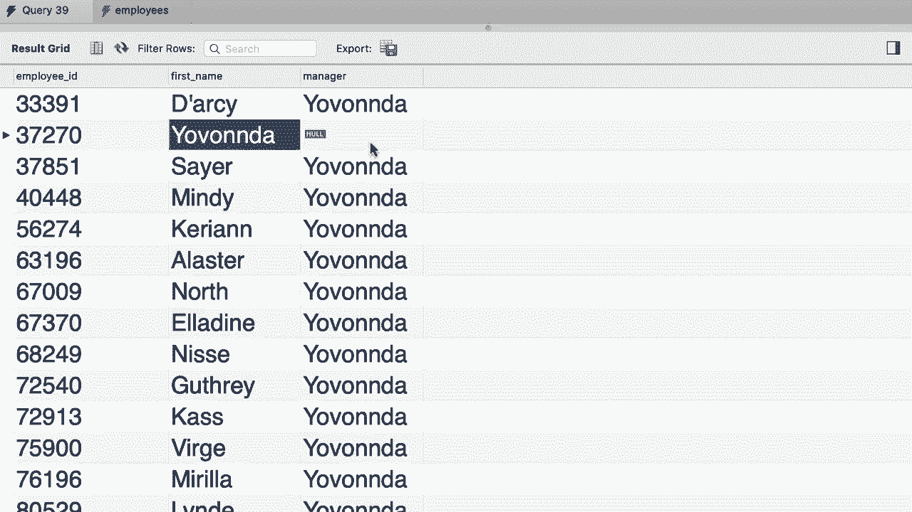

# SQL常用知识点合辑——高效优雅的学习教程，复杂SQL剖析与最佳实践！＜快速入门系列＞ - P26：L26- 自外连接 - ShowMeAI - BV1Pu41117ku

哦。早些时候我们讨论了 SQL 中的自连接，所以在 SQL HR 数据库中，我们有这个员工表。😊 我们写了一个查询来获取所有员工及其经理。所以这里有这一列 reports2，指定了每个员工的经理。让我们回去重写这个查询，以获取所有员工及其经理。😊

回到我们的查询编辑窗口。首先，让我们使用 SQL HR 数据库。然后选择所有内容。😊 来自员工表。我们给它一个别名，然后与自身连接。😊 这就是我们所称的自连接。现在我们将使用一个不同的别名，例如 M 代表经理。😊 现在，连接条件是 E.dot reports to 应该等于 M.dot employee ID，目前为了清晰起见。

让我们只选取三列，E.dot employee ID，E.dot first name，和 M.dot first name，我们将其重命名为经理。好的，让我们执行这个查询，看看我们得到什么。所以这是结果。正如我们所看到的，所有这些员工都有同一个经理。然而，这里缺少了一些东西。我们没有这个人的记录，也就是这个经理本人。

所缺少的是我们可以看到这个人的员工 ID、姓名和经理的记录，而经理应该是 null，因为这个人是 CEO 或公司的负责人。但为什么会这样？这是因为我们的内连接。因为我们这里的条件只会返回有经理的人。

我们可以通过使用左连接来解决这个问题，所以我们进行左连接，因为我们想要获取这张表中的每一个员工，无论他们是否有经理。😊 好的，现在我们再执行一次查询。😊 来吧，现在我们有这个人的记录，经理，正如你所看到的，这个人没有经理，这就是我们这里有 null 的原因。😊

哦。
