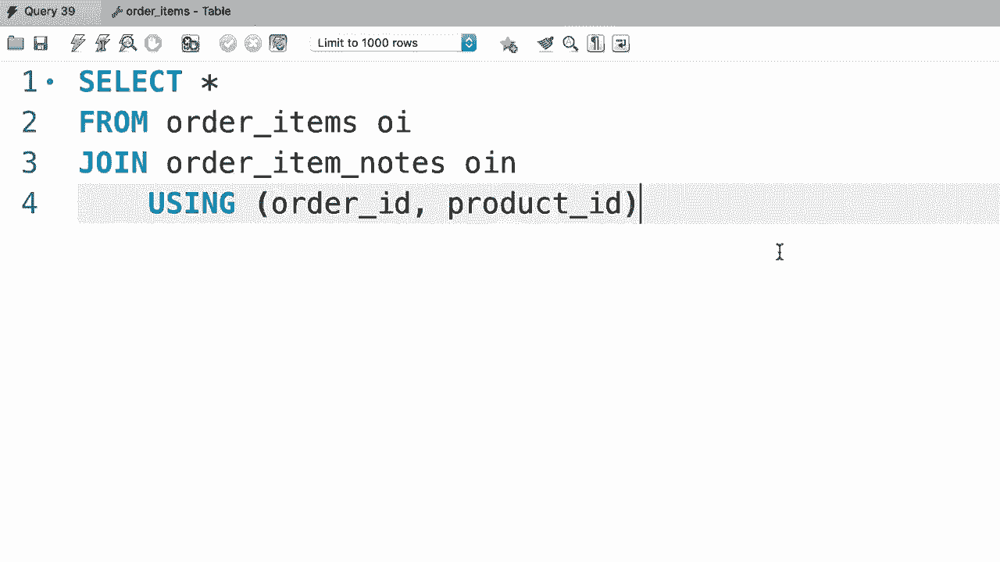
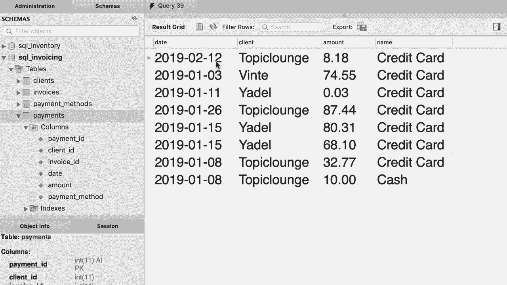
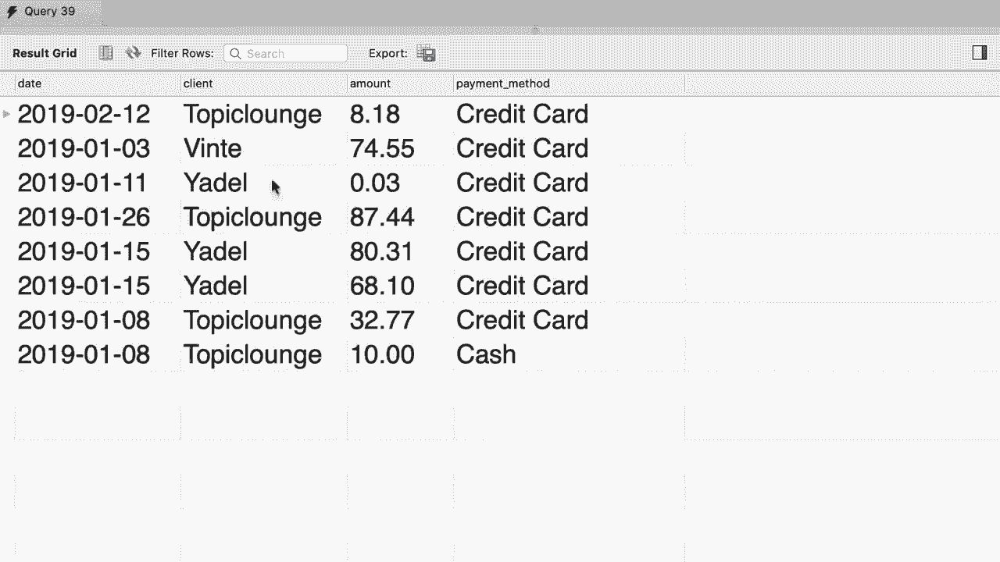

# SQL常用知识点合辑——高效优雅的学习教程，复杂SQL剖析与最佳实践！＜快速入门系列＞ - P27：L27- USING表达式 - ShowMeAI - BV1Pu41117ku

哦。

回到我们的 SQL 存储数据库，这里有一个简单的查询，将订单表与客户表连接在一起。这是我们的连接条件。你之前见过几个这样的例子。随着查询变得更加复杂，这些连接条件会造成困扰。它们使得我们的查询难以阅读，但好消息是，在 MySQL 中。

我们有一个强大的功能可以简化这些查询。😊。如果这两张表中的列名完全相同，我们可以用 using 子句替换 on 子句，这样更简单更短。让我给你演示一下。所以我要注释掉这一行，而是输入 using。😊，在括号中。

我们键入的列名是客户 ID。第 7 行的内容与第 6 行完全相同，但更短且更易读。所以让我删除这一行。我们可以在这里添加另一个连接语句，将订单与发货人连接，因此连接发货人。😊。使用。这两个表中都有的发货人 ID，我们有一个完全相同的列名。好的。

现在让我们执行这个查询。这是我们得到的结果。我们有订单 ID，后面跟着客户的名字。让我们在这里添加一列。因此。我将添加。SH。那个名字是发货人的名字，所以发货人。现在显然因为我们的一些订单没有发货。我们需要将这个内连接替换为左连接。😊。

所以我们可以在内连接和外连接中使用 using 关键字。让我们再执行一次查询。现在我们在每个订单旁边都有发货人名称。很棒。😊，然而，我们不能使用这种技术将结果与订单状态表连接，因为在订单表中我们有一个名为状态的列，但在订单状态表中，这一列有不同的名称。

它是订单状态 ID，让我给你演示一下，所以订单状态列。看，这里有订单状态 ID。所以只有当不同表中的列名完全相同时，using 关键字才有效。现在，如果我们的连接条件中有多个列，例如，之前。

我们谈到这个订单项目表。😊，我告诉你在这个表中我们有一个复合主键。这基本上意味着一个由多个列组成的主键。因此，这两列的组合唯一标识这个表中的每条记录。如果你想将这个表与订单项目备注表连接，在我们的连接条件中，我们应该将这两列与订单项目备注表中的对应列进行比较。

所以让我们快速编写这个查询，然后用 using 关键字简化它。😊，所以选择所有内容。从订单项目。现在将其与订单项目备注连接。在这里，我们需要比较 Oi。订单 ID 与 OI。订单 ID。还有。OI dot 产品 ID 等于 OIN dot 产品 ID。这个连接条件有点混乱。这条查询很难阅读。

现在我们可以用 using 关键字简化这个查询。因此我们谈到使用。😊 在括号中，我们添加两个列并用逗号分隔它们，所以是订单 ID 和产品 ID。

这样不是更好吗？嗯。

现在进行练习，回到我们的 SQL 开票数据库。写一个查询，从支付表中选择支付记录，生成类似这样的内容。因此在这个表中，我们有日期、客户、金额和支付方式，我们可以看到在什么日期谁支付了多少，使用了什么支付方式。

好的，我将使用 SQL 开票数据库。😊 然后选择所有内容。😊 从支付表中。将其与客户表连接。使用客户 ID，因为在这两个表中，我们都有客户 ID 列。接下来，我们需要与支付方式连接，然而这两个表之间的列名不同。

所以在支付表中，我们有一个叫支付方式的列，但在支付方式表中我们的列叫支付方式 ID。😊 所以在这里我们不能使用 using 关键字。我们必须使用 on 子句，因此 on P.dot.payment 方式等于 PM.dot.payment 方式 ID。

现在让我们选择我们的列，支付日期、客户姓名，我们将其重命名为客户。接下来，我们选择金额，最后是支付方式，所以让我们将其重命名为支付方式，并执行查询。这样就得到结果了。😊 日期、客户、金额和支付方式。

哦。
