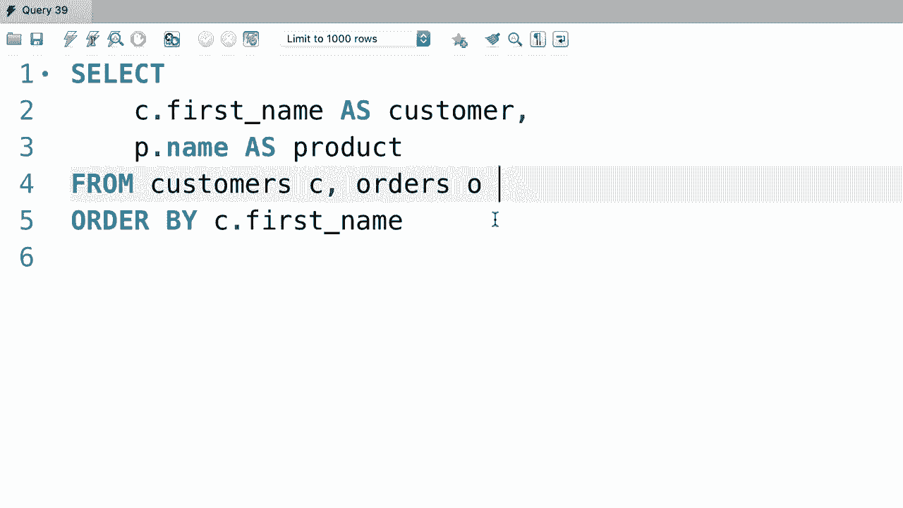
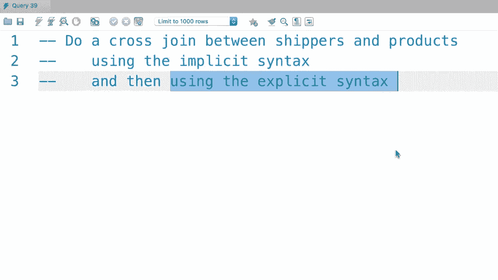
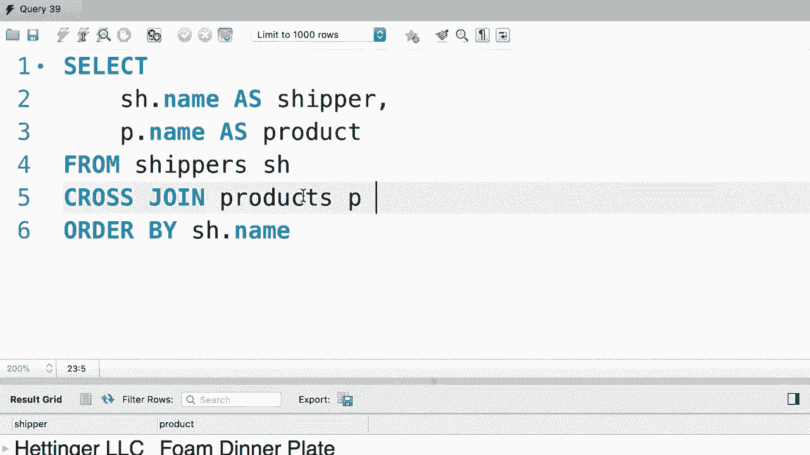

# SQL常用知识点合辑——高效优雅的学习教程，复杂SQL剖析与最佳实践！＜快速入门系列＞ - P29：L29- 交叉连接 

哦。在本教程中，我们将查看 SQA 中的交叉连接。我们使用交叉连接将第一张表中的每一条记录与第二张表中的每一条记录组合或连接。这里有一个例子。让我们选择所有内容。😊，来自客户表。现在我们在这里进行交叉连接。与产品表。因此，客户表中的每一条记录将与产品表中的每一条记录组合。

这就是为什么我们这里没有条件。好的，这就是我们所说的交叉连接。为了清晰起见，我们选择几列。比如看到这个名字。我们将其重命名为客户，然后是产品名称，我们将其重命名为产品。此外，让我们按客户的名字对结果进行排序。现在执行查询。😊

这是交叉连接的结果。所以首先我们有 Amber 作为客户。然后是所有与不同产品的组合。接下来，我们有 Barbara 或其他的。再次，我们有这个客户与所有产品的组合。在这个特定的例子中，使用交叉连接并没有太大意义。

使用交叉连接的真实例子是当你有一个包含小、中、大的尺寸表和一个包含红、蓝、绿等颜色的表时。然后你想将所有尺寸与所有颜色结合起来。这就是你使用交叉连接的时机。😊现在，我们所拥有的被称为交叉连接的显式语法。

我们还有隐式语法，这样看起来就不是输入交叉连接。我们在 F 子句中输入多个表，所以是客户和订单。这两个查询产生相同的结果，但我个人更喜欢使用显式语法，因为它更清晰。

这里有一个简单的练习给你。对运输商和产品做一个交叉连接。首先用隐式语法，然后用显式语法。这个过程相当简单。我只希望你在代码中动手，熟悉这种语法。😊

好的，首先，我将使用隐式语法，然后我将向你展示显式语法。让我们开始选择两个表中的所有内容，运输商。😊和产品。为了清晰起见。让我们选择两列，运输商的名字，我们将其重命名为运输商。产品名称，我们将其重命名为产品。最后，让我们按运输商的名字对所有内容进行排序。

让我们执行查询。这是我们得到的结果。所以所有运输商和所有产品的组合。太美了。现在让我们使用显式语法。所以我们从基础表中选择所有内容，在这种情况下，是运输商，然后与产品进行交叉连接。😊这产生了完全相同的结果。

哦。
