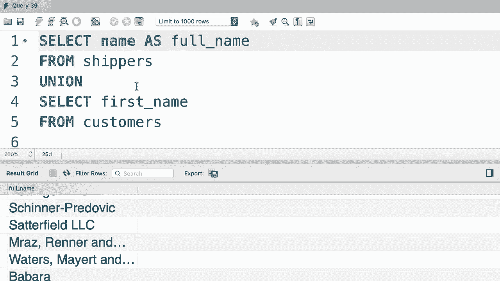
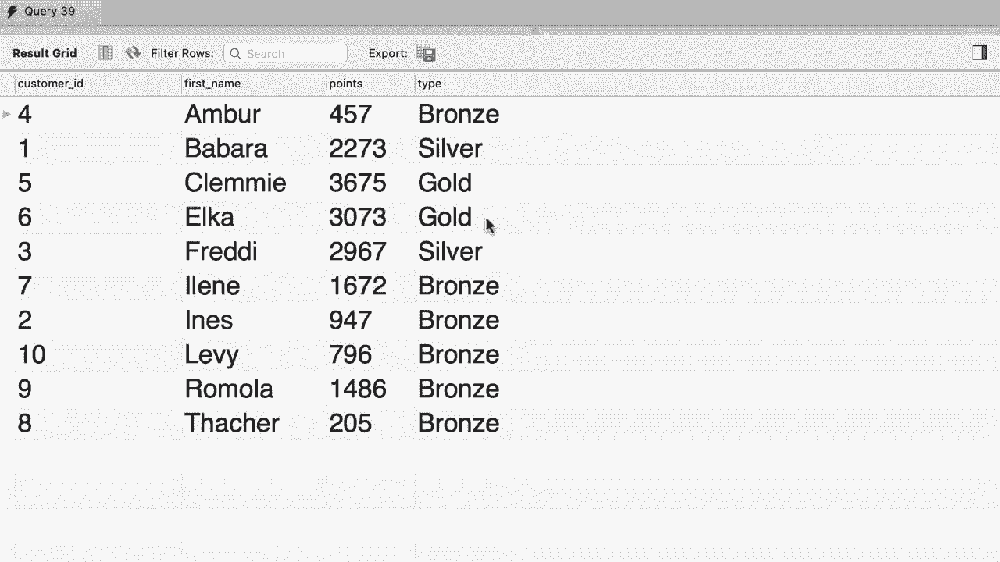

# SQL常用知识点合辑——高效优雅的学习教程，复杂SQL剖析与最佳实践！＜快速入门系列＞ - P30：L30- 联合 

哦。我们已经涵盖了所有关于连接的内容。你将了解到，通过连接我们可以组合来自多个表的列。但在SQL中，我们也可以组合来自多个表的行，这个功能极其强大。让我给你展示一下它是如何工作的。😊，首先，让我们快速查看我们的订单表。所以从订单表中选择所有内容。现在，如果你查看数据。😊。

我们可以看到第一个订单是在当前年份2019年下单的。所有其他订单都是在之前的年份下单的。现在假设我们想创建一个报告，获取所有订单，并在每个订单旁边添加一个标签，如果订单是在当前年份下单，标签将是active，如果订单是在之前的年份下单。

我们想将其标记为归档。所以。😊，让我们更改查询并在这里添加一个条件。首先。我们想获取当前年的所有订单，所以条件是。订单日期大于或等于2019年01月01日。现在我只是想强调，这不是获取当前年订单的理想方式，因为这里我们硬编码了2019。所以如果我们在明年执行这个查询，我们不会得到正确的结果。

但现在不用担心，稍后在课程中我会告诉你如何在不在这里硬编码日期的情况下获取当前年的订单。😊，所以让我们执行这个查询。😊，现在我们只得到一个订单，让我们挑选几个列。比如订单ID。还有订单日期。并且，我想在这里添加一个字符串字面量。😊，比如active。对吧。让我们执行这个查询。这就是我们得到的结果。我们有三列，订单ID，订单日期。

还有一个active，在这一列中我们目前有这个字符串值active。😊。现在让我们也把这一列重命名为状态。并执行查询。😊，这更好了。现在我们想写一个类似于这个的查询，返回前几年的订单，但有一个不同的标签归档，所以为了节省时间。😊，我将复制这几行。

然后将它们粘贴在我们的第一个选择语句后面。请注意，这里我们有一个语法错误，因为我们没有用分号终止第一个选择语句。但现在不用担心，我们马上会回到这个问题。所以对于第二个查询。

我们想返回一个不同的标签归档。😊，而且我们想将条件更改为小于2019。现在。只需选择这几行并通过点击这里的图标或使用你在课程中学到的键盘快捷键来执行这个查询。

看！这里是所有来自前几年的订单，带有归档标签。这个查询返回了九条记录，而之前的查询返回了一条记录。现在使用联合操作符，我们可以将这两个查询的数据结合在一起。在我们的选择语句之间，输入union。现在让我们再执行一次查询。

所以这是我们当前年份的第一张活动订单，下面是之前年份的所有订单。因此，通过使用`union`运算符，我们可以合并多个查询的记录。在这个例子中，我们的两个查询都是针对同一张表，但我们也可以对不同的表进行查询，然后将结果合并成一个结果集。😊 让我给你展示另一个例子。我要把这里的所有内容删除。😊

让我们从客户表中选择名，然后我们可以将其与。😊 发货人表中的姓名进行`union`。让我们执行查询。这样在一个结果集中，我们可以看到所有的客户和所有的发货人。据我所知，这个特定查询在现实世界中没有实际应用案例。

但我想指出的是，通过`union`你可以合并多个查询的结果。😊 这些查询可以针对同一张表或不同的表。在你的数据库中，你可能会有一张类似“归档订单”的表，和另一张“订单”表。然后你可以将所有归档的和活动的订单合并成一个结果集。

只需记住，每个查询返回的列数应该相等。否则你会得到一个错误。例如，让我们从客户中选择名和姓，然后将其`union`。😊 用发货人姓名来做，让我执行这个查询，我们会得到一个错误，因为这个查询的第一部分返回了两列。

但第二部分返回了一列。因此我的技能不知道如何合并这些记录。在我们完成这个教程之前还有最后一件事。如果你查看这里的结果，这一列的名称基于第一个查询，所以第一个查询返回了名。也正因如此，这一列被称为名。如果我们改变这些查询的顺序。

并把这个`union`放到这里。现在让我们运行这个查询。😊 如我们所见，我们的列叫做姓名。因此，我们在第一个查询中的内容用于确定这些列的名称，我们也可以将列重命名为“全名”。

有一个。

好的，这里是你本教程的练习。写一个查询来生成这个报告，这里我们有四列：客户ID、名、积分和类型。正如你所知，我们在客户表中没有这个列，所以我们根据每个客户的积分计算了这一列的值。

如果他们的积分少于2000，他们的类型是青铜；如果他们的积分在2000到3000之间，他们是银客户；如果他们的积分超过3000，他们是金客户。同时请注意，我们在这里是按名对结果进行了排序。那么现在请花两分钟时间来写这个查询。好的，首先。

让我们获取青铜客户。所以从客户中选择所有记录，条件是😊，积分少于2000。现在我们要选择三列：客户ID、名字和积分。最后，我们添加一个新列，内容为字符串字面量😊，Fronance。让我们运行这个查询，看看结果。这里是所有的青铜客户。

但是这个列的名称是青铜。我们不想要这个名称。所以让我们把它重命名为类型。现在这部分超出了屏幕范围。所以我会把它分成多行，使我们的查询更清晰、更易读。😊。好吧，让我们再运行一次查询。现在这个列叫类型 Beai。

现在我们应该进行一次合并。并重复这个查询，但提取白银客户。所以我会把这个查询粘贴到这里。😊，然后进行一些更改。我将把青铜替换为白银。并将条件改为在2000到3000之间。让我们运行查询，看看结果。我们首先得到了所有的青铜客户。

接下来是所有的白银客户。这些记录的顺序是根据我们的查询结果。在第一个查询中，我们得到了青铜客户，所以它们排在最前面。但这不是我们想要的。我们想要按客户的名字对结果进行排序。所以让我们在最后添加一个排序。按照名字排序。现在还有一部分内容没有处理。

我们应该再进行一次合并。我准备查询以获取黄金客户。所以我将选择这几行并😊，把它们粘贴到这里。现在将白银改为黄金。并将条件更改为积分大于3000。最后我们再做一次排序。让我们再运行一次查询。😊，这是最终结果。

我们的客户按名字排序。我们可以看到所有的青铜、白银和黄金客户。
