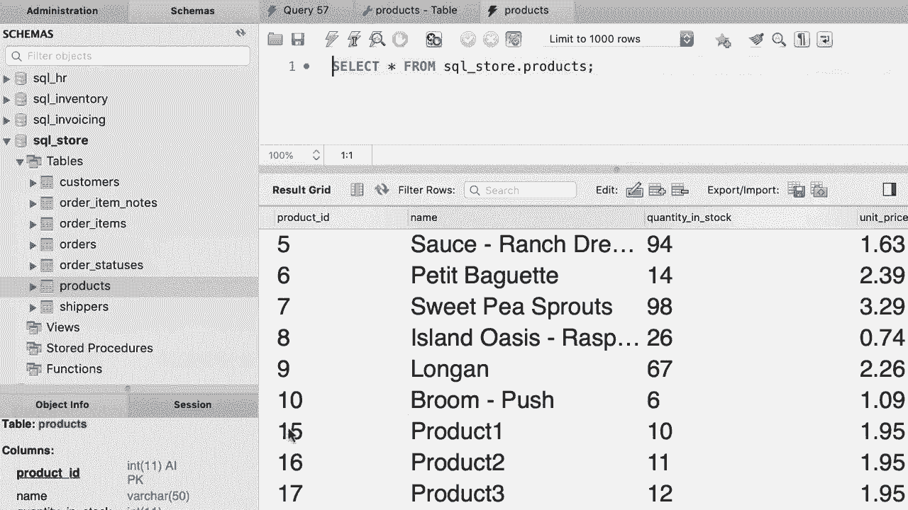

# SQL常用知识点合辑——高效优雅的学习教程，复杂SQL剖析与最佳实践！＜快速入门系列＞ - P33：L33- 插入多行 - ShowMeAI - BV1Pu41117ku

哦。在本教程中，您将学习如何一次插入多行。为了这个演示，我们将使用这个shippers表。让我们快速查看一下表的定义。😊。在这里，我们有两个列，shipper ID和名称。😊，Shiper ID是主键，它不能为空，并且是一个自增列，因此我们将让MySQL为此列生成值。

😊，我们只需要为名称列提供一个值，所以回到我们的查询编辑窗口。😊。我们输入，插入到shippers。在括号中，我们指定要插入值的列名称。在这种情况下，名称后面跟着值子句。这里我们添加一对括号，值为shipper1。现在要插入多行，您只需添加一个逗号，后面跟着另一对括号。

所以Shiper二，再来一次，逗号，括号，Shiper3。😊。这就是您如何一次插入多行。现在让我们执行这个语句。😊，好的。然后检查shippers表中的数据。看吧。因此，最初我们只有五个发货人，这里是我们插入的三个新发货人。

请注意，我的SQL自动生成了发货人ID列的值，因此我们得到了6、7和8。😊，嗯。好的，这是您本教程的练习。编写一个语句以在产品表中插入三行，这很简单。您可以在一分钟内完成。😊，所以这是我们的产品表，我们只有四列。

我们将省略第一列，因为它是自增列。因此，我们只需要提供名称、数量和单价的值。😊。回到我们的查询编辑窗口。😊，让我们插入到产品中。列是名称、库存数量和单价。值将是，假设是product1。

股票将达到10，单价将为1.95。现在，我要选择这些值，复制。来吧。粘贴。像这样。相应地更改值。最后，最后一行是product3。好了，让我们执行这个语句。😊，好的。然后验证结果。所以在产品表中。现在我们应该有三条新记录。现在。

你看到的这些值是15、16和17，因为在录制这个视频之前，我实际上在这个表中插入了一些记录，然后将它们删除了。所以我有产品111213和14。现在，尽管它们实际上已从此表中删除，但我的技能仍记得它们的ID。因此，而不是将10递增到11，它递增到了14。这是之前的最后一条记录，这就是为什么它生成了15。 在你的电脑上。

这些值将是1112和13。😊，哦。
