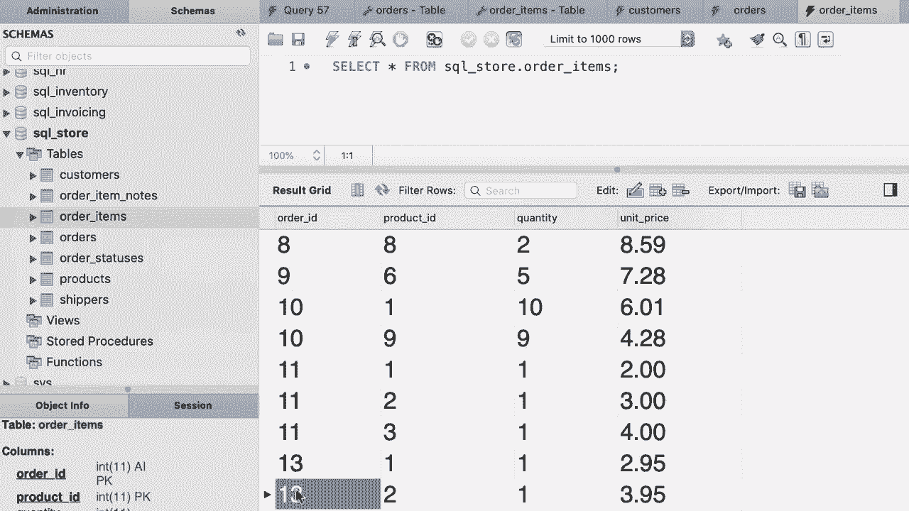

# SQL常用知识点合辑——高效优雅的学习教程，复杂SQL剖析与最佳实践！＜快速入门系列＞ - P34：L34- 插入分层行 - ShowMeAI - BV1Pu41117ku

哦，到目前为止，你只学会了如何在这个教程中向单个表插入数据。我将向你展示如何向多个表插入数据。这里有一个非常好的例子。看看订单表。我们这里有什么列？我们有订单ID，我们有客户ID，所以我们知道是谁下的这个订单。我们知道订单的日期。

我们知道这个状态、评论以及运输信息。但此订单的实际项目不在此表中，它们在订单项目表中。所以在这个表中我们有四列，我们有订单ID，所以我们知道这个项目属于哪个订单。我们还有产品ID。

所以我们知道什么产品被订购，数量和价格。因此，一个实际订单可以有一个或多个订单项目。这就是我们所说的父子关系。在这个关系中，订单表是父表，订单项目表是子表。所以订单表中的一行可以在订单项目表中有一个或多个子项。在这个教程中，我将向你展示如何插入一个订单及其所有项目。这样你将学习如何向多个表插入数据。

😊 好的，回到我们的查询编辑器窗口。首先，我们需要插入订单。所以插入到。让我关闭导航面板。好的，我们想在订单表中插入一条记录。😊 现在，这里有什么列？我们有这些列，但只有前四个是必需的，实际上第一个我们不需要担心，因为这是一个自增列。

所以我们只想提供客户ID、订单日期和状态的值，回到我们的查询。😊 我们在这里指定这些列。客户ID、订单、日期和状态。现在让我们应用这些值。在客户ID列中，我们需要添加一个有效的客户ID。让我们快速查看一下我们的客户表。😊 好的，那里有11条记录。

这些是有效的客户ID。现在回到我们的查询，让我们用一个作为客户ID。然后2019年1月2日作为订单日期，状态再次为1。在这一列中，我们需要插入一个有效的订单状态ID。如果我们不提供有效的ID，系统将会警告我们。所以我们在这里插入一个订单。现在我们需要插入项目。

现在回到我们的订单项目表。在这个表中，我们有这个订单ID列。所以这是一个棘手的部分。我们一旦插入一个订单，我的技能将为我们的新订单生成一个ID。现在我们需要能够访问这个ID，以便在此表中插入项目，我们该如何做到呢？

返回到我们的查询编辑器窗口。😊 在MyQ中，我们有一堆内置函数，函数基本上是一段我们可以重用的代码。就像电视中的功能，每台电视都有一堆内置功能，比如开机。

关闭电源，调整音量，更改频道等等。因此，Myq 和其他数据库引擎提供了一堆内置函数，我们可以在程序中使用。其中一个函数是 last insert ID。我们可以通过在这里添加括号来调用或执行此函数。这将返回当我们插入新行时 Myq 生成的 ID。因此在进一步之前。

让我们选择这个，确保我们得到正确的结果。😊现在我们这里有一个语法错误，因为我们没有用分号终止第一个语句。好的，现在让我们执行这个查询。😊好的，新的订单 ID 是 12。让我们验证一下，所以回到订单表，看看我机器上的数据，我这里有 12 条记录。

实际上我在录制这个视频之前刚创建了一个。因此在你的机器上，你将有 11 个订单。😊现在回到我们的查询窗口。现在我们知道如何获取新插入记录的 ID。我们可以使用该 ID 来插入子记录。因此，我们将编写另一个插入语句。

插入到订单项中。让我们再看看这个表中的列。我们有四列，所有列都是必需的。所以实际上没有必要在我们的插入语句中指定列名。我们只需提供订单 ID、产品 ID、数量和单价的值。

在值子句中，我们有括号。我们的订单 ID 是什么？这是调用此函数返回的值。所以我将从这里剪切这个并放到这里。接下来我们需要提供一个有效的产品 ID。假设是 product1。数量，假设是 1，单价为 $2.95。现在让我们删除这个选择。

我们其实不再需要它。让我们再添加一组值。所以再次，我们将调用 last insert ID 来获取新订单的 ID。😊我们将把产品更改为产品编号 2，价格也不同。就这样。现在让我们执行这些语句，看看我们得到什么。😊好的，回到我们的订单表。

让我们在这里刷新记录。好的，我们有一个新的订单，订单号为 13。太好了。现在让我们查看订单项表。😊这里是订单项，让我们打开表格。对于订单号 13，我们应该有两个项目。太棒了。这就是如何在 MySQL 中插入层次数据。😊

