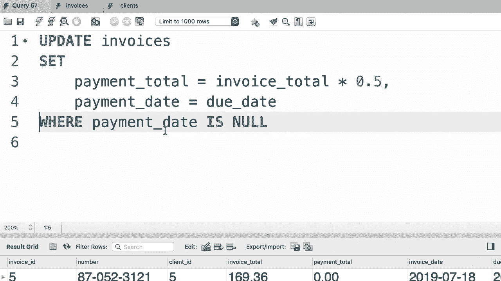

# SQL常用知识点合辑——高效优雅的学习教程，复杂SQL剖析与最佳实践！＜快速入门系列＞ - P38：L38- 在更新中使用子查询 - ShowMeAI - BV1Pu41117ku

哦。在这个教程中，你将学习如何在更新语句中使用子查询，这非常强大。所以我们将继续上一个教程的例子，但我们会让它更有趣。这里我们正在更新客户编号三的所有发票，但如果我们没有客户的ID，只有名字怎么办？想象一下，你有一个应用程序，在那个应用程序中用户输入客户的名字。所以首先我们应该找到该客户的ID，然后用那个ID更新他们所有的发票。我们该怎么做呢？

让我们快速看一下我们的客户表。😊这里有这个客户，我的工作。假设我们有名字，我们想找到ID。😊所以回到我们的查询编辑器窗口。😊在这个更新语句后，我将写一个选择语句来选择客户ID列。😊来自客户表，条件是名字等于我的工作。

现在这里出现了语法错误，因为我们没有用分号结束最后一个语句。但不用担心，我们马上会回到这一点。让我们选中这几行并执行这个查询。😊这个客户的想法太美妙了。现在我们可以在更新语句中将这个选择语句用作子查询。

正如我之前所说，子查询是在另一个SQL语句中的选择语句。😊所以，我们不再在这里硬编码，而是将这个选择语句用作子查询，但我们需要将其放在括号中。😊所以，我的学校会首先执行这个查询。它会返回客户ID，然后在这个条件中使用它。😊为了清晰起见。

让我们去掉换行并缩进这几行。😊这是最终结果。现在我们执行这个查询，这更新了该客户的所有发票。现在，如果这个查询返回多个客户，比如，回到客户表。让我们想象一下，我们想更新所有位于纽约或加利福尼亚的客户的发票。

所以我们需要像这样更新我们的子查询。😊在，加利福尼亚和纽约。现在，在执行整个语句之前，让我们先选择我们的子查询并执行它，看看我们得到什么。所以我们得到了两个客户ID，一个和三个，太美妙了。因为这个查询，这个子查询返回多个记录，我们不能再在这里使用等号了。

所以我们需要将其替换为in运算符。😊现在这个语句更新了位于这两个州的所有客户的发票。让我们执行它。😊太美了，一切都正常。作为最佳实践，在执行你的更新语句之前，运行你的查询以查看你将要更新哪些记录，这样你就不会意外更新不应该更新的记录。现在这里有一个子查询。

但是即使没有子查询，我们仍然可以查询要更新的记录，让我给你演示一下。所以假设我们要更新所有支付日期为null的发票。😊，在执行整个更新语句之前，我会运行一个这样的查询。

选择开始从发票中支付日期为空。现在，让我们执行这个查询。😊。这两条记录没有支付日期。因此，一旦我们确认更新了正确的记录，我们就会回到这里。去掉这个选择语句，只需将字词子句附加到我们的更新语句上。😊。

好吧，这是本教程的练习，回到我们的 SQL 商店数据库。查看订单表。😊，如您所见，一些订单没有评论。我希望您编写一个 SQL 语句，更新积分超过3000的客户的订单评论。所以积分超过3000的客户被视为黄金客户。如果他们下过订单，请找到他们的订单，更新评论列并将其设置为“黄金客户”，这是一个很好的练习。

首先，我们需要找到黄金客户，因此从客户表中选择所有记录，条件是积分大于3000。顺便说一下，因为当前数据库是 SQL 发票，我们要么在顶部输入使用语句，要么在执行此查询之前双击此数据库。好了，我们有三个黄金客户。现在。

我们需要获取这些客户的信息以便在更新语句中使用。所以我们只选择客户ID。然后将此选择语句用作子查询和更新语句。😊，更新订单，设置评论为黄金客户。条件是客户ID。因为我们正在处理多个客户ID，我们需要使用 in 操作符。😊。

然后要将其用作子查询，我们需要将其放在括号中。这就完成了。让我们缩进代码。这样更好。这里是最终解决方案。

哦。
