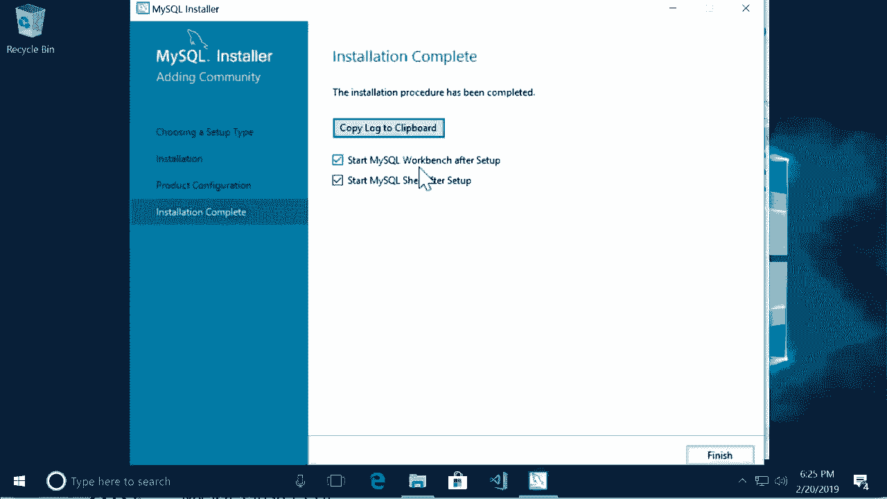

# SQL常用知识点合辑——高效优雅的学习教程，复杂SQL剖析与最佳实践！＜快速入门系列＞ - P5：L5- 在 Windows 上安装 MySQL 

哦。在这个教程中，我将向你展示如何在Windows上安装MySQL。打开你的浏览器，访问Mysql。co。😊，然后去下载页面。现在，在这里，向下滚动到底部。我们将使用My SQL Community Edition，这是完全免费的，所以让我们选择这个。😊，现在选择My SQL Community Server。😊，然后，向下滚动。

在这里，你应该看到类似于Windows的My Sql安装程序。这是推荐的在Windows上安装My Sql的方法。所以点击这个。好的。在下一页，向下滚动。然后下载这里的第一个安装程序。在下一页，向下滚动并点击“不，谢谢”。只需开始我的下载。否则。

你需要在登录时创建一个账户，这对学习本课程并不是必要的。所以让我们继续。然后将此文件保存到我们的电脑。😊。

然后，运行它。

我们将使用这个设置向导在我们的电脑上安装My Sql。这非常简单。你只需点击下一步，但有几个地方需要输入密码。让我给你展示一下。在设置类型的第一页，我们将使用开发者默认设置。😊，去到下一页，这里我们收到一个小警告，因为这个安装向导想要安装Python 3的连接器。

7，但我在这台机器上没有Python，所以我收到了这个警告。现在在你的机器上你可能会或可能不会收到这个错误，这并不重要，只需点击下一步，再一次。😊。所以这里是将要安装的产品。第一个是mySql服务器。

第二个是mysql workbench。这是我们用来连接数据库服务器和管理数据库的图形工具。你很快就会看到这一点。所以点击执行。😊。现在这大约需要五到十分钟，所以我会暂停录制。

好的，所有产品都已安装，太棒了。让我们去下一页，这里在组复制页面上也点击下一步。😊。在下一页，关于网络设置，保留所有默认设置。所以让我们去下一页。现在我们应该为root或admin用户设置一个密码。

所以点击下一步。😊，在这个框中，为admin用户输入一个密码。好的。然后我们再次进入下一页，保留所有默认设置，点击下一步，再次执行。好的，现在让我们完成安装。再次，我们必须点击下一步，然后完成。😊，再一次，有这么多步骤。现在这是你需要输入admin密码的页面。

这个页面叫做连接到服务器。你可以看到用户名是root，代表管理员用户。😊，在这个框中，输入你之前设置的密码，然后点击检查。好的，连接成功，太好了。让我们进入下一页并点击执行。😊，最后，完成。好了。

我们还有一步。现在，经过所有这些步骤，安装完成。接下来，这将启动我的Sql工作台，这是我们用来管理数据库和运行SQL查询的图形工具。所以点击完成。😊。

现在我们有一个命令提示窗口，可以在这里输入指令与我们的MySQL服务器对话。我们其实不需要这个，所以关闭它。😊。

这是我的SQL工作台。现在，第一次打开这个页面时，你应该会看到一个连接，如果没有看到，点击这个加号图标。😊，在这个页面上，给这个连接起个名字，比如本地实例，将所有设置保持为默认值。但在密码这里，点击存储在保管库。😊，在这个框中。

输入你为管理员用户设置的密码。所以我将把它放在这里。好的。现在点击测试连接。好的，我们成功连接到了这台电脑上的MySQL服务器。😊，然后点击确定。现在我们点击这个连接以连接到我们的数据库服务器。好的。这里是你在本课程中将使用的界面，左侧是导航面板，中间是查询编辑器。

我们可以调整大小。😊，这里是我们将编写SQL查询的地方。右侧是SQL附加功能。😊，我们已经完成了在电脑上安装MySQL。接下来，我将向你展示如何为本课程创建数据库。😊。

哦。
