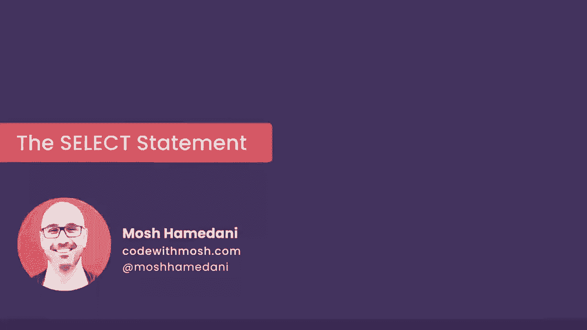
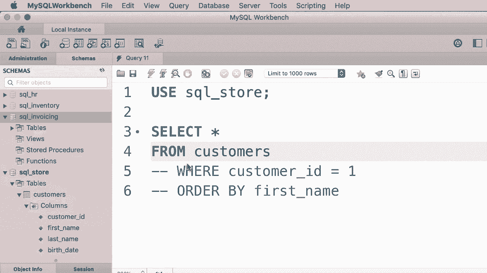
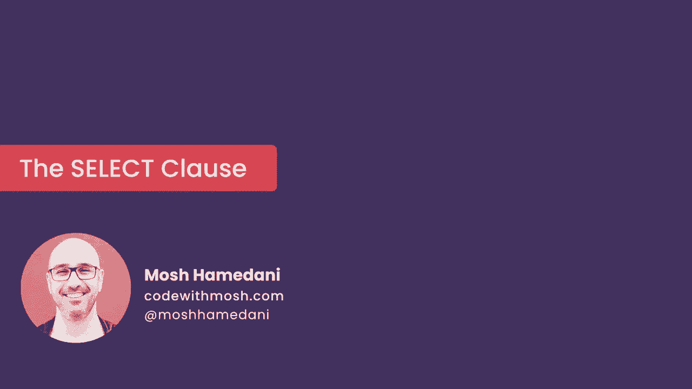

# SQL常用知识点合辑——高效优雅的学习教程，复杂SQL剖析与最佳实践！＜快速入门系列＞ - P7：L7- SELECT 语句 

哦。在本教程中，我将向你展示如何从单个表中检索数据。现在看看导航面板，目前没有我们的数据库以批量方式显示，这意味着这些数据库都没有被选中用于查询。因此，编写从数据库获取数据的查询的第一步是选择一个数据库。我们将写的查询将针对该数据库执行。

在这个演示中，我们将使用这个SQL存储数据库，所以我们输入使用SQL在线商店。使用是SQL语言中的一个关键字，这就是它显示为蓝色的原因。现在SQL不是大小写敏感的语言，这意味着我们可以使用大写或小写字符。其实没有关系，但作为最佳实践，我们应该将SQL关键字大写，其他内容小写。

😊，所以现在让我们继续执行这个查询。好的，看看。这个SQL存储数据库现在在批量中显示。现在，在我的技能工作区，你也可以通过双击来选择一个数据库。所以现在我双击SQL发票，它就是当前数据库。现在，如果我们再次运行这个查询。

😊，SQL存储数据库已被选中。好吧。现在让我们写第一个查询，以检索该数据库中的所有客户。😊。在使用语句之后，我们将使用选择语句。以下是选择语句的基本语法或基本结构，我们在前面输入选择，指定我们要检索的列。例如，我们可以检索客户ID列和名字列，或者我们可以使用星号检索所有列。

现在，在此之后，我使用了F子句，这是我们指定要查询的表，在这种情况下是客户表。所以这是选择给定表中所有客户的最简单查询。😊。现在，每当你有多个SQL语句时，你需要用分号终止每个语句。看看，我们这里有一个红色下划线，表示错误。

如果你将鼠标悬停在这里，你会看到这个工具提示说选择在这个位置无效，因为我们没有用分号终止第一个语句。现在让我们再执行一次这个查询，我们可以点击这里的按钮，或者使用快捷键。

😊，所以请看顶部的查询菜单。😊，第一个项目是执行。现在，这个命令在Mac上的快捷键是shift命令和enter，而在Windows上会有所不同。老实说，我不太确定。所以无论是什么，使用那个。现在我将按shift命令和enter。😊。这里是所有客户和一个表格。所以这个选择语句有两个子句。

select 子句和 f 子句，但我们还有其他子句可以用来过滤和排序数据。例如，我们可以使用 where 子句来过滤结果，获取 ID 为 1 的客户，所以我们可以写出这样的表达式 where customer_underline ID equals one。

现在，当我们执行这个查询时，我们只会得到 ID 为 1 的客户。😊，这就是 where 子句。我们也可以对数据进行排序，所以。😊，在 where 之后我们使用 order by 子句。在这里，我们指定希望根据其名字排序的列。假设我们想按客户的名字排序。

所以我们在这一行输入 first name。那是这个表中其中一列的名字。现在如果我们执行这个查询，这个 order by 实际上没有任何影响，因为结果中只有一条记录。所以让我暂时去掉 where 子句。为了做到这一点，我们可以在这一行前面加上两个短横线。现在这一行被视为注释。

这意味着 SQL 引擎将不会执行这个。好的，所以让我们再执行一次这个查询。😊，现在我们获取的所有客户都是根据他们的名字排序的。这就是基本的想法。在接下来的几个教程中，你将详细学习每个子句。

但在这个教程中你需要记住的是，这三个子句 from、where 和 order by 是可选的，正如你在这个例子中看到的，我没有使用 word clause。我们也可以注释掉 order by 子句，我们也可以注释掉 from 子句，所以我们可以选择某些值，比如一和二，而不是选择给定表中的所有列。现在，如果你再次执行这个查询，结果中会有两个名为 one 和 two 的列，在这些列中我们有这些值。

😊，所有这些子句都是可选的，但在现实世界中我们经常使用它们。现在你需要明白的是，这些子句的顺序很重要。因此我们总是先有 select，然后是 from，再是 where，最后是 order by，我们不能改变这些子句的顺序。否则我们会得到一个语法错误，这基本上意味着我们的 SQL 语句的语法或结构不正确，因此无法执行。在结束这个教程之前，还有一件事需要提到。在这个例子中，你可以看到我将所有这些子句列在新的一行上，实际上你不必这样做，因为换行是被忽略的。

在执行 SQL 语句时，空格和制表符会被忽略。因此，我们可以回到这里，将 from 放在 select 前面。所以 select star from customers 全部写在一行，这对简单查询来说是完全可以的，但随着查询的复杂性增加，最好将每个子句放在新的一行上。

😊，所以这就是本教程的全部内容，下一个教程将详细探讨 set 子句。😊。

哦。
