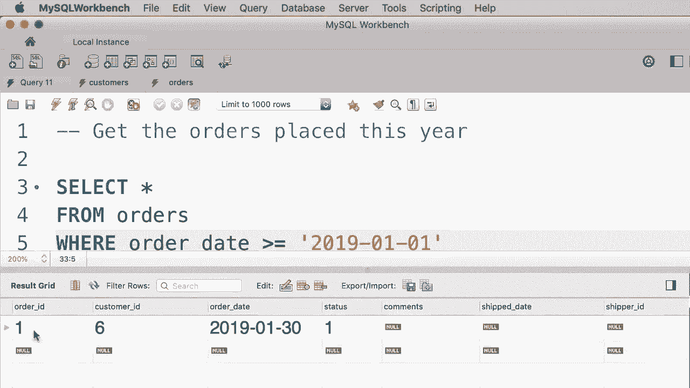

# SQL常用知识点合辑——高效优雅的学习教程，复杂SQL剖析与最佳实践！＜快速入门系列＞ - P9：L9- WHERE 用法 

哦。在本教程中，我们将查看SQL中的WHERE子句，所以之前我告诉过你我们使用WHERE子句来过滤数据。例如，假设我们只想获取积分大于3000的客户。那么在WHERE子句中，我们可以输入这样的条件。😊 积分大于3000。当我们执行这个查询时，我的技能中的查询执行引擎将遍历客户表中的所有客户。

对于每个客户，它会评估这个条件。如果这个条件为真，它将返回该客户的结果集。所以让我们继续执行这个查询。😊 这是结果，如你所见，我们只有两个积分大于3000的客户。这就是我们所称的“大于”运算符，它是SQL中的比较运算符之一。

让我给你展示完整的比较运算符列表。😊 我们有大于、大于等于，还有小于、小于等于。这里是等于运算符，和不等于运算符。我们可以使用一个感叹号后面跟一个等号，或者像这样。

所以这两个都是不等于运算符。让我给你展示一些这些运算符的例子。所以我将删除所有内容，恢复到之前的查询。假设我们只想获取弗吉尼亚州的客户。那么我们可以将条件更改为这样的形式，即状态等于弗吉尼亚。注意我把弗吉尼亚放在引号中，因为这就是我们所称的字符串。

字符串是一串字符，所以每当你处理一串字符或基本文本数据时，你需要用单引号或双引号括起来，但通常习惯上我们使用单引号。所以让我们执行这个查询。😊 这是结果。你可以看到，我们只有这两个位于弗吉尼亚的客户，ID为1和2。

而且不管我们使用大写字母还是小写字母，所以如果我们以小写输入VA并执行查询，我们会得到完全相同的结果。那么，如果我们想获取所有不在弗吉尼亚州的客户呢？我们可以使用不等于运算符，因此我们可以在前面加上感叹号。😊 或者使用。

这种表示法。无论如何，我们得到相同的结果。所以这些是未位于弗吉尼亚的客户。现在我们也可以将这些比较运算符与日期值一起使用。例如，假设我们想获取只在1990年1月1日之后出生的客户。

所以我们再次将条件2更改为出生日期大于，我们使用引号来表示日期值。尽管日期实际上并不是字符串，但在SQL语言中，我们应该用引号括起来。因此这里我们输入1990-01表示一月，-01表示日期。

所以这是在MySQL中表示日期的标准或默认格式：年份4位，月份2位，日期2位。我们来执行这个查询。其实我这里犯了一个错误，所以我们看不到结果，反而看到了操作输出或输出窗口。如果你滚动到底部，可以看到错误的详细信息。

所以这里我用了错误的列名。😊，我们应该用下划线分开这两个词。这就是我们的列名。所以我们再执行一次查询。我们只有三位客户是在1990年1月1日后出生的。所以这些是SQL中比较运算符的例子，在下一个教程中，我将向你展示如何在过滤数据时结合多个条件。

好的，这是你的练习，我希望你写一个查询，获取今年下的订单。所以查看订单表，看看我们有哪些列，并基于此写出带有条件的查询。😊，这里是订单表，我们有这个列“订单日期”。我们可以用这个列来查看今年下的订单，所以我们的查询是。

select star from orders where order_unalign_date is greater than or equal to January 1, 2019，假设这是当前年份，所以2019-01-01。😊，现在，由于我们当前在2019年，这个查询将返回今年下的所有订单，但明年这个查询将不会给我们正确的结果。

但别担心，在课程后面，我会教你如何写查询以获取当前年份的订单。所以为了这个练习，这是一种有效的解决方案。现在我们来执行这个查询，看看我们得到什么。😊，所以我们只有一个订单，订单ID为1，是在当前年份下的。

哦。

哦。
