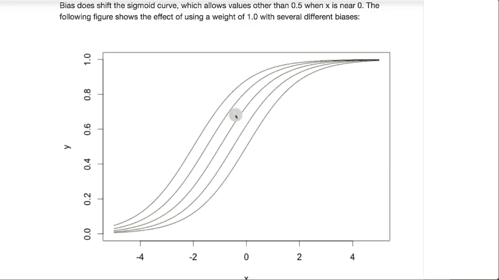

# T81-558 ｜ 深度神经网络应用-P17：L3.1- Keras深度学习和神经网络编程介绍 

嗨，我是Jeffy，欢迎来到华盛顿大学深度神经网络应用的视频，在这段视频中，我们将对深度神经网络进行一般介绍，以及它们的概念如何运作。这将使我们能够在本课程之前部分学习的Python基础上构建，实际上构建出神经网络，以便于我AI课程和项目的最新进展。

点击旁边的小铃铛订阅，以便收到每个新视频的通知。神经网络已经存在一段时间了。深度学习就是训练非常深的神经网络的能力。😊！

你可能见过其他机器学习模型和其他类别，比如支持向量机、梯度提升、XGBoost和LightGBM，以及所有这些基于数据训练模型的不同方式。神经网络可以作为这些模型的替代品。

神经网络简单地接受你通常会发送给支持向量机或其他模型的数据，并输出分类结果，试图对输入的内容进行分类或确定类型。或者它可以进行回归，并根据你想让神经网络预测的数据输出一个数字。然而，神经网络的真正强大之处在于它们能够处理最终数据并以不适合典型分类和回归的方式生成数据。

类型模型，例如，你可以将图像输入到神经网络中。你甚至可以让神经网络接收一张图像并生成另一张图像。因此，神经网络所能做的非常富有表现力，输入几乎可以是任何东西，输出也可以是任何东西，输入和输出并不一定要是同一类型。在其他模型中，你会。

只需发送一个一维向量，即一组预测变量。然而，使用神经网络，你也可以传入一个二维矩阵。现在，这就是你开始传入，比如一个带有像素网格的图像的地方。神经网络的强大之处在于它意识到相邻的像素彼此之间更重要，而其他模型类型中，输入因素的顺序变化对任何事情都没有影响。

它也可以传入一个三维矩阵或三维张量。这本质上是一幅彩色图像，其中第三维指定你传入的单个像素的颜色。而在谈论神经网络的维度时，这种维度可以以几种不同的方式使用。

通常你会谈论输入向量或输入矩阵的样子。你有多少个输入神经元，它们是如何排列的，是网格还是盒子？

维度也可以指神经网络中的权重数量。现在，传统模型中会谈到回归和分类，神经网络也是如此。神经网络的输出神经元变成单一的回归输出或分类输出。所以像你这里看到的回归神经网络，这里有两个我组合在一起的示例神经网络。

我在寿险行业工作，因此你将看到我提供的许多例子，类似于保险科技的方式，其中包含与医疗记录等相关的输入，这些是你在寿险中感兴趣的内容。在这里，你请求神经网络预测最大保额。那么我们应该为某人投保多少，针对个人的最大风险金额是多少。

分类神经网络会产生类别。因此我们可能会有一个优选标准、次标准或下降。这只是将潜在的保险申请放入正确的桶中。因此，回归分类。这些是你传统的模型类型，我们将在本课程后面看到，神经网络可以产生比这更复杂的输出。

分类或回归，神经网络甚至可以同时进行分类和回归。输出神经元，也就是最右侧的那些，这里只有一个。如果是回归神经网络，它总是只有一个输出神经元。这里我们有额外的输出神经元，每个类别对应一个输出神经元。

你可以通过神经网络的分类方式来判断它是否是一个二分类神经网络，这意味着它只是在分类两个事物，通常它只有一个输出神经元，指定了它属于其中一个类别的概率。

然而，如果你在处理多类别分类，类别数为三或更多，通常你会为每个类别有一个输出神经元。你绝不会有单一类别的分类神经网络，因为只有一个类别。它总是那个类别，因此你至少需要有两个类别，以便神经网络有区别的对象进行分类。

这就是神经网络的结构。它们有多个层。现在我们将看到还有其他类型的层和其他会使其更复杂的内容。但对于表格神经网络来说，它的输入看起来有点像Excel中的行和列。这就是它的样子。你会有输入层。

这些输入神经元是进入神经网络的值。接下来，你会有几个隐藏层，最后到达输出层。这些是偏置神经元，你不会直接向它们发送输入，它们仅仅是存在于这里，以增强神经网络的预测能力。

我们马上会看到偏置神经元的具体作用，它们处理输入都为零的情况。但你并不一定希望输出也为零。箭头是神经网络中各个实体之间的权重。

在隐藏层中，你可以在深度学习中有很多隐藏层，数以百计。通常有四种类型的神经元，神经网络中的输入神经元接收其余神经网络的输入。隐藏神经元，因为它们位于输入和输出神经元之间。输入神经元接收神经网络的输入。

输出神经元接收从神经网络发送出的输出，或者在这之间。上下文神经元在我们进入时间序列和递归神经网络时会更多了解它们。它们在对神经网络的调用之间保持状态。然后是偏置神经元，它们本质上就像y截距和传统数学中的线性方程。

你还有几种层类型，神经元会进入这些层。输入层接收输入，输出层发送神经网络的输出，然后是隐藏层。在后面的部分，我们将手动计算神经网络的输出。但现在，我们会看到神经网络实际经历的计算并不复杂。

它本质上是一个加权和，传递到激活函数。所以计算一个隐藏神经元或神经网络中的输出神经元的输入，本质上是接收特征向量或进入它的向量。如果我们为下面的这个神经元计算，输入向量就是1，2，3。这些值。

本质上，你会将输入1乘以权重1，输入2乘以权重2，输入3乘以权重3。将这些相加。然后这个值传递到激活函数，这就是该神经元的输出。这个方程基本上就是在向你展示这个。

它本质上是所有θ的总和，θ或权重，乘以所有的x。x是输入，然后φ是激活函数。这基本上在神经网络中反复进行，以计算每个隐藏和输出神经元。这给你一个示例，输入是1和2。

现在这个第三个神经元，实际上是你的偏置神经元。它作为偏置神经元的表示方式是将一个一连接到末尾。所以一个输入到第一个神经元，二输入到第二个，这个则输入到第三个。这个神经元基本上就是偏置。因此，这个权重会被加上，就像一个截距。

由于这是1，我们将1乘以第三个权重。这基本上是偏置神经元的工作方式。我们的权重可能是这样。因此，这可能是三个权重值。第三个称为偏置值。我们将这些输入乘以每个权重值并求和。这是0。

8变成了被传递到激活函数的总和。激活函数只是引入非线性的函数到神经网络中，使得一切都不是线性的修正线性单元。我们将看到这是现代深度学习中最流行的激活函数之一。

深度学习及其他与修正线性单元相关的家族成员，如leaky ReLU。softmax通常用于分类神经网络的最终输出。这确保了所有输出神经元的总和为1，因为你希望这些输出神经元代表神经网络试图分类的每个类的概率，softmax确保这些概率是真正的概率，并且加起来为1，正如概率通常应有的那样。

修正线性单元是一个相当简单的激活函数，但极其有效。你实际上是在取0和x的最大值，所以x是传入的值。softmax看起来像这样，它本质上是将它们相加，然后将每个值除以总和，这种归一化确保它们加起来都为1。

顺便说一下，如果你想实验一下softmax并看看这些单独的值是如何生成的。我有一个JavaScript示例，链接就在这里。那为什么是修正线性单元呢？

那么受欢迎的原因是什么呢？为什么这是如此受欢迎的激活函数？在深度学习之前，最常用的激活函数是双曲正切和sigmoid。这里显示的是sigmoid。当你将值输入到它时，它会产生压缩效果。无论是负无穷大还是正无穷大，这种行为都是所期望的。

这工作得很好。通常，你是通过梯度下降优化这些神经网络。因此，你是在计算误差函数的导数。这是误差函数。当我们改变一个权重时，误差会上升，误差会下降。你希望将误差降到最小。

只不过你无法一次看到整个图形。你实际上必须为合理范围内的每个数字计算神经网络。你只能看到你实际上所处的点，但这就是微积分中的导数的作用。你取导数，它会给你权重所在的瞬时变化率或斜率。

你可以通过这个值的斜率来判断。这有一个负斜率。这意味着我们需要增加权重以朝向最小值移动。你总是通过斜率或梯度的符号的反向来改变权重。这通常在机器学习中被称为梯度。因此如果我们查看导数。

在sigmoid函数中，你可以通过虚线看到它。注意它是如何迅速收敛到零的，因为那个导数被称为梯度。它会到0或消失的事实意味着我们会有消失梯度。这是消失梯度问题。在深度学习中解决了。

这是它主要解决的众多问题之一。因为它饱和到0，所以不如。因为修正线性单元在两个方向上都不会饱和到0，就像sigmoid函数那样。我们将看看为什么需要偏置神经元。本质上，它们是截距。就像你之前处理的Y等于Mx加K线性方程。

如果你查看这个，这就是我们改变权重的一个例子。如果你注意到我们改变了权重，它实际上改变了斜率。并且你真的。线总是必须通过零。当输入是。因此所有这些都通过零。没有办法真正改变这一点。当你改变偏置神经元时，现在你在移动。

你并没有影响斜率。因此将这两者结合使用，你实际上可以。你可以影响斜率并进行移动。你可以移动它。所有这些神经元一起可以以某种加法效果贡献所有神经元。让我们让这条线断开并基本上近似任何函数。

感谢观看这个视频。现在我们已经看到深度神经网络的一般介绍。我们准备开始查看Tensorflow和汽车，看看这些是如何在Python中实现的，以便你可以利用它们。这个内容经常变化。所以请订阅频道，以便及时了解本课程和其他人工智能主题。😊
