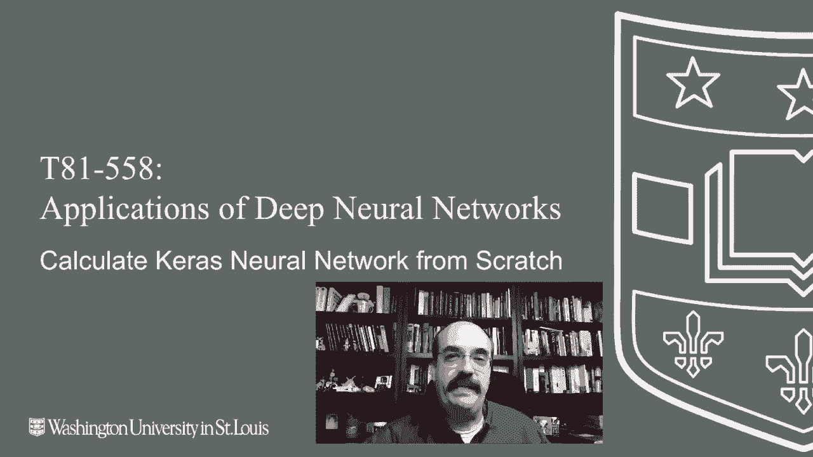
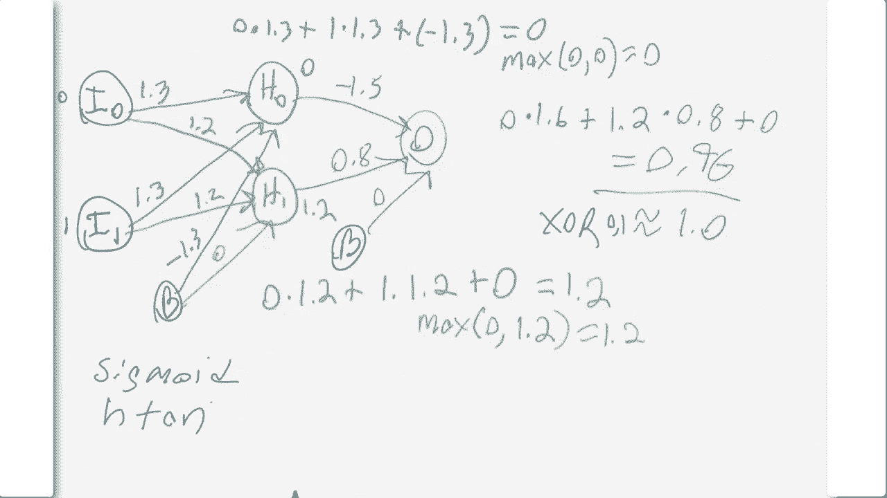

# T81-558 ｜ 深度神经网络应用-P21：L3.5- 提取Keras权重并手动进行神经网络计算 

嗨，我是Jeffine。欢迎来到华盛顿大学的深度神经网络应用。在这个视频中，我们将看到如何实际提取Kes创建的神经网络中的权重，并将这些权重放入方程中，以便我们可以实际计算神经网络的输出，并看到这个过程并没有什么魔法。

😊，这仅仅是权重与输入相乘，产生我的AI课程和项目的最终输出。点击旁边的铃铛订阅，以便接收每个新视频的通知。这是Ks和Tensorflowlow的代码，但这实际上适用于几乎任何东西。我将向你展示如何实际提取神经网络中的权重。

这样我们就可以将它们放入图表中，实际进行计算，得出与Tensorflowlow相同的数字。😊。

对于这个，我们将使用一个异或神经网络，即XOR函数。这是它的输入，0，0，任何与与或相关的真值表。预期的输出是。记住XOR的要点是，如果两个输入相同，输出就是0。如果两个输出不同，零和1与1和0相比，输出就是1。

在这里我们设置了一个神经网络。它有两个输入和一个隐藏层，层中有两个神经元。我们追求绝对最小的神经网络，只是为了表明你实际上并不需要太多就能计算一个异或。此外，由于我们将手动计算这个，或者说懒惰一些，我不想给你一个真正深、深的神经网络，然后再手动计算。

这样做是不行的。所以我们将用均方误差来优化它，最终输出将是一个神经网络，这是一种回归神经网络。你可以将XOR用作分类或回归，在这种情况下，我将其作为回归来处理。我基本上在这里训练它。我训练了100,000个周期。

这可能会花更长的时间，因为这里的权重很少，你的初始随机值或权重将对你的训练成功有很大影响。我们可以用远少于这个数量的周期来完成这项工作。这基本上就像用发电机烤奶酪三明治，但我现在并不想向你展示如何调整这些东西。

我只是想设置权重，以便它们适合一个异或网络。我们将把这些放在图表上，向你展示基本上你可以计算相同的输出，这样你就可以看到Kis给你的权重。我训练它，我预测它，这对神经网络来说是好的，因为。这四个权重对应于输入中的这四个。这是科学记数法。

所以负4是0.000。那个数字。因此这两个实际上是0，而中间的这两个实际上是1。所以如果你不习惯看到这样的数字，这可能看起来很奇怪，但这是一个很好的输出，神经网络训练得相当好。然后我们能做的是，我写了这个小程序，它会转储权重。

所以你看到层0的计数是从零开始的。偏置到下一层1的权重。再一次，我们是从0开始计数。神经元1，神经元0，神经元1。这些是偏置。这些是真正的权重。因此，这个神经网络中没有很多权重和偏置，它相对较小。

所以我将在这里稍后画一个图，我们将把这些值复制到图上。然后我们将手动计算。如果你想这样做，我在这里给你代码，你把输入设置为1和0，So1在0和X O R。这是不同的。

所以它应该是1。它输出的是0.96。现在，由于我们是手动计算的，我截断了相当多的数字。所以1.29变成了1.3，当我们画图时会这样做。因此我们失去了一些准确性，但这两个输入神经元，我们将给它们输入值0和1。这就是我们要计算的。

你可以真的计算它，任何你想要的其他值。但对于那四个独占的值，我们还将有偏置神经元。所以像我们在之前的课程视频中看到的，你实际上是在不断计算一个加权和，用于神经网络。

所以我们将计算隐藏神经元0的值。H0。每个零都有来自前面三个的输入。这些都有权重，正如我们之前程序输出所看到的，我将把它们复制过来。因此，这将成为我们用于计算隐藏0的值的加权和。

所以要做到这一点，我们将输入0乘以它的权重，即1.3。我是1乘以1.3。那个是来自第一个，实际上是第二个输入神经元。然后我们必须加上偏置。我们基本上执行这个计算，结果是0。因此隐藏神经元0的值是0。接下来，我们将计算。

隐藏神经元1，即第二个神经元。它也有类似的情况。它有三个权重进入。将从Keras程序的输出中复制这些值。因此这就是简单的1.2，我们基本上再次计算加权和。第一个输入I0消失，第二个输入贡献了1.1.2。

第二个隐藏神经元的截距或偏置为零。这整个内容，加起来，基本上等于 1。2。然后这个值，我们需要通过激活函数。两个都需要经过激活函数。那就是修正线性单元。

基本上，这将是最大值。0 和 1。2。也就是 1。2。所以这里的隐藏神经元的输出是 1。2。上面的处理方式类似，用它的激活函数。它将被最大化，因为它也是这个值。最大值 0，0 是 0。可以使用的激活函数，我可能会在期中考试中给你一个不同的。

在这门课上你会见到的其他激活函数只有 sigmoid 和双曲正切。还有其他的，但这些是用于回归的。如果你在做分类，你可能还会看到 softmax。但主要关注这些。现在输出是最终层，这样我们才能实际获得这个神经网络为我们提供的内容。

这将与之前类似。我们确实有另一个偏置连接。所以你将基本上再次拥有三条有界连接。我们基本上会复制在 Caras 中的输出权重。这里是 0。最终的方程将整个内容联系在一起。

这基本上就是从隐藏神经元 0 输出的内容。乘以 1。6，加上 1。2 乘以 0。8。你可以看到 1。2 乘以 0。8，然后加上偏置或截距，这里是零。然后整个内容等于 0。96。这是你的最终输出，约等于 1。0。

这就是你从异或运算中预期的结果。零和什么。就是这样。这是使用 Kiro 为我们训练的权重计算出来的神经网络。所以我们可以看到，这里真的没有什么魔法。😊 这么简单的神经网络，你实际上可以手动编码这些权重，难度不大。

我可能还会做一个视频，这样你可以看到如何实际手动编写其中一个。你确实需要这个大小的神经网络。你绝对需要隐藏层。

感谢观看这个视频。在下一个视频中，我们将看到可以与神经网络一起使用的更高级的训练技术。😊 以获得更好的结果，并以各种不同的方式测量我们的错误。内容经常变化，所以请订阅频道，以便随时了解本课程和其他人工智能主题。
