# T81-558 ｜ 深度神经网络应用-P23：L4.2- Keras构建深度神经网络多类分类并用ROC和AUC评估 

嗨，我是杰夫·希顿，欢迎来到华盛顿大学的深度神经网络应用。在这个视频中，我将向你展示如何进行二分类和多分类。使用Keras的神经网络了解我的AI课程和项目的最新动态。

点击订阅和旁边的铃铛以接收接下来两个视频中的每个新视频通知。在接下来的两个视频中，我们将查看分类和回归。本视频专注于分类。我们将其细分为两个部分。有二分类，还有多类分类。

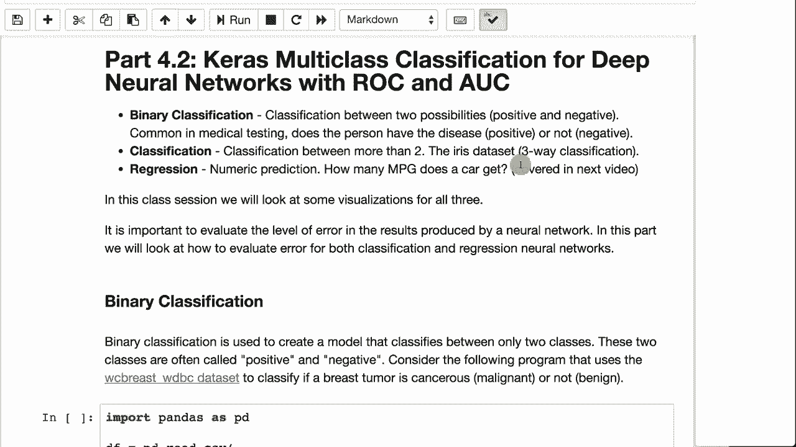

我们将首先查看二分类，二分类。

我们将查看摇滚图表，看看如何测量假阳性和假阴性，并探讨我们评估二分类的特殊方法。

你可以将这视为一个医疗测试。因此，我们将查看威斯康星乳腺癌数据库，它包含肿瘤的测量数据。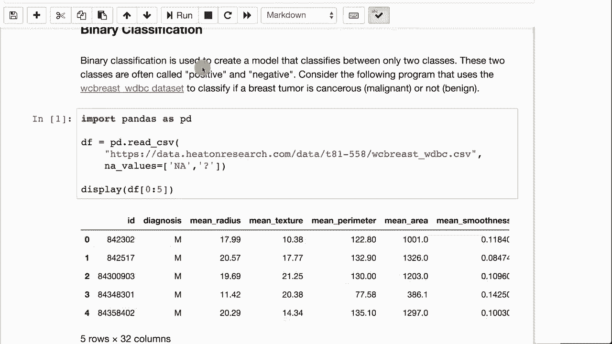

还有一个目标列，说明它们是恶性还是良性，这些都是恶性的，但也有良性的。我们将首先查看如何根据此来衡量模型的成功。你可以只计算准确率，计算神经网络如何为每个样本预测恶性或良性。

它会简单地返回一个百分比。它得到了90%的正确率，或者得到了70%的正确率。然而，这只是硬币的一面。你可能关心的是它错误地说某人有癌症肿瘤的次数，或者你可能关心的是它错误地说某人没有癌症的次数，因为这两者是完全不同的事情，你可能希望进行不同的校准。

对于一个被错误地认为有疾病的人来说，这可能会更糟。

被告知没有癌症以放弃医疗治疗，然后在一个没有疾病的人身上进行额外医疗治疗。或者反之，如果治疗对个人来说特别可怕。对于摇滚曲线，我们查看假阳性和假阴性。

假阳性是指结果为阳性时。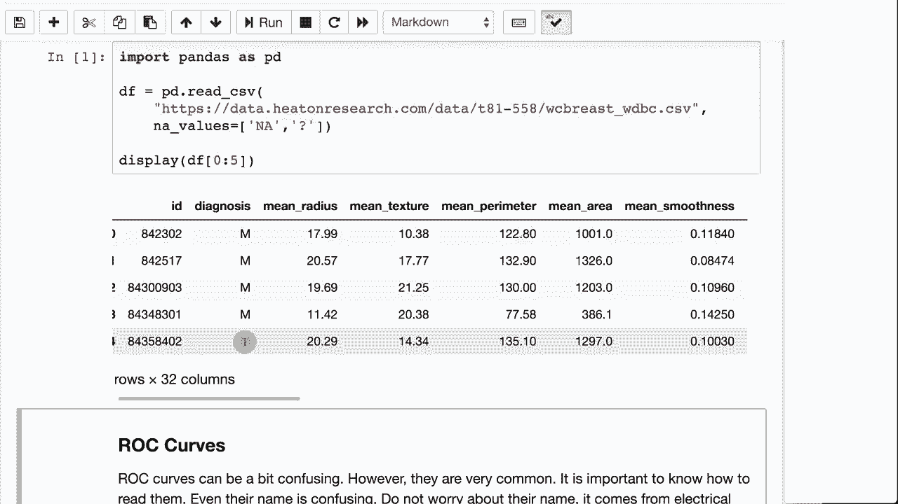

但假阴性并不是指某个结果返回为阴性。也就是说，真正的阳性是测试真正识别出的阳性，真正的阴性是测试真正识别出的阴性，还有其他名称，比如第一类错误和第二类错误，以及敏感性和特异性。敏感性是模型正确预测你确实有病或阳性的能力，特异性是模型准确检测你没有病的能力，这两者合在一起就是整体准确性。通常对于这些，我们需要定义一个临界值，这就是ROC曲线发挥作用的地方，临界值可能是因为大多数测试都会返回某种数值。

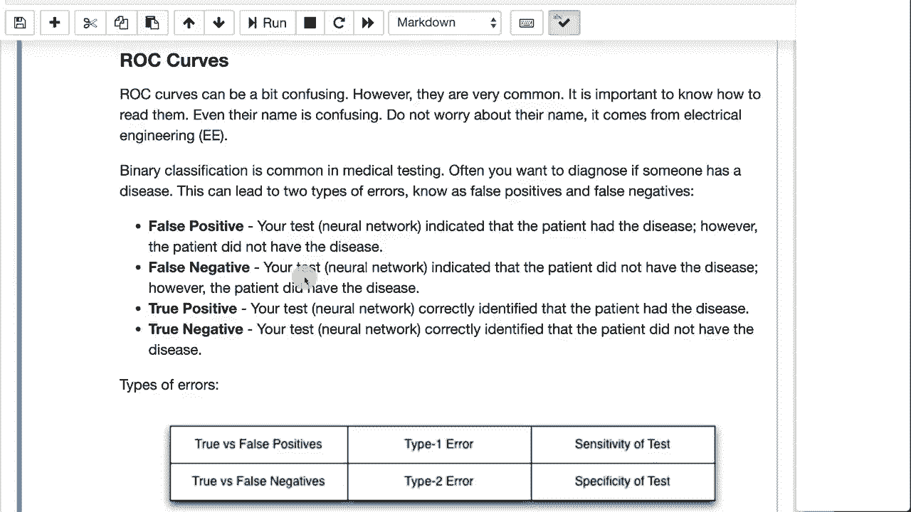

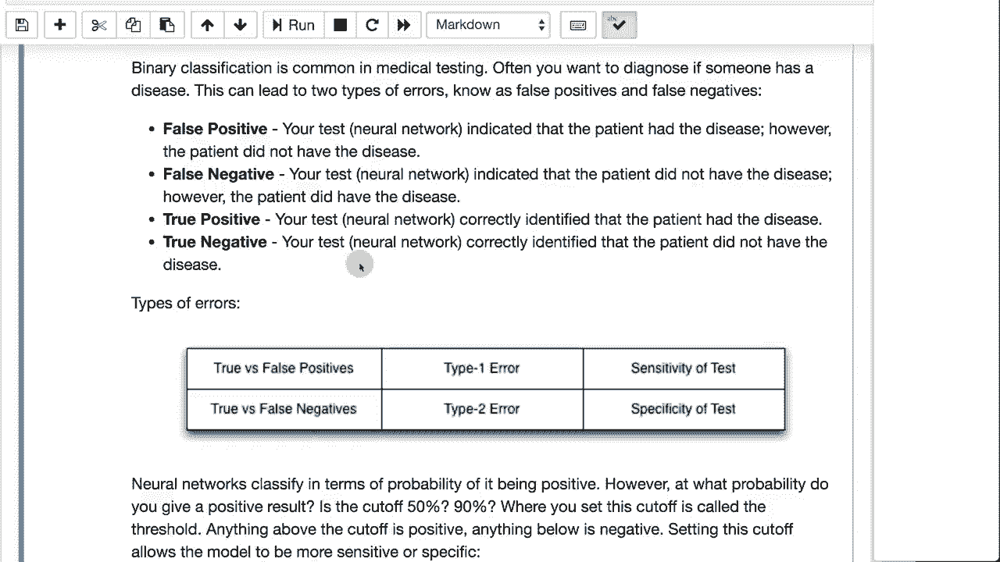

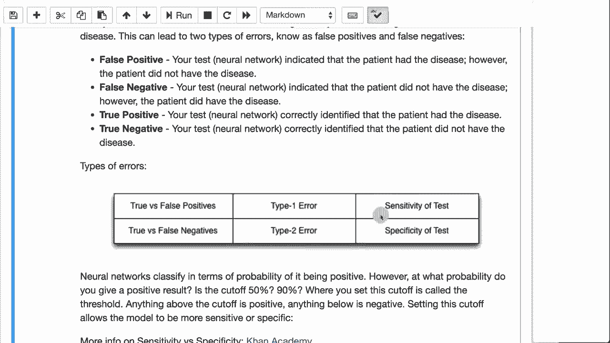

这是你输出神经元的输出，零意味着你可能处于一个不确定的状态；高数值可能意味着你是阳性，负数可能意味着你是阴性。你必须决定在哪里切断这一点，你的切断可能不只是零，也可能不均匀。如果你想偏向假阳性或假阴性，显然你都不希望有，但如果必须选择，你会选择假阳性还是假阴性？然后你可以将阈值优化为敏感性或特异性。接下来，我将运行这一段代码，这段代码并不重要，只是用于显示这个图表。这个图表展示了你的神经网络的输出可能是什么样子，也许当神经网络输出零时，它并不确定你是阴性还是阳性。

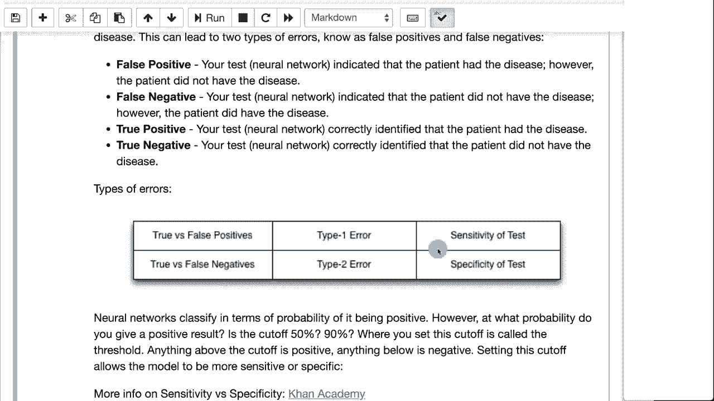

如果你更偏向于阴性，系统会输出一个负值，表示你没有这种情况；如果你更可能是阳性，系统会输出正值。现在这些线指明了你可能设置的切点或阈值，当你移动这条线时，你是在调整模型的敏感度，即在假警报和真正阳性案例之间进行平衡。

如果你将线设置在这里，敏感度就会很高；如果你将线设置在这里，特异性就会很高。原因在于，如果你提高敏感性，那么你会倾向于产生假阳性；而如果你倾向于提高特异性，整个负曲线就会偏向这边。显然，你可能不想将其设置在这两者之间，而是想在中间的某个地方。

完全平衡就在这里。所以这是一个重要的认识。你可以得到完美的敏感性或完美的特异性，但你会有很糟糕的结果。如果你想确保你的模型完全敏感，能识别每一个有疾病的人，只需将每个人都分类为阳性，这样你就不会遗漏任何人，阴性情况也是如此。

但显然这并不是特别有用，但它展示了这两者的极端。顺便说一下，这两个范围的 X 是来自神经网络或测试的输出，这就是你如何读取测试的结果是阴性还是阳性，Y 只是我们在这些类别中有多少个值，它们并不总是正态分布的，但这样可以让图表看起来不错，顺便说一下，这是你在统计学中看到的经典图表。

如果你想阅读更多或了解更多，这里有一个很棒的 Khan Academy 视频，我的图表很大程度上是基于这个。这也是机器学习和数据科学中常见的面试问题，我们会给你这个图表，问你这两条线的区别，有时中间的线会缺失。

这是一个更敏感与更特异的测试。现在我们继续，加载这个测试的二元数据。我将运行这个部分，简单地加载数据。重要的是要看到这里我们正在准备 X 和 Y。

注意我如何处理 Y。这是进行二元分类的方法。我将恶性肿瘤标记为 1，良性肿瘤标记为 0。现在我们将定义两个函数，稍后会用到。我不会过多解释这些函数或绘图的内容。

我可以做一个完整的绘图课程，但这将基本上绘制一个 ROC 图和混淆矩阵。这两者对分类神经网络都非常有用。现在我们来看一个 ROC 图的例子，我们将训练一个用于二元分类的神经网络。

对于二分类，我们使用二元交叉熵。这非常重要，我们只想要一个输出，像之前那样的回归并不是这种情况。它看起来像回归，并且确实有一些相似之处，但这仅在处理二元结果的分类时使用，不要使用虚拟变量。你不想做两个，所以这里在X上我们没有使用虚拟变量，对不起，Y上我们没有使用虚拟变量。

我们简单地有一个由零和一组成的列矩阵。我们将继续运行这个模型，使用早停法。好的，我们已经早停了，我们将在下一个模块中看到更多关于交叉验证的内容，这是获取训练集之外的样本结果的一种方法，适用于整个数据集。让我们获取我们的预测并绘制 ROC 图表。好的，这就是 ROC 图表。

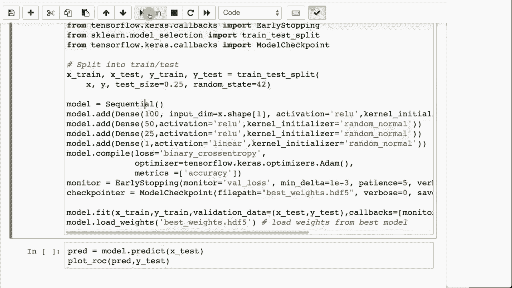

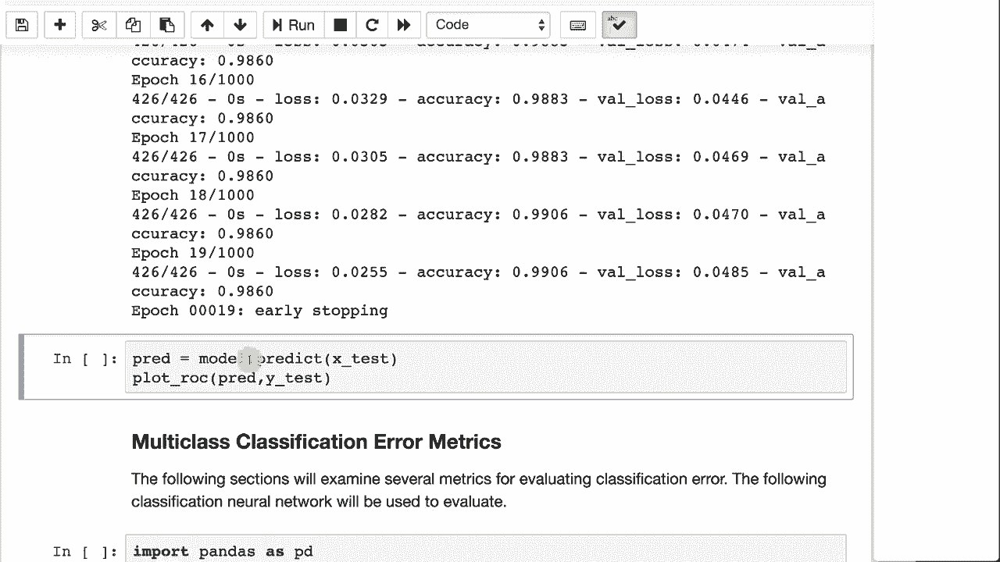

这基本上展示了你的模型如何表现，无论你设置的阈值在哪里，查看 ROC 图表可以让你看到关于假阳性率和真实阳性率的整体情况。

在这里，你可以设置不同值的阈值。你通常想在 ROC 图表中查看的是，这个值与虚线有多接近。虚线仅表示随机预测。

如果你的模型低于这个标准，那将是一个非常低效的模型，这种情况是可能发生的。你的模型甚至比随机预测还要差，这真的很糟糕。

越接近这个上部点，模型的准确性越高。你可以通过测量曲线下面积来评估，如果曲线下面积是整个图形，那么就是1.0。所以，曲线下面积通常被称为A，它是1.0，这意味着一个几乎完美的模型。这不是，它的准确率和敏感性以及特异性都在99%左右，但这是一个相对容易且快速训练的乳腺癌数据集，因此这是二分类。

让我们来看一下多类分类，这里我们将使用之前给过的简单数据集。这是一个更难的数据集，因此看起来更有趣，因为它会出错。我们将在这里构建一个分类交叉熵，这非常重要。

这是我在之前的学期中，学生们最常问我的问题之一。

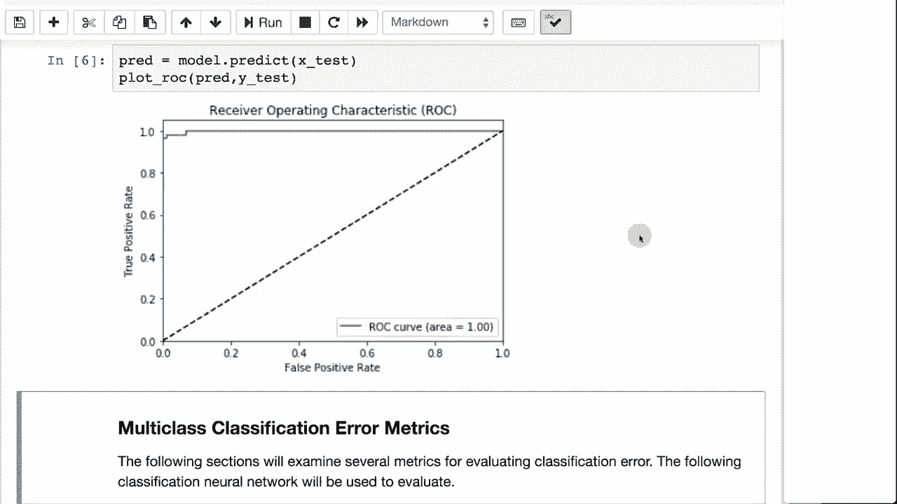

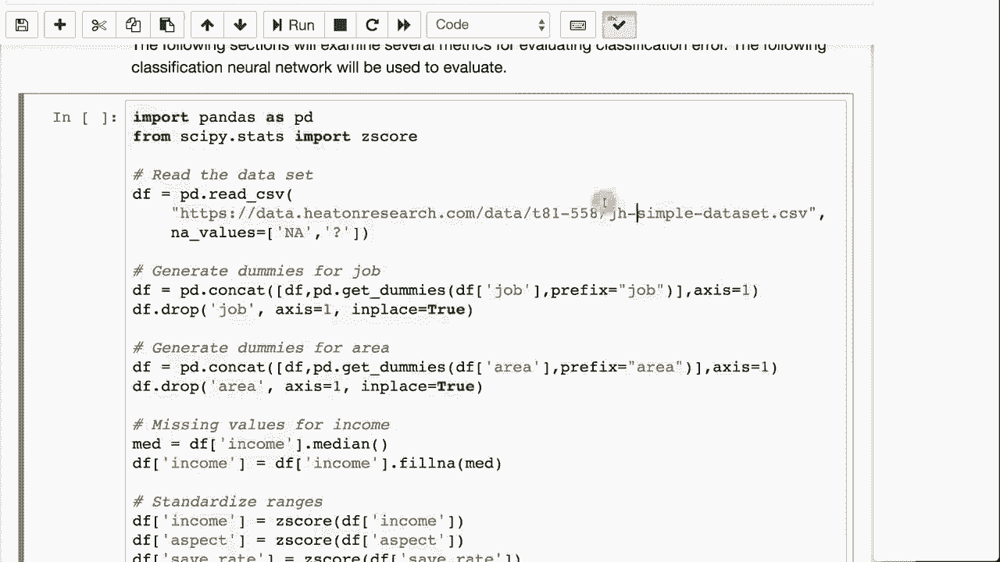

当数据是回归时，他们会设置分类神经网络，或者像这样进行多类分类，并使用二元交叉熵。你想使用分类交叉熵，因为这里是一个多类分类问题。

你不想只有一个输出神经元，而是想要与类别数量相同的输出神经元。那么现在让我们开始运行这个，按我的记忆，它的准确率大约是70%，其实稍微高一点，所以这很酷，这与随机权重的准确率有关。

这个准确率通常在70%左右，所以它的训练结果通常也是在70%左右，你可以看到，它差不多在这个水平。

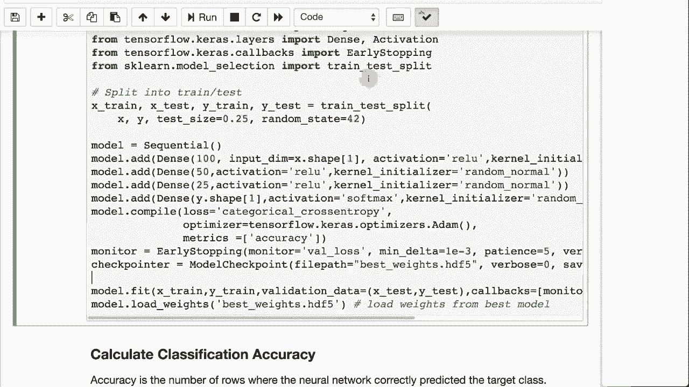

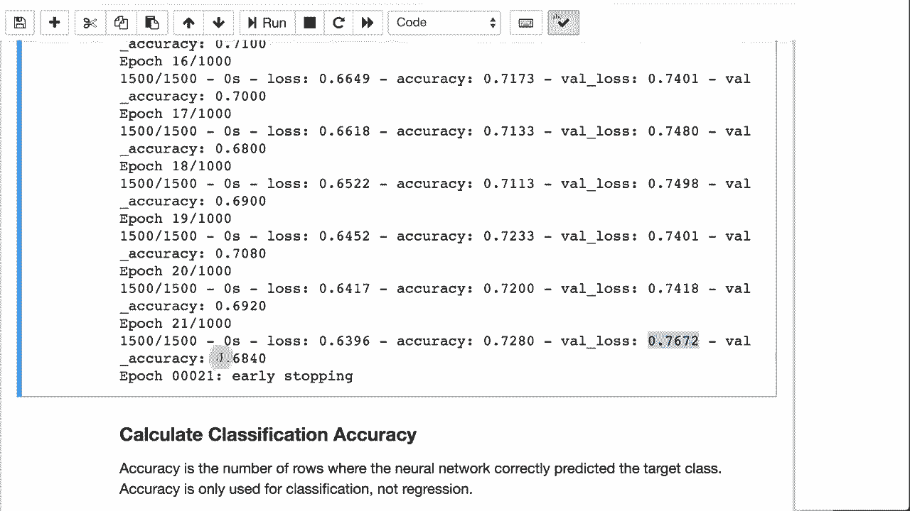

在早期停止时，我们将计算其准确率，这将与我们上面得到的值相同。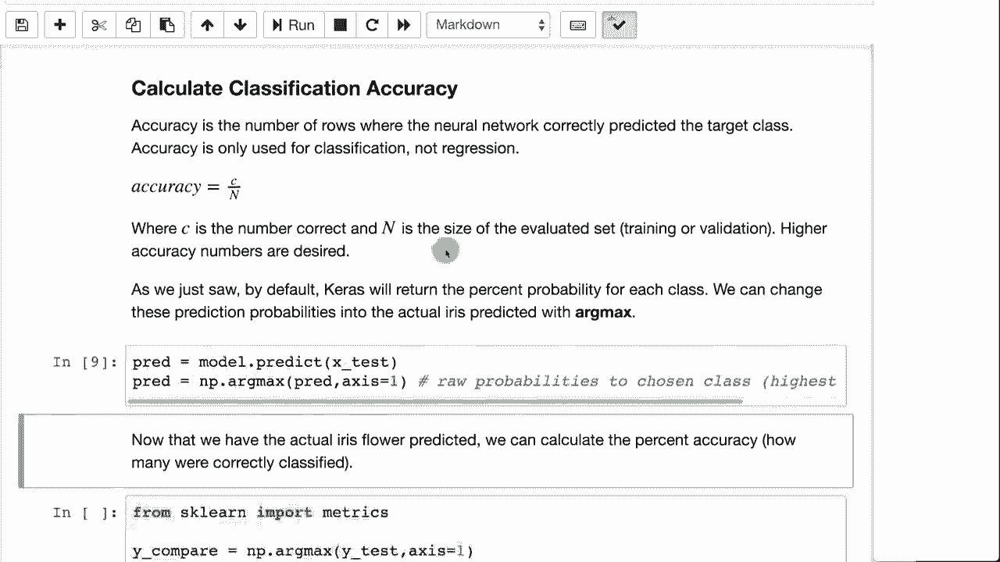

准确率是70%。我们将继续计算对数损失。对数损失与准确率不同。有时准确率的输出与对数损失相似。然而，范围是相当不同的，准确率的范围是从0到1，而对数损失的范围通常在0到三或四之间，这是我见过的最高值。

我从未真正看过实际的上限在哪里，如果对数损失超过一或二，你就有麻烦了。那么我们来计算一下，看看我们如何实际计算对数损失。我们将在这里做预测，并使用numpy来计算。对数损失是0.74，这并不好，但也不是完美的，完美的当然是零。

这就是你如何计算它。几乎与准确率的调用方式相同，只不过你在做对数损失。你将知道是正确的Y值和你的预测传递给它，它会为你计算。

不同于准确率，**对数损失**考虑了神经网络对错误答案的自信程度。以下是预测的输出。每一行代表一个预测，每一列代表一个它尝试预测的类别。我们可以查看底部的结果，因为我将其乘以了100。

而这基本上就是预测。因此它表示以70%的可能性，它是第三类，并不是100%确定，它也在考虑可能是第二类或第四类。所以对数损失的工作方式是我们为每个值统计一堆对数值。这里在这种情况下，如果这是正确值，它将获得0的对数。

7添加到累加器，最终会取那个对数负值的平均值，因为对数是负的。所以如果你考虑一下，如果这是在训练中，这将会是1。我们会在这里放一个1，所有其他都是0，那将是完美的。所以1的对数是0，问题在于，如果你错误了。

如果你绝对确定错误。所以如果第一类是正确的，我们将会添加0的对数，0的对数是负无穷大，因此你的得分会是无穷坏的，所以它会因为过于自信和错误值而大幅惩罚你。

这就是为什么在内部计算时，零会被稍微提升到零以上，以便你的对数得分会被大幅削减。但它不会变成无效数字，这就是计算的全部内容。你取正确的值并添加那个特定对数的负值，因此，越接近1。

对数加法越接近零越好，因此这就是它如何惩罚你过于自信。但准确性是非常苛刻的，因为在准确性上没有部分得分。如果这一项可以，如果这一项，即第四项是正确答案而你选择了这一项不准确，你将得不到任何分数，而对于对数损失，至少你可以得到一些分数，因为你会添加0的对数。

22的负对数这是计算它的更正式的数学方程，基本上发生的事情是所有值都遍历整个数据集，所以是除以n。负值抵消了对数函数的负性。

然后我们基本上是看Y系数。因此，y总是会是0或1，所以正确的系数会是1，而其他的系数会是0并且抵消掉，所以你基本上只会剩下其中一个，其他的都会抵消，这实际上就等于取了正确值的对数。

再次强调，这个函数其实并不需要。我的意思是，你不需要关注代码。我们对对数的图感兴趣，所以你可以看到如果你接近于正确答案的零，它会非常、非常快地下降，所以你可以看到一个负值或四，我们会取绝对值。一个四的对数损失其实非常糟糕，你几乎要到负二的下降点，对不起，二和小于一的值是更理想的对数结果，当然你不能超过一的正确性。所以这是我们用于误差评估的对数函数的整个范围。现在让我们看看混淆矩阵，我们之前定义了这个混淆矩阵函数，所以我们现在要绘制它。你希望在混淆矩阵中看到的是。

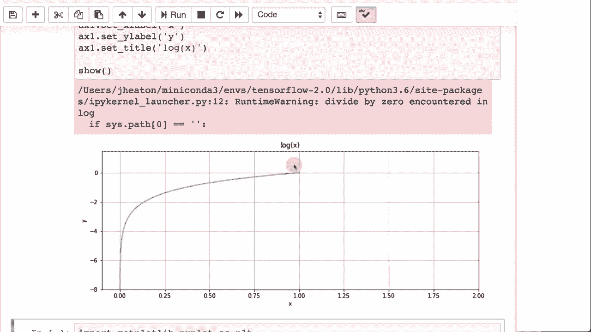

强对角线，这条对角线是正确分类的情况。你可以在下方的混淆矩阵中看到这一点，这是真实标签，这个是预测标签。通常你希望查看归一化的那个，另一个只是计数，而这是归一化的，这显示了一些潜在问题。如果真实标签是A，预测为A，那就是好事。

然而，G由于某种原因，被错误分类的情况相当多，你还可以看到预测值EF和G在这里存在相当大的问题。这些是你在优化模型和特征工程时想要关注的一些问题，试图将一些内容移动到这里，这就是混淆矩阵。

如果是二元分类，它们可以使用，那就是一个二乘二的情况。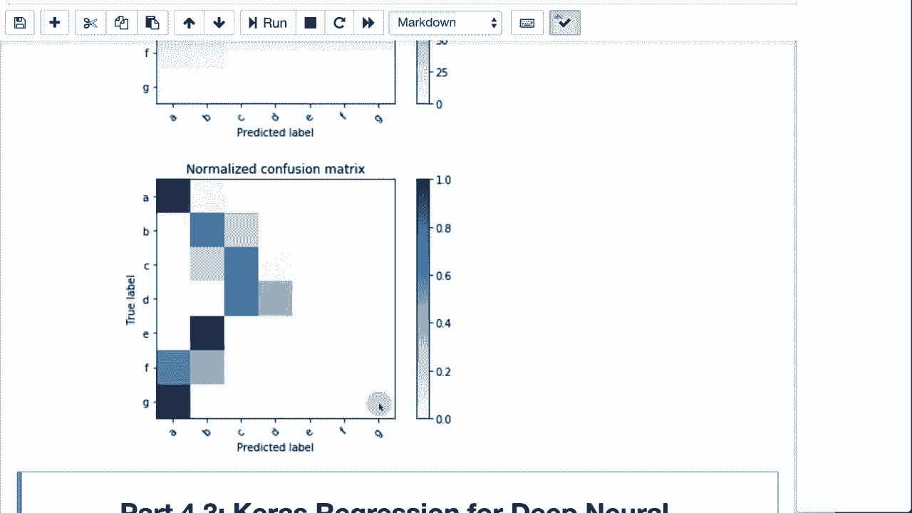

但是，如果你有多个类别，那么这是一个好的模型或可视化，可以查看你的模型。感谢观看这个视频。在下一部分，我们将看到如何用回归神经网络做同样的事情。

这个内容经常变化，所以请订阅频道，以便及时了解这个课程和人工智能的其他主题。
