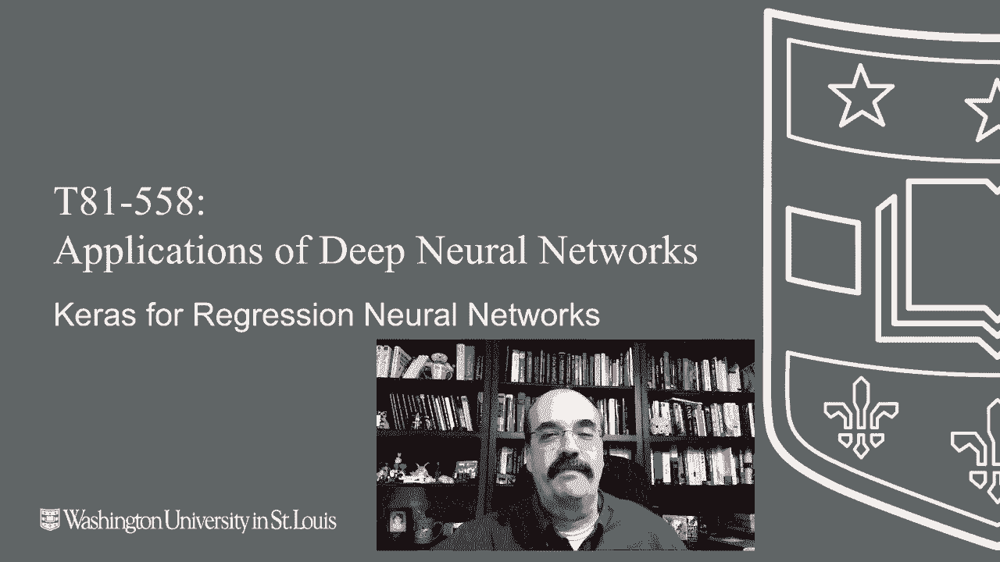
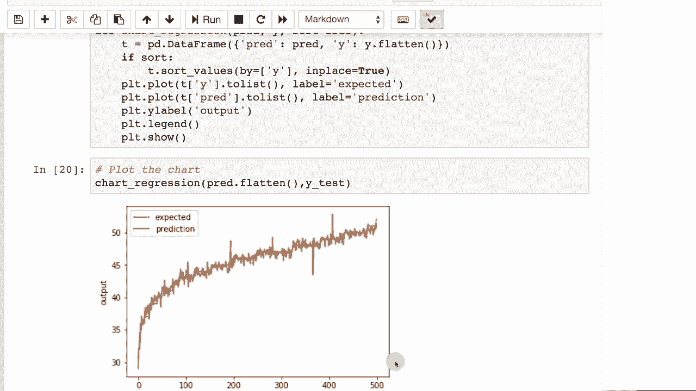

# T81-558 ｜ 深度神经网络应用-P24：L4.3- Keras深度神经网络回归建模与RMSE评估 

嗨，我是杰夫·希顿，欢迎来到华盛顿大学的深度神经网络应用。在这个视频中，我将向你展示如何在Keras中构建一个回归神经网络。回归神经网络是能够预测数值的神经网络，而不是分类神经网络中类或非数值值。点击旁边的铃铛订阅，以便接收每个新视频的通知。😊

所以如果你正在处理回归问题，我们将看看那个我们多次使用的样本数据集，它预测个体将购买哪个产品。不过在这种情况下，我们想把它变成一个回归问题。所以我们要做的是根据他们购买的产品和他们的其他特征来预测他们的年龄。

所以这段代码和我们之前做的特征工程非常相似。我们在填充缺失值，标准化各种范围。疾病评分使其对神经网络更具预测性，但Y来自年龄。我们还将数据分为训练集和测试集。接下来。

我们将构建和训练神经网络。再次注意我们是如何设置损失的，这是回归，所以我们有一个输出神经元。均方误差是我们的损失函数。我们运行它，训练效果相当不错，验证损失迅速下降。我们得到一个相当不错的结果。

我们将计算均方误差。均方误差本质上是每个预测值和每个预期值之间的差值平方后求和。所以如果我们查看这个均方误差，它是0.45。均方误差的问题在于单位，它很像统计中的方差。

这些单位并没有实际意义。关于均方误差，我能说的就是数值越低越好。如果你取它的平方根，它就变成了均方根误差（RMSE）。你可能之前听说过，它是一个常用的度量。我们对整个数值取平方根，现在单位和数据是一样的。

所以我们可以看到它是0.67，所以我们在计算我们对预测年龄的实际值的接近程度时，约差一年，稍微少于一年。一个对RMSE非常有用的可视化是所谓的Ly图。生成Ly图的方式有很多不同的方法。

有几种不同的方法在流传。我肯定没有发明这个。但这是我使用的最常见方法。所以我们将按照预期输出对数据进行排序。这些是你的Y值。因此实际年龄。数据将按此顺序排列。所以这将是单调递增的，线将向上移动。

向上，向上，但不会再回落，因为年龄是那样排序的。然后对于每一个。X。对于沿着X的每个输出值，我们将。基本上绘制实际预测值的位置，所以这两条线。如果完美的话会完全重叠，但你会看到一些噪声，X轴只是数据的0到100%，Y轴的范围则根据预测值进行调整，所以是从零到年龄。现在来看这个图表。

预期和预测的线应当接近，注意其中一条在线上方或下方，因为在较高的年龄段，你的准确性可能较低，而在较低的年龄段则更好。下面的图表是。通常在较低年龄段更准确，但我们将看到这并不总是如此。

这取决于训练的实际情况。这里的结果实际上是非常好的，我们在较高年龄段有一些异常值。但总的来说，这就是我为什么说它通常在较低年龄段更准确。所以这显示了在经过预期值时，它有点嘈杂。

你几乎看不到预期值，因为预测线正好在其上方。所以这实际上是相当不错的。底部的数字从零到500。我们的测试集中有500个元素，所以这是来源于这里。

感谢观看这个视频，在下一部分我们将深入研究反向传播算法，看看它们是如何工作的。这个内容经常变化，所以请订阅频道以便及时了解本课程和其他人工智能主题。
