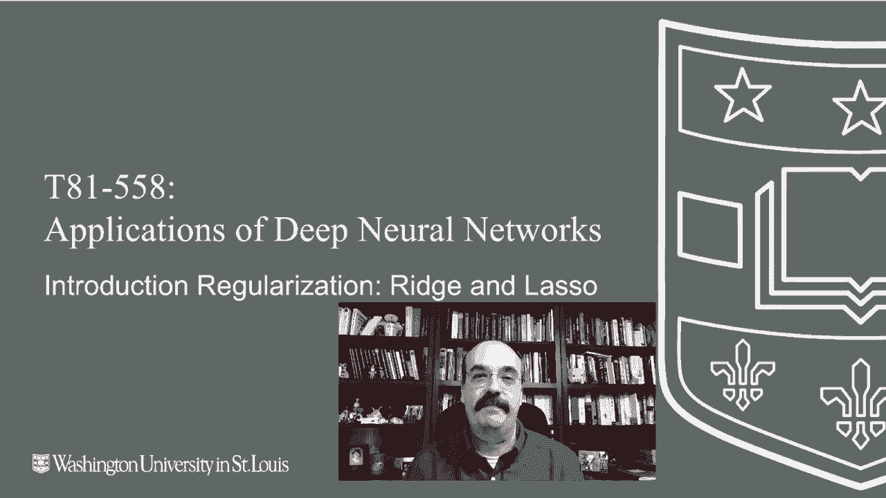
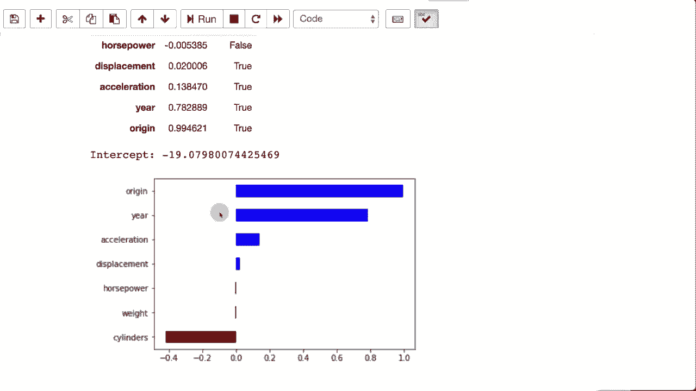

# T81-558 ｜ 深度神经网络应用-P27：L5.1- 正则化简介：Ridge 和 Lasso 

嗨，我是杰夫·希顿，欢迎来到华盛顿大学的深度神经网络应用课程。在这个模块中，我们将开始研究正则化，这是对抗神经网络及其他模型类型过拟合的另一种工具。实际上，许多正则化技术，特别是L1和L2。

这些模型比神经网络更古老，特别是线性回归。我们将从这里开始，看看L1和L2的起源，这将帮助我们理解神经网络的相关性，关于我最新的AI课程和项目的信息。

点击订阅以及旁边的小铃铛，以便在每个新视频发布时收到通知。那么让我们看看L1和L2正则化是如何被引入的。

它们来自Ridge和Lasso回归，这只是线性回归的几种形式。我们将使用汽车每加仑英里数的数据集来展示这些，只使用直接的线性回归，然后在后续视频中我们将看到如何将L1和L2引入Kara的神经网络中。因此，我已经加载了数据，并在这里创建一个报告系数的函数。

线性回归中的系数告诉你各种输入的相对重要性，然后是截距，显示零时发生的情况。因此在此之前，我们将直接看线性回归，我们将使用一个心理学习的线性回归模型，并将汽车每加仑英里数拟合到这个模型中。

所以你可以看到某些事物，比如气缸数，与汽车的每加仑英里数效率是非常负相关的。原产地是非常正相关的。这是1970年代的数据，基本上原产地意味着该车并不是在美国制造的。

如果是在美国制造的，那它的效率相当低。年份也很重要，因为随着年份的增加，汽车变得更高效，你实际上可以看到这些数值，这样你就可以真实地计算一辆车的每加仑英里数。你只需将所有这些数值相乘每个系数，然后加上截距，它就会给你一个粗略的每加仑英里数估计。顺便提一下，我应该将原产地转化为虚拟变量。

但在这里我们只是将其视为基本数值。我发现这并没有给我带来太多提升。让我们看看L1 Lasso。L1 Lasso利用的是。我们基本上在将权重相加，所以我们在对权重求和。我们将权重作为惩罚，因此如果权重变得太高。

权重的绝对值变得过高，这会影响到误差。因此，期望输出与实际输出之间的差异，以及这两者结合在一起。你正在给神经网络设定多个目标。在训练过程中，你会说，好吧。一方面，尽可能准确，但另一方面，不要让这些权重变得太大。

这在某种程度上涉及到奥卡姆剃刀，即更简单的解决方案通常是更好的。现在，绝对值是一个相当尖锐的截断。这会完全消除一些输入。这对特征选择是有好处的。如果你有很多输入特征，并且认为其中一些是不必要的，L1 可以是一个好的正则化技术，因为它可以简单地切除，并让神经网络。

现在，神经网络，线性回归将更关注更重要的目标。我们将继续运行这个。你可以看到，它削减了很多在这里的权重。它将它们压到接近 0，而我们仅关注年份和来源。你还可以看到最终得分并不是那么糟糕，考虑到我们没有使用全部数据。

完整的数据集，数据集的完整列，这些几乎都被消除。顺便提一下，你还会注意到我们指定了一个 alpha，这是权重作为多目标的一个坏指标的程度。因此，你给了它两个目标。每当我的老板来找我说，好吧，这是一个高优先级，这是一个高优先级。

好吧，你有一个加权，哪个高优先级的两个选项中优先级最高。这就是发生的事情。这实际上在告诉神经网络，好吧。是的，回归，正则化很重要，但它仅仅是获得准确结果的重要性的十分之一。然而，尽管如此，这仍然使它削减了一些，所以效果相当不错。

它正在执行你期望它执行的任务，即去除不需要的列。改变这点有什么影响呢？那就是 alpha。你会发现，当你增大 alpha 时，误差会变得相当、相当糟糕。因此，这基本上就是所展示的。所以通常情况下，你不希望将 alpha 调得太大。

但这又是一个超参数需要调整。所以稍后，当我们进入 kle 竞赛模块时，我们将看到几种优化所有这些超参数的方法。因为在神经网络中，这已经变得有很多需要管理的内容。你有正则化，如何选择多少个神经元，多少层。

所有这些都是L2岭回归。与取绝对值不同，你在进行平方运算。这使得它更加平滑。因此，这导致它对试图完全消除单个列的影响减小，而是仅仅寻求保持权重或系数的降低。这就是L2回归。我们将继续运行它。我们在这里使用来自第二学习的岭回归，我将alpha设置得相当激进。

你可以在这里看到结果。它确实推动了一些中间值，但没有其他值那么强烈。顺便说一下，选择alpha为1。基本上，我只是玩一下这些，看看哪个结果给了我更好的结果？在稍后的模块中，我们将看到如何使用贝叶斯优化来帮助选择这些。

还有弹性网。弹性网结合了这两者。所以现在你有一个alpha和L1比率。这允许你，你可以指定。Alpha是L2，然后是L1比率。将它们平衡在一起，所以你现在有两个超参数需要处理。如果我运行这个，你会发现它在某种程度上类似于L2。

这与我设置的两个比率有关。但这又是你可以做到的另一种方式，稍后我们会讨论在何时将L1和L2结合使用。当我们将它们引入神经网络时。现在我们只是看到了如何在线性回归中做到这些，以展示一些基础知识，因为我们无法查看神经网络的权重。权重太多了，并且观察这些相同的情况发生。在下一个视频中，我们将看看k折交叉验证，以帮助我们更好地理解我们的常规神经网络样本预测内容是否经常更新并保持智能。

