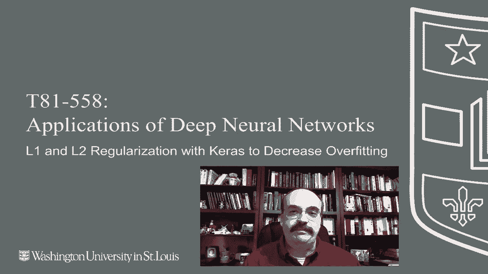
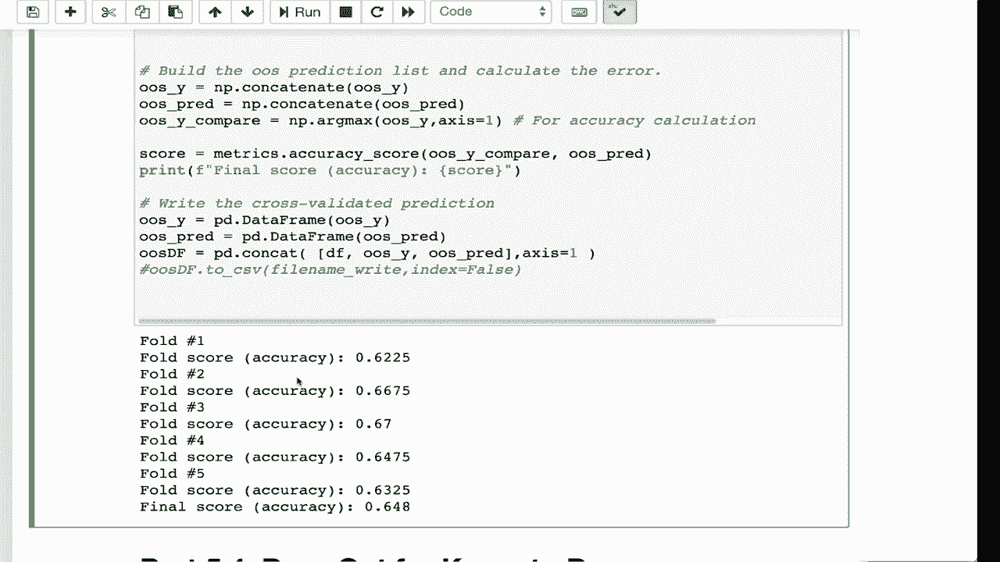

# T81-558 ｜ 深度神经网络应用-P29：L5.3- 在Keras中使用L1和L2正则化来减少过拟合 

嗨，我是杰夫·希顿，欢迎来到华盛顿大学的深度神经网络应用。在这个视频中，我们将看到如何将L1和L2正则化应用于Kira的深度神经网络。想了解我的AI课程和项目的最新信息，请点击订阅和旁边的铃铛，以便收到每个新视频的通知。我们可以将L1正则化应用于Kira，回顾一下L1和L2，我们在这里展示了它们的图形，以便你看到绝对值与平方的效果。你可以看到L1更像是拉普拉斯，边缘更尖锐，这就是它会导致系数或权重归零的原因，而L2则不会像L1那样强迫它们归零。我们可以独立或一起使用这两者应用于神经网络。我这里有一个链接，展示了Kis的实际操作说明，但我们将看一些例子。

那展示了如何将其实际应用于你的神经网络。我们将使用这个样本数据集。我们将预测产品。因此我们在进行分类，让我们继续运行这个，以便将其加载。好的，数据已经可用，所以这是我们将进行L1和/或L2正则化的地方。

这是按层级进行的，所以你可以看到这里有一个活跃的活动。Regizer并且使用O1。我们也可以使用内核正则化器，通常使用活动多于内核。活动处理的是实际的激活。😊，正则化器的。但我尝试了两者之间反复比较，看看哪个给我最佳结果，特别是L2活动正则化器的结果往往更好于L1。我通常不试图完全消除特征，使用它在神经网络上，这可以是一个有用的方法。

你也可以在Kira的文档中稍微阅读一下活动和内核之间的区别，它实际上与计算的哪个点有关，在激活函数应用之前或之后，正则化器被应用，而这就是全部。将其放在第一个隐藏层中会导致正则化器被应用，你也可以选择在这里应用第二个正则化器，简单地通过做L2。

将其从L1更改为L2。随意根据你的喜好进行调整，这又是另一个超参数，所以需要一些优化和试错。当我们到达讨论CAle竞赛的模块时，我们将看到如何使用贝叶斯优化自动优化，或者至少推动它朝着好的方向发展。

我们想对所有这些超参数做的事情。这是我们之前看到的alpha。这只是应用的程度。如果你在这里输入零，它会简单地抵消一，而根本不会应用，1就是完全的力量。你可能不想这样做，这会使训练非常不稳定。你可以继续运行这个，它会经过交叉验证并生成样本外预测，我们只是训练了500个epoch。

我们没有进行任何形式的早停，因为我们确实想要一个好的估计，看看500个epoch会如何表现，以便我们可以多次运行这个，使用不同的L1和L2值，真正了解每个值的效果。现在随着它的进行。

你将看到每个折叠的准确性。这是分类，所以我们向你展示了正确预测的百分比。在第一个折叠中，大约是66%。我会让这个继续快进，以完成其他折叠。好的，现在完成了，最终的准确性是，如我们所见，65，95。

我想给你展示一些有点烦人的特性，这与神经网络有关。我们会发现，当你重新运行它们时，分数可能会有很大变化。所以记住65，95。同时也要记住full2是最好的。我们将快速推进，以便你不必等待。好的，完成了。注意，现在不再是65，95了。它已经改变了。

看起来情况稍微变糟了。如果我们在这里尝试调整，我们可能会错误地认为上面的调整导致了问题，其实并不是一个很好的调整。你还可以看到full2，尽管这次不是最好，但仍然相当不错。

这通常保持不变，因为我们为交叉验证设置了种子值，所以在这里我们将随机状态设置为42。某些折叠肯定会比其他折叠容易，而你希望它保持一致，这样至少可以进行真正的比较。因此，我们稍后会看到这个模块中有一个叫做自助法的东西，我们可以运行很多次，然后将结果进行平均。

这样我们就能更好地了解我们对超参数的调整是否真的有所不同。感谢观看这段视频，在下一个视频中，我们将讨论dropout，这是一种专门为神经网络创建的正则化类型。

这个内容经常变化，所以请订阅频道，以便及时了解这个课程和其他人工智能主题。
