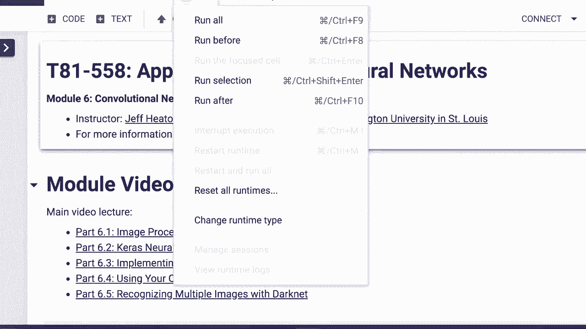
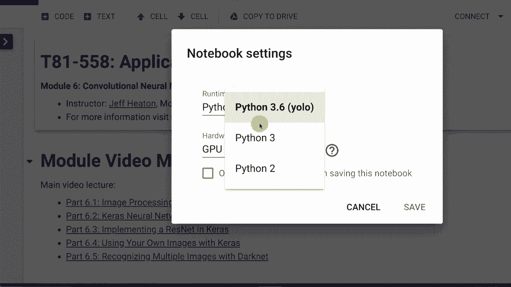
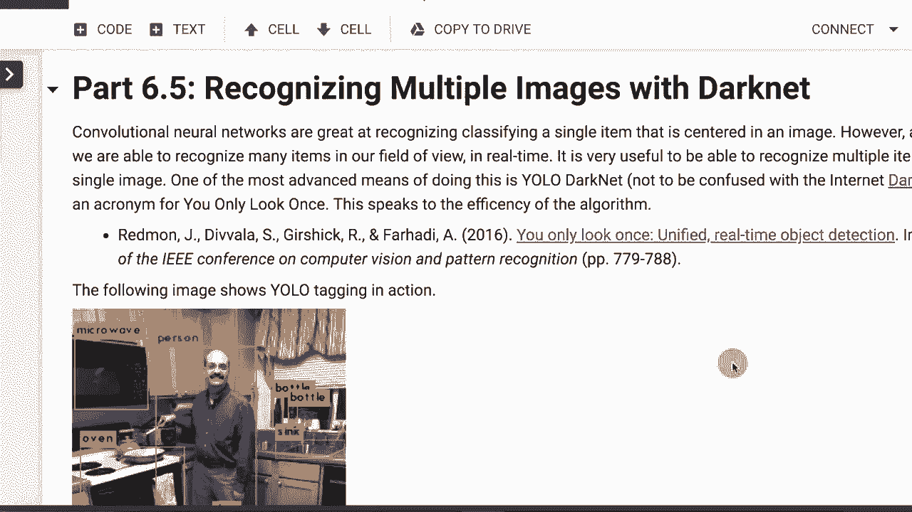
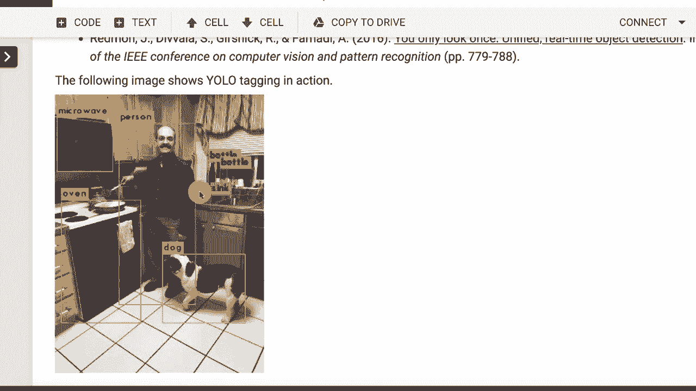
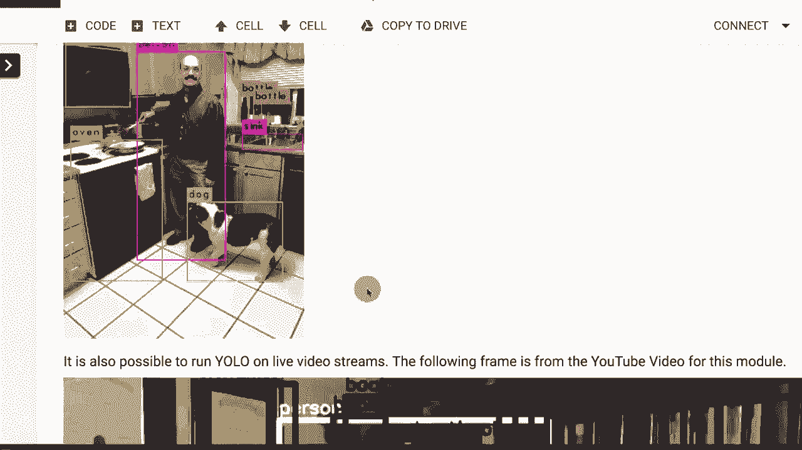
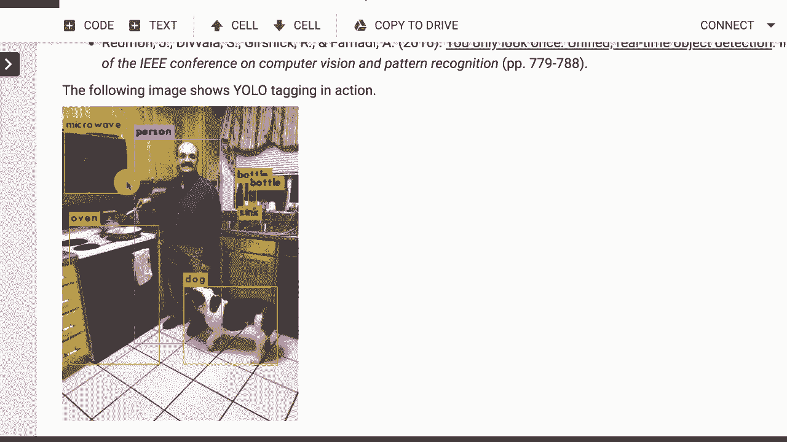
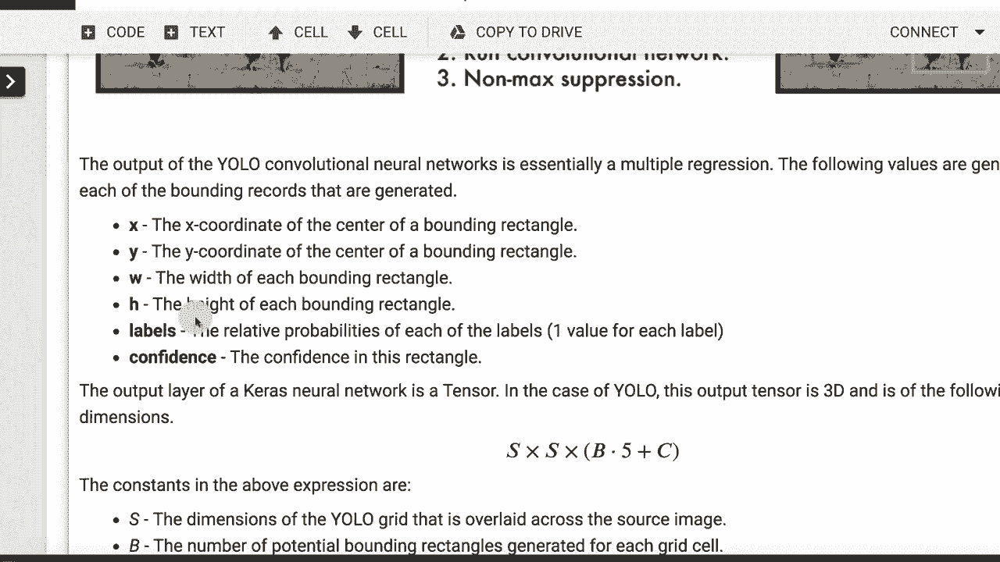
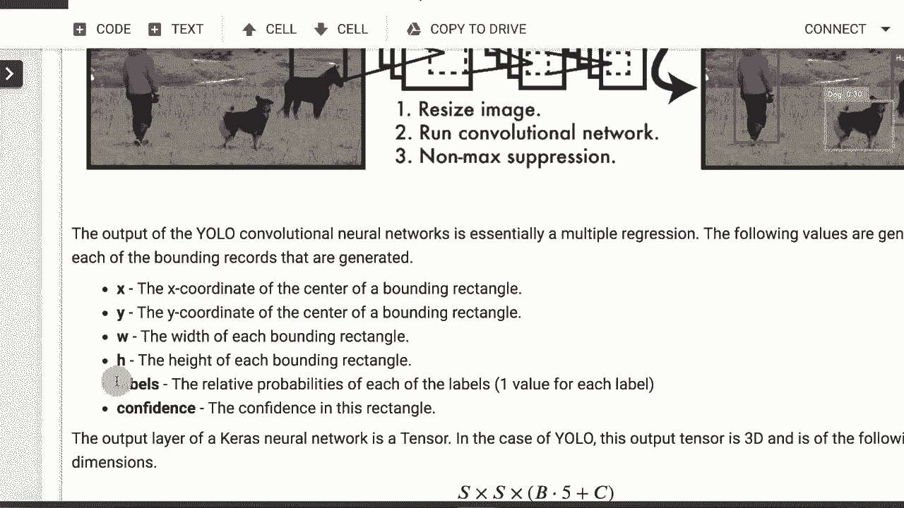
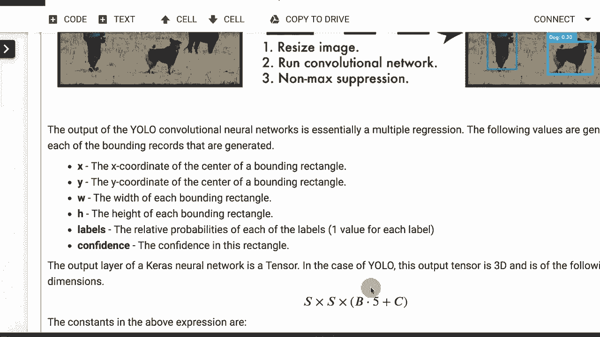
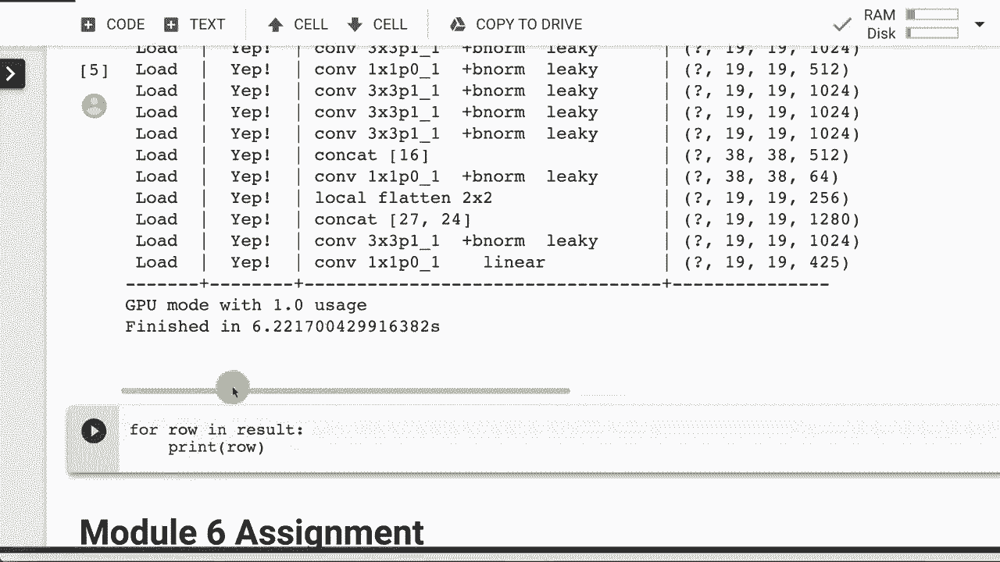

# T81-558 ｜ 深度神经网络应用-P36：L6.5- 使用YOLODarknet识别多个图像 

嗨，我是杰夫·希顿。欢迎来到华盛顿大学的深度神经网络应用课程。在这段视频中，我们将讨论Darknet和Yolo。我不是指像互联网那样的暗网。我是指，暗网，像多个物体检测。你可能会看到我周围的所有这些框，因为系统能够检测各种事物。😊，我们将看看如何使用Tensorflow在Python中利用这项技术，了解我AI课程和项目的最新动态。

点击订阅并按旁边的铃铛以接收每个新视频的通知。好吧。你会注意到我在这次的视频中使用了Google协作布局。我们将利用GPU。所以让我们开始，确保你打开了我的第6节课。😊，Google Collaboratory。这在Github上。我在本视频描述的底部有一个指向Github存储库的链接。

我们将去运行时，改变运行时类型。我已经把它放进去了。但确保你有GPU。不要担心这个Python 3,6黄色。这是我本地环境中的。Google没有那个。所以你要Python 3。然后我们会保存它。让我们向下滚动到第5部分。

因为这就是我们所谈论的。我们将看看我如何拍摄你在这之前看到的视频，其中有所有的方框。😊。

但我们将开始，看看如何现在通过卷积神经网络识别多个图像。像我们几部分前看到的单个卷积神经网络可以识别多个图像。如果它足够大。它能够查看图像并标记这些。所以你会看到微波炉旁边有人。嘿，我是一个人。还有几瓶坐在我的窗台上。这是真的。这就是。

这是我的厨房。实际上，水槽开始为我做晚餐，而不是为狗。但它在那里想看看我在做什么。每当我们做饭时，它总是在附近。但这个图像正是用相同的方法训练的。😊。

我们在卷积神经网络中看到的技术。这是一种叫做Yolo的东西。我给你一个链接到论文。Yolo代表你只看一次。而这项技术的酷之处在于，它使用的是一个具有相当复杂输出层的单个卷积神经网络。所以这不仅仅是简单的分类，还有回归。

它确实向你发送了所有这些找到的图像。所以这就是卷积神经网络真正酷的地方。你可以让输出层发送几乎任何你想要的东西，实际上。你可以让它在这种情况下，发送多个边界矩形以及它认为每个矩形中的内容。

😊，在下一个模块中，我们将看看GANs，看看它甚至可以输出一张图像。输入到GAN的不是图像，而是一个像种子一样的数字。输出将是图像。所以卷积神经网络，输入可以是图像。输出也可以是图像。输入和输出都可以是图像或其中之一。

因此，我们将在这节课的多个模块中研究卷积神经网络，因为它们非常多面化。你可以将它们用于自然语言处理图像。现在，你也可以在直播中运行这个。所以这只是我妻子用手机拍的照片。😊。

这是，嗯，这也是用手机拍的。这并不是我用来录制这节课的正常相机。所以当我在视频中谈论这些时，我无法正确地讨论它正在分类或错误分类的某些内容，因为它是录制到视频中的。

我在这里的本地电脑上没有连接强大的GPU。我通常在云端做GPU以直播这种视频。如果你想直播这种视频，Titan V的GPU将非常合适。大约3000美元。所以我目前并不拥有这样的设备。

我想过这个，但大多数我做的事情并不是直播视频。所以我只是在云端做这个，我使用B100s，这些与那些相似。但每小时4美元，而不是一次性投资几千美元。这完全取决于你要做什么。如果我每天使用那个设备数小时。

做这个3是有意义的。如果你看一下，这确实显示出一些限制。注意它在我的书架上正在分类每一本书。😊。有趣的是，在我厨房的这个图像中。它没有，它分类为这里的一小部分东西。它正在分类成百上千的东西。

处理时间是一致的。你只需看一次，它并没有查看那些书籍中的每一本。我们稍后会看看这如何运作。但是你可以看到它正在分类电视监视器和其他东西。这里的黄色东西实际上是一个工具箱，但它一直认为它是一个遥控器或其他东西。它在视频中正确地分类了我的笔记本电脑，但并不总是正确分类。

它将我分类为两个人。我的头是一人，剩下的我是另一个人。我也站着这个。因为如果你看过我很多视频，希望你能去订阅，以便在我坐着时可以看到我通常介绍和总结视频的姿势。

它没有识别我。它只是识别了我所有的书。谁在乎呢？这太无聊了。我想让它识别我。并不是说我觉得被忽视。它还识别了我的椅子，这很好。其实就一把椅子。那么，让我们谈谈Yo。😊，现在，这正是多图像检测的最前沿技术。

你可以用这个做一些非常、非常酷的事情。我的意思是，假设我想在我家后面放一个狗门，而我只希望狗可以通过。我可以写一个非常简单的程序来实现。只要我在某个地方看到一只狗，它就会打开门。希望如此。

它不会把浣熊误判为狗。那么Yolo是如何工作的呢？这也是一个卷积神经网络，就像我们看到的那样。我们创建一个S乘S的网格。对此有几个标准尺寸。通常不会太大。通常在十几的范围内。它基本上会调整你的图像大小，或者在其上放置一个网格。

它运行卷积神经网络，并获得了很多这些方框。这些潜在的边界框被称为预测。但大多数都不够好。我们把它们扔掉。我们设定一个阈值，只保留高于这个相对确定的阈值的东西。

我们要实际展示吗？所以你可以调节它在这方面的敏感度。现在，这是一个卷积神经网络。所以我们需要看看这个。😊，它是如何工作的。输出层非常有趣。我之前展示的神经网络都是分类或回归。这是两者兼具。技术上，论文称之为回归。所以我想这算是回归，但。

我几乎将其视为分类的混合体，因为发生的事情是。基本上，很多边界框被返回。当我第一次看到Yolo时，这让我困惑。你会看到这里返回了一堆方框。没有那么多。神经网络的输出层是固定长度的。除非它们是生成型神经网络，否则不会改变长度。

但当我们进入自然语言处理时，我们会更深入地讨论。但这些在这方面不是生成型的。它们只是给你一组固定的输出神经元。输出神经元的数量是固定的。这是一个张量。我起初在想。它是如何给我一个可变的列表的。好吧，答案是。

更明显的是来自论文中的这个图。这是整体网格。这就是你展示的S乘S。它返回类似这样的东西。它返回大量的边界框。返回的边界框总数始终是固定的。因此，输出神经元的数量是固定的。只需扔掉那些它不太自信的较弱的。

在这里，你可以看到边界框的黑暗。所以真的。😊。

那是黑暗的，那是黑暗的。那是星星，那是黑暗的。所以狗与车。所以这些最终都是超过阈值并被考虑的标签。让我们看看输出层实际是什么样子，因为输入层及其以上的部分。这只是一个典型的卷积神经网络。它有卷积层。

最大池化层和密集层。就像你拥有的任何其他层一样。然而，输出神经元返回的是一堆边界框。每个边界框。这些是你输出层中的值，它们只是这六个值不断重复。

所以你有X坐标和Y坐标。这是这些边界框的中心。嗯。它们不是框，而是矩形，宽度和高度。因为这些不必相同。所以它们是围绕各种事物绘制的矩形。然后是标签。这是你可以得到很多标签的地方，因为你可能有成千上万的标签。

在这里，你可能只有几乎一百个。每个标签代表像“人”、“狗”、“房子”这样的东西。这基本上是这些标签的独热编码。所以你得到的是。

对于标签，无论哪个标签的值最高，这就是它实际选择的标签。所以“人”可能会在该标签中具有最高值。你也可以查看第二高的值，看看是否可以认为它是这个人的亚军。单靠该标签，并不能反映你所寻找的整体置信度。

你在看这个置信度。这个置信度是一个数字，指示它是否认为那里真的有东西。因此，所有这些其他框你都不会显示。你甚至不计算那些。因此，这就是你本质上得到的变量数量的值返回。你总是得到相同数量的边界矩形返回。

你基本上是抛弃了大多数标签。现在让我们看看实际的神经元数量。返回的是一个3D张量。所以这并不仅仅是一组简单的线性输出神经元。你可以这样想，它实际上是S乘以S。因此，无论那个网格有多大，比如说10乘以10。将会是100乘以B，B是每个网格单元可能的边界矩形数量。

你要使用的方程式基本上直接来自于论文。5来自于X、Y、宽度和高度的1、2、3、4，然后是置信度。所以一共是5。再加上我们拥有的标签数量。这样就是独热编码。而C是我们拥有的类别数量。所以你必须处理这个问题。

它只能为实际已知的类别进行分类。这样你就可以得到所有的边界矩形。你运行它。这就是全部。现在，看看卷积神经网络的实际样子。这是你输入的图像，大小为 4，4，8，论文使用的正是这个尺寸。

这是一个 7x7 的扫描卷积层，进入另一个卷积层。还有其他卷积层，及最大池化层，和我们之前看到的一样。这没有什么新鲜事。这里唯一的区别是我们有一个 7x7x30 的张量作为输出。这些是论文中的示例图像。他们甚至展示了一个错误分类的示例，这里他对从汽车上跳下来的人有问题。

嘿，他是一架飞机。不，他不是，他的行为很像飞机，但他并不是飞机。论文中也提到了这一点的某些局限性，比如如果有一群鸟在远处，它就无法识别，因为它在识别非常小的物体时有困难。

高密度的事物群体。如果我们之前看到的书籍要小得多，它们的表现就不会那么好。现在在 Python 中使用这个。我在这里给你一些链接。这是给 darknet 的。现在我也使用这个。这是它的 C 版本。我已经编译了它，并且基本上可以从命令行运行。

我还没有在 C 程序中使用它，但很多人已经使用过，它当然是可用的。我们将更多关注 darkflow。Darkflow 让你可以在 Python 中使用这个。我们不打算训练一个黄色网络。你可以。我们将继续安装 darkflow。现在你有选择了。

你可以在 Google Coabab 上执行此操作。这就是我要演示的，这样我们可以用 GP 运行。会快一点，主要是为了识别单独的图像。如果你想实际录制实时视频，那你真的需要在系统上有某种 GP。

使用单独的图像就可以。使用 CPU 没问题。处理单个图像大约需要 5 到 10 秒。我们将从 Google Col 运行 dark low Yolo。我将快速带你完成说明。这并不困难。我们需要一些文件，所以我们需要权重，因为我们不打算训练一个 Yolo。

我们将使用论文作者为我们准备的原始权重。这是在引入迁移学习的基础上，我们将稍后学习这一点，在这里我们可以使用那些由在高训练环境中进行训练的人生成的权重。

我们有许多 GP，并且可能花费了许多周来训练它们。因此，我们将能够利用这些权重并加载它们。这开始变得有趣。我们将在这个模块和下一个模块中都进行此操作。我们将从已经训练好的神经网络中受益。

我们并没有把它们发送到云端。我们实际上在我们的计算机上有这些权重，并且可以在需要时查看它们。所以你需要三个文件来运行这个，你需要把它们放在你的 Google Drive 中。你需要权重，Yolo 的权重。我们还需要配置文件。我们需要标签文件。现在，我有一些脚本可以在这里运行，帮助你轻松完成这个操作。

所以我们首先需要做的事情是。😊，安装 darkflow 和 GitHub。所以我们来做这个。我们正在重置所有运行时。我之前运行过这个，因为我测试过它。它仍然需要重新克隆。Google 删除了你放在这里的所有内容，除了你放在 Google Drive 的内容。所以请始终记住这一点。我们已经克隆了它。现在我们要进行特殊的 Pip 安装。

这将把 darkflow 安装到 Python 中。现在我在 Google Colab。每次我重新启动环境时，都必须执行这个操作。注意我给它指定了一个目录。那就是我们刚刚检查过的 darkflow 目录。这很方便。我运行它，我们现在正在进行 darkflow 的 Pip 安装。现在我们已经安装了 darkflow。

现在如果你在本地计算机上执行此操作，你需要基本上进行完全相同的步骤。但是你需要一些先决条件才能运行 darkflow。你需要安装 Python 和 OpenCV。因此，请确保你安装这些并了解如何操作。对你来说，使用 Google Colab 是更简单的方法，我将挂载我的驱动器。

这就是我如何在这里使我的 G Drive 可用。我正在运行这个以进行一些安全设置。我必须选择我希望成为谁。现在是我。😊。出于安全原因，我正在阻止所有这些。然后你复制并粘贴它给我的这个小令牌。回来 Google Colab，把它放到这里。现在我可以解锁这些命令。

这些是 Unix 命令。这可以让你免去拖放所有单个文件的麻烦。我将继续运行这个，所有的操作就是在我的 Google Drive 中创建一个名为 projects 的目录，然后在里面有 Yolo。

所以我通常在我的 Google Drive 中创建一个 projects 目录，所有这些我在 Colab 中需要的东西，我只需把它们放在这些不同的位置。因此，在 Yolo 中，我们有一个 bin 和一个配置目录，希望这一切都能正常工作，所有这些文件现在都已下载完毕。你将在本地运行，以下是来自作者网站的说明链接，关于如何做这件事。现在我们要运行这部分。

首先选择你想要的内容，所以我们需要切换到我们实际运行此程序的目录。如果你在本地驱动器上下载了这个，那么你需要根据你的路径来存储东西。但在这里，我将我的Diy改为我的Google Drive到黄色。然后选择选项。如果你使用GPU，那么你希望这一部分是GPU 1。否则，你就不需要。

所以我们将使用GPU来运行它。我们将从互联网上拉取一张图像。我们将使用cook JPg，那是我在厨房里做饭的样子。你早些时候看到过我和我的狗，让我们继续运行这个。现在它将加载来自预训练神经网络的权重。你看，它正在构建它。

我们看到了所有的卷积层，这是一种相当复杂的卷积神经网络，但这只是一个卷积神经网络，学习识别所有不同的图像类型。这真的是非常酷。我们在GPU模式下运行，它完成得非常非常快。现在，谷歌给你的GPU非常棒，节省了我们数小时的时间。

但这与下一个级别相比，简直不值一提，比如Titan V，😊。我还没有在那个高端上运行过。我可以在亚马逊的企业级V 100上做到这一点，但那会更快。而这正是你进行实时视频所需的，因为你需要能够做到每秒30帧左右。

如果你真的想要接近实时的范围。现在，让我们运行它，看看结果。现在，不是得到带有边界框和文本的图像，而是得到我们之前讨论的输出值。我们看到人，狗，猫，瓶子，微波炉，水槽，所有这些不同的东西，以及置信度。然后是坐标和大小。

所以我们基本上看到左上角和右下角。它将中心、宽度和高度转换为边界坐标。这很好，你可以在自己的程序中用这个来检测图像中的各种事物。😊。

感谢观看这个视频，在下一个视频中我们将开始研究GAN神经网络。此内容经常变化，因此请订阅频道以保持更新，了解本课程及人工智能的其他主题。
