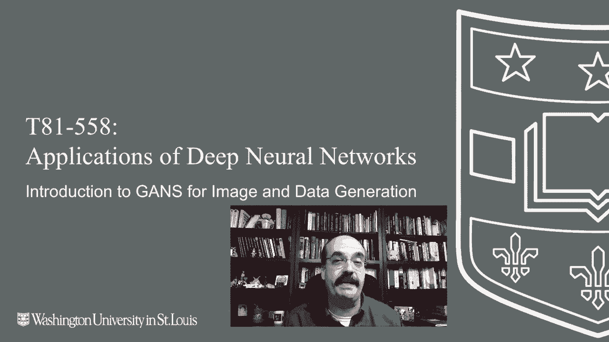
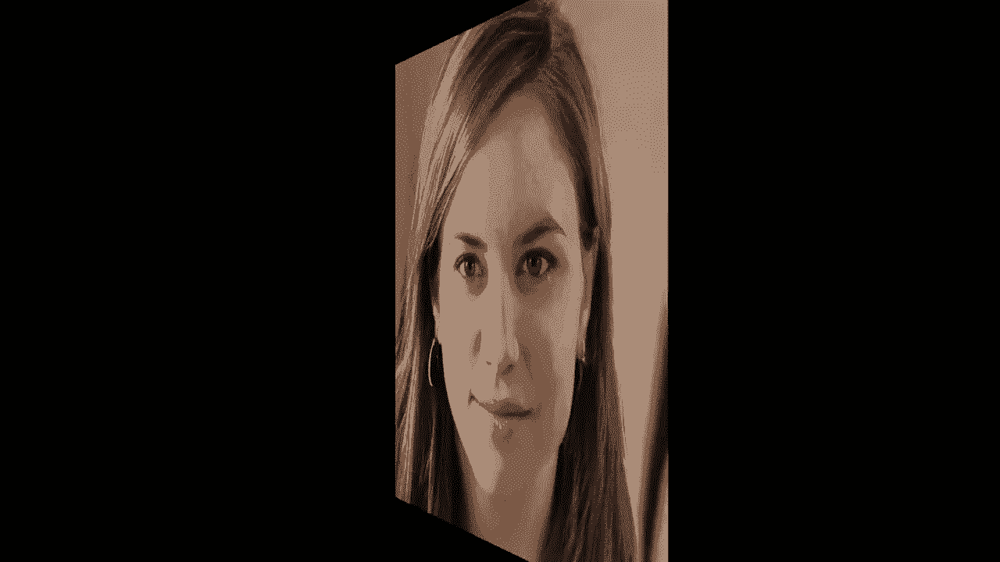
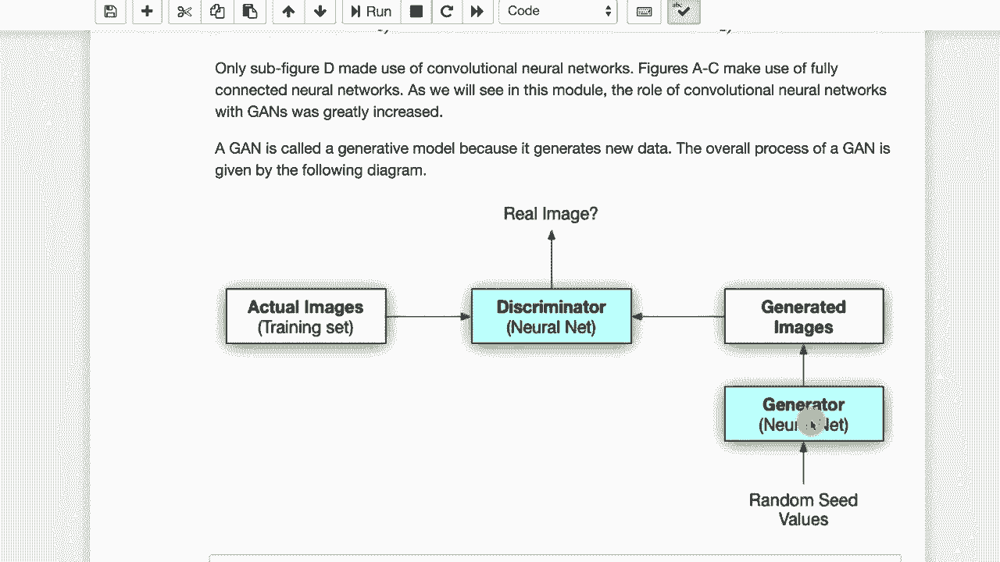

# T81-558 ｜ 深度神经网络应用-P37：L7.1- 用于图像和数据生成的生成对抗神经网络(GAN)简介 

嗨，我是Jeffhein。欢迎来到华盛顿大学的深度神经网络应用课程。在这个视频中，我们将看一下GANs，即称为生成对抗神经网络的成对神经网络。你有一个生成图像的神经网络，另一个神经网络则试图判断这些图像是假的还是现实的。

并且它不一定非得是图像，实际上可以是任何类型的数据。在本课程中，我们将看到几种数据类型，想要获取关于我的AI课程和项目的最新信息，请点击订阅并按下旁边的铃铛，以便接收到每个新视频的通知。那么我们来谈谈GganNs。

GAN是生成对抗神经网络的缩写。这实际上是两个神经网络共同工作，以生成一个高度逼真的图像或其他类型的数据。所以你在这里看到的这个人是完全虚假的，他们并不存在，是由一个学习了许多数据的GAN生成的。

许多，许多人脸。

如果你想玩玩这个技术，可以访问这个网址 doesnotexist.com。这是我用来生成这个的网页。在本课程的后面，我会告诉你如何使用这些人所使用的完全相同的技术，以及如何完全使用自己的计算机或谷歌Colab来生成。你确实需要一个GPU来运行stylegan，除非你对它进行一些修改。让我们稍微谈一下如何识别这些fakegan图像，如果你看这个人，首先最明显的事情总是要看背景。

看起来有点超现实，如果你看其中一张图像的背景，乍一看似乎是现实的，但如果你仔细检查，就像梦一样，这里并不真实，也许那是一种大理石背景，她站在前面，另外一边也有一种从一侧到另一侧的强烈变化，所以这也是值得注意的地方。

看一下他们的衣服，关注肩部的位置，她的肩膀在哪里？并不是完全对齐，这通常也是你在这些gan中看到的头部肖像，从脖子到头部，因为他们不想让衣服过于复杂，因为那对于G来说要处理起来要困难得多。

并不是说一些较新的算法没有做到这一点。我见过一些G现在可以做全身照。但让我们刷新一下，看看其他几张面孔，因为这确实是G特别著名的地方。现在，这张背景是比较单一的颜色，经过一些Photoshop处理，你可以去掉G的背景。

😊，并替换成不同的背景。这更涉及到图像处理技能。但你可以看到这些头发与背景融合在一起。如果某人的Photoshop技巧不太好，他们会把那部分剪掉，头发看起来像是有额外的丝线延伸到背景中。

我们还会讨论另一件事，耳朵通常不像你预期的那样对称，尤其是如果它们有耳环。看看我能否找到一个带耳环的人。通常两边的耳环会完全不同，所以让我们看看这项技术实际上是什么。生成对抗网络是由伊恩·古德费洛在2014年引入的，这项技术确实在深度学习中引起了轰动。2014年的第一篇论文生成了一些相对基本的面孔，包括卷积神经网络和不使用卷积神经网络的情况，这远远超出了仅生成数字图像的范畴。

伊恩·古德费洛最初处理的多伦多面孔数据集中的相对简单的面孔，他还从CR数据集中生成了图像和照片。你会看到一些超现实的、幽灵般的狗、猫、青蛙等图像，这些图像的生成方式实际上是。

生成，意味着它生成某种东西，生成模型通常使用某种随机输入，并在输出中生成某种东西。对抗意味着有对抗者。所以这意味着你需要至少两个东西在相互对抗。

所以有两个神经网络在一起工作，但又互相对抗。一个是判别器，另一个是生成器。判别器学习识别假数据，因此它学习识别假面孔。另一方面，生成器学习生成能够欺骗判别器的数据。

这两个模型在某种程度上有一种军备竞赛或博弈，因为它们试图变得越来越好。判别器试图变得越来越擅长检测生成器的欺骗尝试，而生成器则试图变得越来越擅长欺骗判别器。

现在，在所有这些训练的最后，你通常会扔掉判别器或生成器。通常是判别器。所以你会得到一个非常擅长生成面孔或其他你希望神经网络创建的假数据的生成器。

然后判别器对你来说实际上并没有太大的用处。稍后我们会看到，当我们处理半监督训练时，这是一种能够在可能非常大的数据集上训练神经网络的方法，而你只在其中少量数据上有标签或预期结果。

当你有这样一个数据集时，你可以使用半监督训练，这样它就可以从标记数据和未标记数据中学习。在这种情况下，鉴别器是你保留的部分，而生成器则被丢弃。我们将在这个模块的后面部分4中处理这个问题，实际上会涵盖半监督学习，以及如何在非图像数据上使用它。

你通常会看到这一点用于生成面孔，但这并不一定是唯一的情况。在这个模块中，我们将逐步介绍几个部分。这第一部分只是给你提供了技术的概述，讨论这些是如何训练的，以及我们如何利用GANs进行图像等的处理，以及它们是如何工作的。我们还将看到如何从头开始构建这些模型。

因此，我们将学习如何构建鉴别器，如何构建生成器，并输入这些随机值来创建面孔。你需要一个GPU，因为这个训练相对密集。你可以使用Google Colab来训练一些模糊的面孔。然后随着我们在这个模块中的进展，你还将看到如何使用NVIDIA风格的GAN，这就是我在本视频早些时候查看的那个网站上生成面孔的技术，接下来我们还将看到如何将GAN用于非图像数据。

只是生成一些随机的额外数据，以补充你可能已经拥有的数据。最后，我们将看看GAN研究中的一些新方向，因为这个领域确实非常火热。我认为GANs是当前深度学习中最有趣的技术之一，或者至少它们正在获得大量论文和其他关注。😊

感谢观看这个视频。在下一个视频中，我们将看看如何在汽车中实际实现。这部分内容经常更新。所以请订阅频道，以便及时了解该课程及其他人工智能主题。😊

