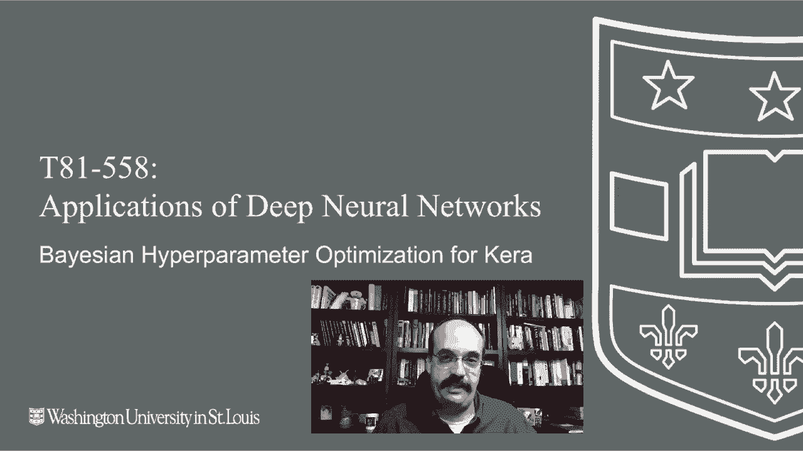

# T81-558 ｜ 深度神经网络应用-P45：L8.4- 基于Keras的贝叶斯超参数优化 

嗨，我是杰夫·希顿。欢迎来到华盛顿大学的深度神经网络应用。在这段视频中，我们将看看如何使用贝叶斯优化来告诉你如何为你的神经网络架构设计。有关我最新的AI课程和项目的信息。

点击订阅和旁边的铃铛，以便在每个新视频发布时获得通知。现在我们要看看贝叶斯超参数优化。相信我，这在Kaggle上是非常重要的，这就是你如何优化超参数。我们之前多次讨论过的超参数就是你需要为特定模型设置的那些东西。几乎所有模型类型在某种程度上都有超参数，神经网络有隐藏层的数量、神经元计数，如果你使用批量正则化，还有许多其他因素。

基本上，这里有两个方面。一个是参数，另一个是超参数，超参数是神经网络的权重和其他将由反向传播为你调整的东西。😊。

期望你进入神经网络并手动设置每个权重。自80年代以来他们就没有这样做了。然而，你确实需要设置你的超参数。反向传播不会为你去删除层或添加层或其他事情。你必须自己设置这些，或者使用像贝叶斯超参数优化这样的东西。现在，贝叶斯超参数优化是众多方法之一。

许多，许多优化算法。大多数这些优化算法的工作方式是简单地取一个向量或一个很长的数字列表，并调整这些数字，以使某个目标函数最小化或最大化。这就是反向传播所做的，反向传播基本上使用导数和微积分，根本上是梯度下降来调整这些权重，以最小化你的误差函数。你不能使用反向传播。

调整你的神经网络的隐藏层或隐藏层计数，因为隐藏层的数量和神经元的数量不是误差函数的一部分，并且也不可微分。你无法对你有多少个隐藏层进行求导。因此，你需要在可微分优化函数之上使用一个不可微分的优化函数。

反向传播通常用于神经网络。原子更新规则，这是反向传播的一种变体。所以我们需要做的是，如我们在本模块的前一部分中看到的，我们将创建一个基于传递给它的向量创建神经网络的函数。

所以简单回顾一下我们在前一个部分中所讨论的内容，我们将继续运行这个，它使用的是我之前给你的简单数据。我们试图用神经网络解决的内容并不重要，然后我将运行这个部分来评估神经网络。

现在它需要一点时间来运行。所以我们将继续让它运行。看到星星表明它确实在运行。你传递给它各种参数，包括学习率、神经元百分比和神经元缩减，这最后两个不是标准的超参数或Tensorflow概念，而是我在这里引入的概念，以便将其转化为一个向量。因此，我们现在有一个四个数字的向量，我们正在尝试优化。你可能想在里面放更多，但我们基本上将向你展示它们的工作原理。

因此，神经元的数量基本上将是这个神经元百分比。所以这个神经元百分比是我们最大5000个神经元中的百分比。遗憾的是，这5000个神经元是我们设定的一个数字，因此这是一个超超参数，但。

你必须设定某种上限。因此，这是我能做到的最好。顺便说一下，Sps是我们评估这一点的次数，因为神经网络是随机的，每次训练时你都会得到不同的结果，所以我把它设得相当低。

你可能想把它设得更高，以便实际上得到更好的结果。因此，我们得到我们的神经元数量，然后这个神经元缩减基本上是大多数神经网络以金字塔样式设置它们的隐藏层，这样你要么从一大堆开始，要么减少。

更少，更少，或者你开始时有一些，更多更多更多的表格数据通常并不是固定的。但通常你会从相当数量的隐藏神经元开始，并在前进过程中减少。就是这样我基本上在做的事情。我有一个神经元。我有神经元的数量，然后我们将在这里使用神经元缩减，实际构建神经网络。

我们将增加到所需的层数，只要不超过10层。再一次，这是另一个潜在的超参数，只要我们至少有25个神经元，我们将继续。因此，这基本上是在选择神经元百分比，这告诉我们整体将有多少个神经元，然后是神经元缩减，这告诉我们缩减的速度来构建这种金字塔风格。所以我们可能在第一个层中从a00开始，然后如果缩减为0。

我们将缩小到 80%。所以下一个将是 800，然后我们每次都会以这个数值继续缩小，我们还有 dropout 百分比和学习率，所以我们将使用贝叶斯优化来优化所有这些。我没有在上面定义我的小时和分钟字符串，这本来可以告诉我实际计算花了多长时间，所以这并不重要，但我们得到的对数损失是负 62。使用负值的原因是。

对数损失。你会看到那里。我有一个负号在那。之所以这样做是因为贝叶斯优化想要最大化。你不想最大化对数损失。所以翻转一下实际上使得它最小化。现在，为了看到我们在这一部分想要运行的部分，我需要在贝叶斯优化的界限中设置一些值。哦，还有一件事，如果贝叶斯优化器还没有安装，你需要安装它，那个 Pip 命令会为你安装，如果已经安装了，它会告诉我要求已满足。

这很好，我已经安装好了，这些界限表示 dropout 可以在 0 到 0.499 之间。顺便说一下，0.499 已经是一个相当高的 dropout 了，我现在就要运行这个。实际上，这可能需要一些时间来运行，所以我不会真的运行它，我只是给你们展示我们在这里得到的最佳值。

所以在这里，我们将 dropout 范围设置在 0 到 0.499 之间，学习率在 0.0 和 0.1 之间。这可能是相当合理的。神经元百分比，我们在 1% 到 100% 的全范围之间，任何中间值神经元缩减，再次是完整的百分比范围。所以这四个是我们尝试优化的。

这就是贝叶斯优化的整个技巧。你需要将其转换为一个向量，以总结所有的超参数。所以我并没有真正放入每个超参数，比如每行有多少行和每个隐藏层中有多少神经元，我应该称它们为隐藏层。

现在这是一个单一的向量。实际上，你可以为此使用任何优化器。任何不需要导数的优化器。因此，你可以使用遗传算法、Nelder-Mead 等。然而，贝叶斯优化的一个很好的地方是，它使得你的优化函数、你的目标函数被调用的次数相对较少，因为。

这里的目标函数非常昂贵。它训练一个神经网络。所以这可能会持续很多分钟甚至几个小时。这就是为什么贝叶斯优化被认为比其他很多方法更好的原因，比如 Nelder-Mead 或其他类似方法。它在实际调用次数上非常高效。

然后你将构建贝叶斯优化器。你给出我们在上面定义的评估网络的函数。我们传入P的边界。我们将使其相当详细。我将继续运行它，以便我们可以看到一些结果。我们无法将其运行到整个电视，因为这会花费很长时间。

然后我们要这样做，由于我们设定为详细模式2。你会看到它已经开始构建这个了。现在你可以看到第一轮已经完成。日志损失在74左右，这并不是特别好。经过几个小时的运行。顺便说一下，我们达到了这个。当我稍后解释。

随机状态仅仅是一个种子。现在这里很重要。你有一个点的数量和😊，迭代的数量。这与整个多臂强盗优化有关。你可以想象一下这个多臂强盗，如果你以前没听说过，它来自赌场。

老虎机。假设你有一排老虎机，就像这样，你必须在利用和探索之间进行优化。探索意味着尝试这一组中的不同老虎机，因为有一个老虎机可能比其他的更慷慨。利用意味着一旦你找到一个相当慷慨的老虎机，就花时间不去探索其他的。

拉动那个老虎机的手臂，尽可能多地赢取钱。回顾代码。我们可以看到10，这是利用。所以这就是我们将要观察的点的数量。可以说我们将尝试10个老虎机。然后一旦我们专注于一个表现不错的，我们将深入足够，利用到100次迭代。

在这里你可以看到它继续运行。它会告诉你，好吧，第二次。迭代我们锁定在一个稍微更好的选项上。这将导致大约110行，因为你有10加100。然后当我运行这个全时间段时，得到的最佳结果是日志损失59，这实际上比我手动优化那些超参数要好得多，而且我甚至没有把每个超参数都放进来。你绝对可以制作那个向量。你可以将那个向量增加到10或20，想出更多创造性的方式来拆分和编码那些超参数，编码神经网络的架构，在这里你可以看到基本的最佳参数。

我们最终喜欢大约13的 dropout 率，学习率相当低0.01，神经元百分比相当低，而且不是一个巨大的神经网络，每次缩小约30%。这可能对你的 Kaggle 竞赛有用，你可能想用来优化你的超参数。不仅仅是针对你的神经网络，如果你使用其他模型类型也是如此。感谢你观看这个视频，下一个是课程内容，变化频繁，所以请保持更新，关于人工智能。

